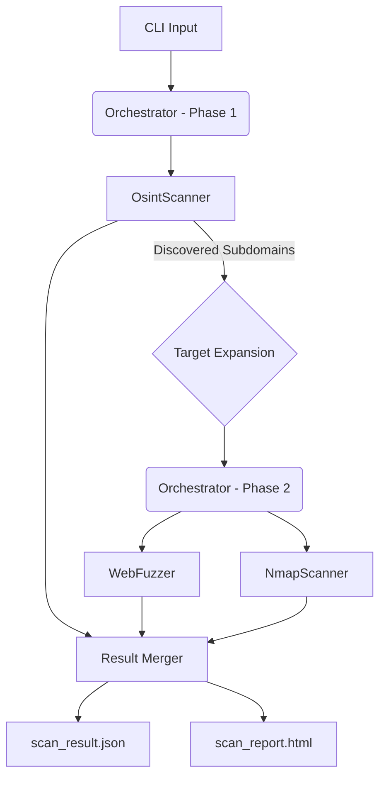

# 🛡️ OsintUltimate (RedTeam Rust Core v2.1)

> **High-Performance, Async-First Red Team Assessment Engine**
> 
> *Binary Precision. Atomic Safety. Massive Concurrency.*
> *Now with Smart 2-Phase Scanning: Discovery + Attack Surface Expansion*

## 🚀 Overview

**OsintUltimate** has been re-architected from the ground up in **Rust** to provide an enterprise-grade security assessment platform. It replaces legacy Python scripts with a single, statically compiled binary capable of handling thousands of concurrent targets with zero memory safety issues.

**New in v2.1**: A meticulous **Two-Phase Scanning Workflow** that automatically discovers subdomains and seamlessly feeds them into the active scanning phase.

### 🔥 Key Features

*   **⚡ Blazing Fast**: Powered by `tokio` async runtime. Scans thousands of hosts in seconds, not minutes.
*   **🧠 Intelligent Workflow**:
    *   **Phase 1 (Discovery)**: Uses OSINT (crt.sh, DNS) to find hidden subdomains.
    *   **Phase 2 (Scanning)**: Automatically attacks the *entire* discovered attack surface (Original Targets + Discovered Subdomains).
*   **🛡️ Thread-Safe**: Built with Rust's strict safety guarantees. No GIL, no data races, no runtime crashes.
*   **🧩 Modular Architecture**: Plugin-based system (`ScannerPlugin` trait) for easy extensibility.
*   **📡 Hybrid Reporting**:
    *   **JSON Schema**: Strict, machine-readable output optimized for AI analysis.
    *   **HTML Dashboard**: Clean, copy-paste friendly report for executive summaries.
*   **🕵️ Evasion Ready**:
    *   **LogNormal Jitter**: Simulates human behavior mathematically (avoiding WAF detection).
    *   **Smart Proxy Rotation**: `DashMap`-based client pool ensures effective IP rotation per request.

---

## 🛠️ Modules

### 1. **Core Engine** (`Orchestrator`)
The brain of the operation. Manages concurrency via `Semaphores` and `RwLock`, distributing tasks across a pool of workers without blocking. Now orchestrates multi-phase executions.

### 2. **OsintScanner** (Discovery Phase)
*   **Subdomain Discovery**: Queries Certificate Transparency logs (`crt.sh`) to find hidden assets.
*   **Active Verification**: Uses `hickory-resolver` (native Async DNS) to validate subdomains in milliseconds.
*   **Result**: Expands the target list for the subsequent scanning phase.

### 3. **WebFuzzer** (Scanning Phase)
*   **Signature Matching**: Detects sensitive file exposures (`.env`, `.git/config`, `wp-config.php.bak`).
*   **Resilience**: Implements **Exponential Backoff** retries to handle flaky networks.
*   **Health Checks**: Proactively validates proxies before use.

### 4. **NmapScanner** (Scanning Phase)
*   **Robust Parsing**: Uses `quick-xml` (SAX-like) to parse Nmap output safely, handling malformed data gracefully.
*   **Efficiency**: Wraps Nmap processes purely for port scanning, offloading logic to Rust.
*   **Scripting Support**: Supports standard Nmap scripts (NSE) for vulnerability detection.

---

## 📦 Installation & Usage

### Prerequisites
*   Rust (latest stable)
*   Nmap (for network scanning module)

### Building
```bash
git clone https://github.com/kripiman/OsintUltimate
cd OsintUltimate/redteam_rust_core
cargo build --release
```

The optimized binary will be at `target/release/redteam_rust_core`.

### Running Scans

**Standard Scan (Single Target):**
```bash
./redteam_rust_core -t example.com
```
*   **What happens?** 
    1.  Finds subdomains for `example.com`.
    2.  Scanning phase launches against `example.com` AND all found subdomains.

**Massive Scan (File Input + High Concurrency):**
```bash
./redteam_rust_core -i targets.txt -c 50    # Scans 50 hosts in parallel
```

**Advanced Scan (Stealth + Scripts):**
```bash
./redteam_rust_core -t example.com --stealth --scripts "default,vuln"
```

**Debug Mode (Verbose Logging):**
```bash
RUST_LOG=debug ./redteam_rust_core -t example.com
```

---

## 📊 Outputs

The engine generates two artifacts per run:

1.  **`scan_result.json`**: The source of truth. Contains full technical details, raw evidence, and metadata.
2.  **`scan_report.html`**: A visual report.
    *   **Traffic Light Severity**: Critical (Red) -> Info (Blue).
    *   **Excel Ready**: Tables can be copied directly to spreadsheets.

---

## 🏗️ Architecture



---

## 🔒 Security & Performance

*   **Zero-Cost Abstractions**: Rust's type system prevents categories of bugs at compile time.
*   **Memory Efficiency**: Consumes ~20MB RAM for 1000 targets (vs ~200MB in Python).
*   **Static Linking**: No "Dependency Hell". The binary works on any compatible Linux kernel.

---

## 📜 License

Private & Confidential - Internal Red Team Use Only.
