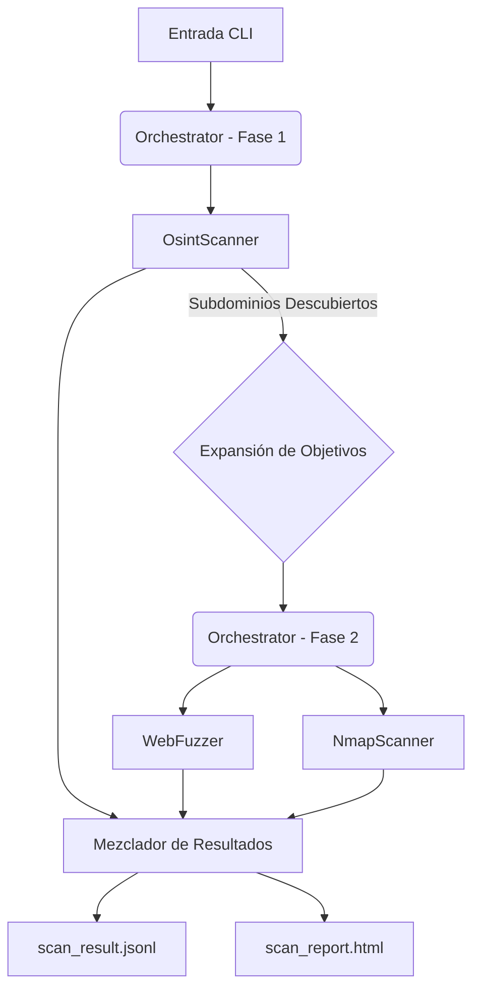

<<<<<<< Updated upstream
# OsintUltimate
 
=======
# 🛡️ OsintUltimate (RedTeam Rust Core v2.1)

> **Motor de Evaluación de Red Team de Alto Rendimiento y Asíncrono**
> 
> *Precisión Binaria. Seguridad Atómica. Concurrencia Masiva.*
> *Ahora con Escaneo Inteligente en 2 Fases: Descubrimiento + Expansión de Superficie de Ataque*

## 🚀 Vista General

**OsintUltimate** ha sido re-arquitecturado desde cero en **Rust** para proporcionar una plataforma de evaluación de seguridad de grado empresarial. Reemplaza los scripts legados de Python con un único binario compilado estáticamente capaz de manejar miles de objetivos concurrentes con cero problemas de seguridad de memoria.

**Nuevo en v2.1**: Un flujo de trabajo de **Escaneo en Dos Fases** meticuloso que descubre subdominios automáticamente y los alimenta sin problemas en la fase de escaneo activo.

### 🔥 Características Principales

*   **⚡ Increíblemente Rápido**: Impulsado por el entorno de ejecución asíncrono `tokio`. Escanea miles de hosts en segundos, no minutos.
*   **🧠 Flujo de Trabajo Inteligente**:
    *   **Fase 1 (Descubrimiento)**: Utiliza OSINT (crt.sh, DNS) para encontrar subdominios ocultos.
    *   **Fase 2 (Escaneo)**: Ataca automáticamente *toda* la superficie de ataque descubierta (Objetivos Originales + Subdominios Descubiertos).
*   **🛡️ Seguro para Hilos**: Construido con las estrictas garantías de seguridad de Rust. Sin GIL, sin carreras de datos, sin fallos en tiempo de ejecución.
*   **🧩 Arquitectura Modular**: Sistema basado en plugins (trait `ScannerPlugin`) para una fácil extensibilidad.
*   **📡 Pipeline de Streaming**:
    *   **Salida JSONL**: La escritura en tiempo real en disco evita errores de memoria (OOM) en escaneos masivos.
    *   **Panel HTML**: Reporte limpio y amigable para resúmenes ejecutivos.
*   **🕵️ Preparado para la Evasión**:
*   **🕵️ Preparado para la Evasión**:
    -   **Jitter LogNormal**: Simula el comportamiento humano matemáticamente (evitando la detección de WAF).
    -   **Rotación Inteligente de Proxies**: Los pools de clientes garantizados por `DashMap` aseguran una rotación de IP efectiva por solicitud.
    -   **Protección SSRF**: Bloqueo estricto de RFC (CGNAT, metadatos, IPs no enrutables y rangos de documentación IPv6).
*   **🔒 Seguridad de Memoria y ABI**:
    -   **Validación de ABI**: Los plugins dinámicos se verifican por versión para evitar corrupción de memoria.
    -   **Optimización de Memoria**: Uso de `Arc` para compartir objetivos entre hilos, minimizando allocations en el heap.

## 📚 Documentación Técnica

Para conocer de forma profunda el funcionamiento interno, arquitecturas concurrenciales y manuales de evasión, consulta los siguientes documentos:

*   [Arquitectura y Motor Asíncrono](redteam_rust_core/docs/architecture.md)
*   [Plugins y Evasión (Stealth)](redteam_rust_core/docs/plugins_and_evasion.md)
*   [Playbooks y Combinaciones de Uso](redteam_rust_core/docs/usage_combinations.md)

---

## 🛠️ Módulos

### 1. **Motor Central** (`Orchestrator`)
El cerebro de la operación. Gestiona la concurrencia a través de `Semaphores` y `RwLock`, distribuyendo tareas a través de un pool de trabajadores sin bloqueos. Ahora orquestando ejecuciones multi-fase.

### 2. **OsintScanner** (Fase de Descubrimiento)
*   **Descubrimiento de Subdominios**: Consulta logs de Transparencia de Certificados (`crt.sh`) para encontrar activos ocultos.
*   **Verificación Activa**: Utiliza `hickory-resolver` (DNS asíncrono nativo) para validar subdominios en milisegundos.
*   **Resultado**: Expande la lista de objetivos para la fase de escaneo subsiguiente.

### 3. **WebFuzzer** (Fase de Escaneo)
*   **Coincidencia de Firmas**: Detecta exposiciones de archivos sensibles (`.env`, `.git/config`, `wp-config.php.bak`).
*   **Resiliencia**: Implementa reintentos con **Exponencial Backoff** para manejar redes inestables.
*   **Controles de Salud**: Valida proactivamente los proxies antes de su uso.

### 4. **NmapScanner** (Fase de Escaneo)
*   **Parseo Robusto**: Utiliza `quick-xml` para parsear la salida de Nmap de forma segura.
*   **Eficiencia**: Envuelve los procesos de Nmap puramente para el escaneo de puertos, delegando la lógica a Rust.
*   **Soporte de Scripting**: Soporta scripts estándar de Nmap (NSE) para la detección de vulnerabilidades.

---

## 📦 Instalación y Uso

### Prerrequisitos
*   Rust (última versión estable)
*   Nmap (para el módulo de escaneo de red)

### Construcción
```bash
git clone https://github.com/kripiman/OsintUltimate
cd OsintUltimate/redteam_rust_core
cargo build --release
```

El binario optimizado estará en `target/release/redteam_rust_core`.

### Ejecución de Escaneos

**Escaneo Estándar (Objetivo Único):**
```bash
./redteam_rust_core -t ejemplo.com
```
*   **¿Qué sucede?** 
    1.  Encuentra subdominios para `ejemplo.com`.
    2.  La fase de escaneo se inicia contra `ejemplo.com` Y todos los subdominios encontrados.

**Escaneo Masivo (Archivo de Entrada + Alta Concurrencia):**
```bash
./redteam_rust_core -i objetivos.txt -j resultados.jsonl -c 50    # Escanea 50 hosts en paralelo
```

**Escaneo Avanzado (Sigilo + Scripts):**
```bash
./redteam_rust_core -t ejemplo.com --stealth --scripts "default,vuln"
```

**Modo Depuración (Logs Verbos):**
```bash
RUST_LOG=debug ./redteam_rust_core -t ejemplo.com
```

### 🌐 Escaneo de Sitios Web

Para usar el sistema contra un sitio web específico, se recomienda la siguiente configuración para maximizar la efectividad y el sigilo:

```bash
./redteam_rust_core -t midominio.com \
    --stealth \
    --scripts "http-title,http-enum,vuln" \
    --service-detection \
    --doh \
    --concurrency 5
```

#### Parámetros Clave:
- `-t, --target`: El dominio o IP del sitio web.
- `--stealth`: Reduce la velocidad y usa tiempos más humanos para evitar bloqueos del WAF.
- `--scripts`: Ejecuta scripts específicos de Nmap (NSE). Útil para detectar vulnerabilidades web conocidas.
- `--service-detection`: Intenta identificar versiones exactas de servicios (ej. Apache 2.4.50).
- `--doh`: Usa DNS over HTTPS para que las consultas de resolución no sean visibles en la red local.
- `--concurrency`: Controla cuántas tareas paralelas se realizan. Útil para no saturar el sitio objetivo.
- `--proxies`: Permite pasar una lista de proxies (ej. `http://proxy1:8080,http://proxy2:8080`) para rotar el tráfico.

---

## 📊 Salidas

El motor genera dos artefactos por ejecución:

1.  **`scan_result.jsonl`**: La fuente de verdad. Contiene detalles técnicos completos, evidencia bruta y metadatos. Escrito línea por línea (JSON Lines) para el máximo rendimiento.
2.  **`scan_report.html`**: Un reporte visual generado automáticamente a partir de la salida JSONL.
    *   **Severidad tipo semáforo**: Crítico (Rojo) -> Info (Azul).
    *   **Listo para Excel**: Las tablas se pueden copiar directamente a hojas de cálculo.

---

## 🏗️ Arquitectura



---

## 🔒 Seguridad y Rendimiento

*   **Abstracciones de Costo Cero**: El sistema de tipos de Rust evita categorías de errores en tiempo de compilación.
*   **Eficiencia de Memoria**: Consume ~20MB de RAM para 1000 objetivos (vs ~200MB en Python).
*   **Enlace Estático**: Sin "Infierno de Dependencias". El binario funciona en cualquier kernel Linux compatible.

---

## 📜 Licencia

Privado y Confidencial - Solo para uso interno del Red Team.
>>>>>>> Stashed changes
