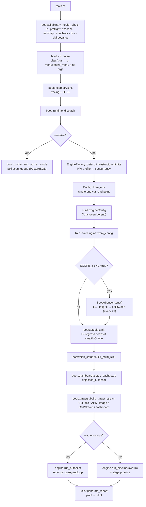
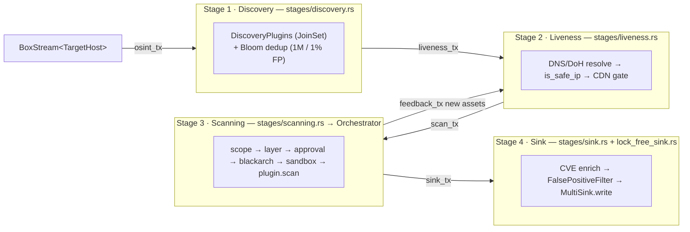

# Mimikri RedTeam Core — Documentation Index

> **Single source of truth:** the code under `src/`. This index and every document it links to are *derived from* that code, not the other way around. When a document and the code disagree, the code wins — and the document is a bug.
>
> Purpose of this folder: let an engineer reverse-engineer the system top-down — understand **what the workflow is**, **how it is divided into modules**, and **where each responsibility lives** — without reading all 200+ source files first.
>
> Last verified against `src/`: 2026-06-05.

---

## 1. What this system is

**Mimikri RedTeam Core** is an async-first red-team assessment engine written in Rust (`tokio`). It ingests *targets* (web, network, host, mobile, container, cloud), runs them through a staged plugin pipeline, enriches findings with a tiered AI router, and fans the results out to multiple sinks (files, PostgreSQL, webhooks, bug-bounty drafts, mesh).

It has **four execution modes**, all reachable from the same binary:

| Mode | Flag | Entry point | What changes |
|---|---|---|---|
| **Pipeline** (default) | — | `RedTeamEngine::run_pipeline` | Sequential 4-stage channel pipeline over all plugins |
| **Autopilot** | `--autonomous` | `RedTeamEngine::run_autopilot` → `AutonomousAgent` | AI decides next plugin per finding; PoC validation; attack chains |
| **Swarm** | `--swarm` | `run_pipeline(swarm=true)` | Stage 3 is AI-directed (`TieredAIRouter::decide_action`) under a token budget |
| **Worker** | `--worker` | `boot::worker::run_worker_mode` | Distributed node claiming jobs from the PostgreSQL `scan_queue` |

---

## 2. How the codebase is divided

The repository splits cleanly into a thin **bootstrap layer** (`boot/`) and a **library** (`lib.rs`). `main.rs` is a 10-line shim; all real bootstrap logic lives in `boot/`, and all domain logic lives in `src/core`, `src/plugins`, `src/models`, `src/infrastructure`, `src/utils`.

```
src/
├── main.rs              # thin shim: health-check → parse → telemetry → dispatch
├── menu.rs              # interactive TUI fallback when no CLI args are given
├── lib.rs              # crate root: re-exports models / core / plugins / infrastructure / utils
│
├── boot/               # ── BOOTSTRAP LAYER (binary-only, not part of the lib) ──
│   ├── cli.rs          # clap Args, parse(), binary_health_check() (P0 preflight tools)
│   ├── telemetry.rs    # tracing + OpenTelemetry (OTLP) init
│   ├── runtime.rs      # dispatch(): the actual wiring — builds EngineConfig, runs the chosen mode
│   ├── stealth.rs      # stealth-infrastructure init (DigitalOcean egress, kill-switch)
│   ├── sink_setup.rs   # build_multi_sink(): assembles the MultiSink fan-out
│   ├── dashboard.rs    # Axum dashboard + live mission injection wiring
│   ├── targets.rs      # build_target_stream(): CLI / file / APK / image / CertStream / dashboard
│   └── worker.rs       # run_worker_mode(): scan_queue polling
│
├── core/               # ── DOMAIN ENGINE ──
│   ├── engine/app.rs   # RedTeamEngine + EngineConfig + run_pipeline / run_autopilot
│   ├── factory.rs      # EngineFactory: hardware detection → concurrency tuning; AI router build
│   ├── pipeline/       # 4-stage async pipeline (see §4)
│   │   ├── mod.rs      #   Pipeline struct + run() channel topology
│   │   ├── builder.rs  #   PipelineBuilder
│   │   ├── enrichment.rs
│   │   └── stages/     #   discovery.rs · liveness.rs · scanning.rs · sink.rs
│   ├── orchestrator/   # Stage-3 plugin execution model (see §5)
│   │   ├── lifecycle/  #   Orchestrator, OrchestratorConfig, run-state, shutdown drain
│   │   ├── dispatch.rs #   two-round priority dispatch
│   │   ├── reactive.rs #   in-scan reactive triggers
│   │   ├── scope_guard.rs
│   │   ├── swarm/      #   coordinator · agent · budget · correlation · inventory
│   │   └── c2/         #   Sliver C2 operators (sovereign)
│   ├── reactive_engine.rs  # attack-chain rule engine (depth ≤ 5)
│   ├── agent.rs        # AutonomousAgent (autopilot loop)
│   ├── correlation/    # CorrelationEngine + AttackGraph + Ingestor
│   ├── ai/             # TieredAIRouter, provider cascade, token optimizer, skills
│   ├── sink/           # DataSink trait + MultiSink + backends (jsonl/postgres/webhook/…)
│   ├── policy/         # PolicyProvider, ReloadablePolicy, scope_syncer (H1/Intigriti)
│   ├── approval_gate.rs# dual-gate for destructive probes
│   ├── capability_layer.rs # ScanLayer + ScanLayerPolicy
│   ├── sandbox/        # SandboxDispatcher (isolated external-tool execution)
│   ├── validation/     # PocValidator
│   ├── lock_free_sink.rs · filter.rs · resource_manager.rs · plugin_loader.rs
│   └── blackarch/ · mcp/ · net_evasion/ · waf/ · web/ · verification/ · selection/ · notifications/
│
├── plugins/            # ── PLUGIN ARSENAL ── (see §6)
│   ├── mod.rs          #   ScannerPlugin / DiscoveryPlugin traits, PluginMetadata, Capability
│   ├── registry.rs · scanner_factory.rs · discovery_factory.rs · config.rs (GlobalConfig)
│   ├── reconnaissance/ · enumeration/ · exploitation/ · intelligence/ · verification/
│   ├── compliance/ · detection_evasion/ · triage/ · reporting/
│   └── lateral_movement/ · persistence/ · privilege_escalation/   # sovereign-gated
│
├── models/             # Finding, TargetHost, TargetType, Objective, Evidence, ScanMetadata
├── infrastructure/     # digital_ocean, certstream, proxy/, decoy/
└── utils/              # config (env read point), executor (StealthExecutor), proxy manager, liveness
```

---

## 3. End-to-end execution flow

This is the path a single run takes, from process start to report generation. Every box maps to a concrete function — follow the arrows to reverse-engineer the system in execution order.



**Key bootstrap invariants** (verified in `boot/` + `utils/config.rs`):

- `Config::from_env()` is the **only** place env vars are read; the engine never touches `std::env` for configuration. CLI args override env values.
- `run_pipeline` wraps the assembled sink in a `MultiSink` and **injects `BugBountyDraftSink`** before building the pipeline — the draft sink is added inside the engine, not in `boot::sink_setup`.
- When `--stealth` is set, `run_pipeline` blocks on `ProxyManager::wait_for_readiness(180s)` before any target is scanned — an OPSEC gate that prevents egress before the proxy mesh is up.

---

## 4. The pipeline: 4-stage channel topology

`run_pipeline` builds a `Pipeline` whose stages are independent `tokio` tasks connected only by `mpsc` channels (no shared mutable state). Defined in `src/core/pipeline/mod.rs::Pipeline::run`; each stage lives in `src/core/pipeline/stages/`.



- **Bypass:** `TargetType::Mobile` and `TargetType::Container` skip Stages 1–2 and enter Stage 3 directly.
- **Recursion:** Stage 3 plugins push newly discovered assets back into Stage 2 via `feedback_tx` (deep discovery).
- **Fail-closed:** an unsafe resolved IP or an out-of-scope target is marked `Dead` and written as-is; no plugin runs on it.

Full stage-by-stage detail: [`engine_core.md`](redteam_rust_core/docs/engine_core.md). Diagram reference: [`ARCHITECTURE.md`](redteam_rust_core/docs/ARCHITECTURE.md) §4.

---

## 5. The orchestrator: how plugins actually run

Stage 3 hands each live target to the `Orchestrator` (`src/core/orchestrator/`). It runs plugins under `for_each_concurrent` with a memory semaphore, then applies a guard chain per plugin before execution:

```
ScopePolicy → ScanLayerPolicy → ApprovalGate → BlackArchBridge → SandboxDispatcher → plugin.scan()
```

- **Two-round dispatch** (`orchestrator/dispatch.rs`): plugins named in `tactical_context["priority_plugins"]` run in round 1, everything else in round 2.
- **Layer cap** (`capability_layer.rs`): `Passive(0) < Discovery(1) < Scanning(2) < Verification(3) < Exploitation(4) < PostExploitation(5)`. Default cap `Scanning`; raise with `--max-layer`.
- **Destructive double-gate** (`plugins/mod.rs::execute_safe_scan`): a `is_destructive` plugin fires only if `tactical_context.allow_destructive_probes == true` **and** `REDTEAM_DESTRUCTIVE=1` **and** the `ApprovalGate` approves.
- **Swarm:** with `--swarm`, `TieredAIRouter::decide_action` chooses the next plugin per finding instead of running the full set.

---

## 6. The plugin arsenal

Two object-safe async traits (`src/plugins/mod.rs`):

```rust
trait ScannerPlugin   { name; metadata; capabilities; check_dependencies; scan(target) -> Vec<Finding>; … }
trait DiscoveryPlugin { name; metadata; capabilities; check_dependencies; discover(target) -> Vec<DiscoveryResult>; }
```

Plugins are registered in two factories and selected by `PluginMetadata` (`target_type`, `layer`, `capabilities`, `is_destructive`, `cost`, …):

| Factory | Count (registrations) | Category dirs |
|---|---|---|
| `scanner_factory.rs::get_all_scanners` | **137** | enumeration, exploitation, intelligence, verification, compliance, detection_evasion, lateral_movement\*, persistence\*, privilege_escalation\* |
| `discovery_factory.rs::get_all_discovery` | **11** | reconnaissance (osint / active / passive) |

\* `sovereign` feature-gated (`#[cfg(feature = "sovereign")]`) — compiled out of default release builds. Counts are raw registrations in the factory; the effective set in a default build is smaller.

Full catalog + metadata audit: [`plugins_and_tools.md`](redteam_rust_core/docs/plugins_and_tools.md), [`PLUGIN_METADATA_AUDIT.md`](redteam_rust_core/docs/PLUGIN_METADATA_AUDIT.md).

---

## 7. Document map

| Document | Covers | Authoritative source |
|---|---|---|
| [`ARCHITECTURE.md`](redteam_rust_core/docs/ARCHITECTURE.md) | Full system reference with diagrams: bootstrap, ingestion, sinks, pipeline, orchestrator, AI router, autonomous loop, persistence, interfaces, safety gates | `src/` (whole tree) |
| [`engine_core.md`](redteam_rust_core/docs/engine_core.md) | The 4-stage pipeline + autonomous mode + correlation engine, stage by stage | `core/pipeline/`, `core/orchestrator/`, `core/agent.rs`, `core/correlation/` |
| [`plugins_and_tools.md`](redteam_rust_core/docs/plugins_and_tools.md) | Plugin traits, categories, tool registry, metadata fields | `src/plugins/` |
| [`PLUGIN_METADATA_AUDIT.md`](redteam_rust_core/docs/PLUGIN_METADATA_AUDIT.md) | Per-plugin metadata completeness audit | `src/plugins/*/` |
| [`swarm_intelligence.md`](redteam_rust_core/docs/swarm_intelligence.md) | Multi-agent swarm, token budget, inter-agent messaging | `core/orchestrator/swarm/` |
| [`ai_infrastructure.md`](redteam_rust_core/docs/ai_infrastructure.md) | Tiered AI router, provider cascade, prompt/token optimization, skills | `core/ai/` |
| [`sink_persistence.md`](redteam_rust_core/docs/sink_persistence.md) | `DataSink` trait, sink backends, PostgreSQL schema, migrations | `core/sink/`, `migrations/` |
| [`stealth_opsec.md`](redteam_rust_core/docs/stealth_opsec.md) | Sandbox, executor modes, scan layers, DigitalOcean egress | `core/sandbox/`, `utils/executor.rs`, `infrastructure/digital_ocean.rs` |
| `ADR-011 … ADR-013` | Architecture Decision Records (orchestrator domain split, AI context hardening, LLM rate limiting) | linked source in each ADR |
| `ARCH-11-STAGE3-WALKTHROUGH.md` | Orchestrator decomposition walkthrough | `core/orchestrator/` |
| [`deployment/`](redteam_rust_core/docs/deployment/) | Hybrid deployment topology, hardening, secrets, DO workers, incident response | infra/runbooks |

---

## 8. Suggested reverse-engineering reading order

1. **This index** → the module map (§2) and the execution flow (§3).
2. `src/main.rs` → `src/boot/runtime.rs::dispatch` — the spine that wires everything.
3. `src/core/engine/app.rs::run_pipeline` — how the pipeline is assembled.
4. [`engine_core.md`](redteam_rust_core/docs/engine_core.md) + `src/core/pipeline/mod.rs::run` — the 4 stages.
5. `src/core/orchestrator/lifecycle/` + `dispatch.rs` — how a plugin is selected and guarded.
6. `src/plugins/mod.rs` + [`plugins_and_tools.md`](redteam_rust_core/docs/plugins_and_tools.md) — the plugin contract.
7. [`ARCHITECTURE.md`](redteam_rust_core/docs/ARCHITECTURE.md) — everything else (sinks, AI, persistence, safety gates), with diagrams.

---

## 9. Maintenance contract

- Every doc carries a **"Last verified"** date and a **source-of-truth path**. When you change code that a doc describes, update the doc and bump the date in the same change.
- Diagrams describe *behavior*, not aspiration. If a box has no corresponding function in `src/`, delete it.
- Plugin counts, env-var names, and file paths are mechanical facts — quote them from the code, don't estimate.
</content>
</invoke>
