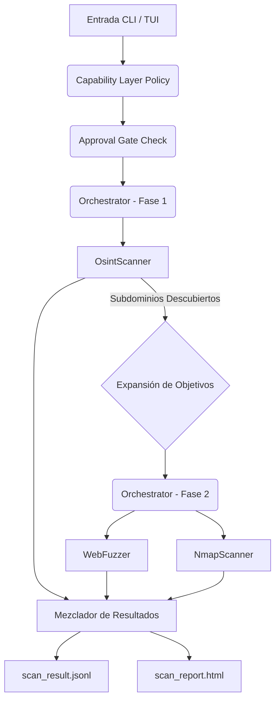

# 🛡️ OsintUltimate (RedTeam Rust Core v4.0)

> **Motor de Evaluación de Red Team de Alto Rendimiento y Asíncrono**
> 
> *Precisión Binaria. Seguridad Atómica. Concurrencia Masiva.*
> *Arquitectura v4.0: Evasión Estocástica, I/O io-uring y IA Off-Path.*

## 🚀 Vista General

**OsintUltimate** ha sido re-arquitecturado en su versión **v4.0** para soportar operaciones de Red Team a escala global. Esta actualización introduce un motor de evasión probabilístico y una infraestructura de red de latencia ultra-baja basada en `io-uring`.

**Nuevo en v4.0**: 
- **Evasión Estocástica (Thompson Sampling)**: Motor de decisión bayesiano que elige estrategias de evasión para minimizar la detección por WAFs con ML.
- **IA Off-Path con LSH Cache**: Análisis de payloads mediante LLMs en segundo plano con caché de similitud (*SimHash*), eliminando bloqueos en el pipeline de red.
- **Pipeline Lock-Free**: Sumidero de resultados basado en colas `SegQueue` para ingestión de datos sin bloqueos de mutex.
- **Native io-uring Scanner**: Escaneo de red de alto rendimiento que bypassa el modelo `fork/exec`, operando directamente en el kernel.
- **Hardware-Aware Core**: Detección automática del entorno para optimizar la concurrencia y el uso de RAM (ajustado para VPS de 1GB).
- **Sentinel Autonomous Agent**: Modo autocompleto (`--autonomous`) con cascada de IA nativa y toma de decisiones tácticas.
- **Resistencia a HashDoS**: Migración a `SipHash-1-3` para todas las estructuras de datos críticas.


### 🔥 Características Principales

*   **⚡ Increíblemente Rápido**: Impulsado por el entorno de ejecución asíncrono `tokio`. Escanea miles de hosts en segundos, no minutos.
*   **🧠 Flujo de Trabajo Inteligente**:
    *   **Fase 1 (Descubrimiento)**: Utiliza OSINT (crt.sh, DNS) para encontrar subdominios ocultos.
    *   **Fase 2 (Escaneo)**: Ataca automáticamente *toda* la superficie de ataque descubierta (Objetivos Originales + Subdominios Descubiertos).
*   **🛡️ Seguro para Hilos**: Construido con las estrictas garantías de seguridad de Rust. Sin GIL, sin carreras de datos, sin fallos en tiempo de ejecución.
*   **🧩 Arquitectura Modular**: Sistema basado en plugins (trait `ScannerPlugin`) para una fácil extensibilidad.
*   **📡 Pipeline de Streaming**:
    *   **Salida JSONL**: La escritura en tiempo real en disco evita errores de memoria (OOM) en escaneos masivos.
    *   **Web Dashboard**: Centro de mando premium con Glassmorphism y actualizaciones vía SSE.
    *   **Panel HTML**: Reporte limpio y amigable para resúmenes ejecutivos.
*   **🕵️ Preparado para la Evasión**:
    -   **Jitter LogNormal**: Simula el comportamiento humano matemáticamente (evitando la detección de WAF).
    -   **Evasión Automática 403**: Motor de escalación reactivo (vía Local AI y DigitalOcean).
    -   **Rotación Inteligente de Proxies**: Los pools de clientes garantizados por `DashMap` aseguran una rotación de IP efectiva por solicitud.
    -   **Protección SSRF**: Bloqueo estricto de RFC (CGNAT, metadatos, IPs no enrutables y rangos de documentación IPv6).
    -   **Honeypot Mapping**: Detecta si tu infraestructura está bajo investigación mediante canarios DNS.
*   **🔒 Seguridad de Memoria y ABI**:
    -   **Validación de ABI**: Los plugins dinámicos se verifican por versión para evitar corrupción de memoria.
    -   **Optimización de Memoria**: Uso de `Arc` para compartir objetivos entre hilos, minimizando allocations en el heap.
*   **🛡️ Capas de Capacidad**: Control de profundidad de escaneo con políticas configurables (Passive, Discovery, Scanning, Verification, Exploitation, Post-Exploitation).
*   **🚪 Puertas de Aprobación**: Sistema de gestión de riesgos con umbrales de aprobación, auditoría y roles de usuario.
*   **🤖 Sentinel AI Agent**: Pentesting autónomo con orquestación de LLMs en cascada y análisis de evidencia en tiempo real.
*   **💻 Hardware-Aware Optimization**: Ajuste dinámico de rendimiento basado en la detección de infraestructura (Server, LocalPC, UltraLowMemory).

### 🆕 Nuevas Características en v4.0

*   **Sentinel Autonomous Agent**: Activa un agente de inteligencia que toma decisiones tácticas y selecciona plugins automáticamente.
*   **Adaptive Infrastructure Mode**: Detección de hardware para optimizar la RAM y evitar errores OOM en VPS de 1GB.
*   **Thompson Sampling Evasion**: Estrategias de salto de WAF aleatorias para evitar patrones de detección de ML.
*   **Native io-uring Scanner**: Escaneo SYN ultra-rápido directamente desde el kernel.

---

## 💻 Requisitos del Sistema

Para garantizar un rendimiento óptimo, se recomiendan las siguientes especificaciones:

### Hardware
| Recurso | Mínimo | Recomendado |
| :--- | :--- | :--- |
| **CPU** | Dual-core (x86_64/ARM64) | Quad-core o superior |
| **RAM** | 1 GB | 4 GB+ |
| **Disco** | 500 MB | 2 GB+ (para logs y resultados) |
| **Red** | 10 Mbps | 100 Mbps+ (Baja latencia) |

### Software (Dependencias)
- **Sistema Operativo**: Linux (Kernel 5.1+ requerido para `io-uring`)
- **Compilador**: Rust 1.75+ (para construcción desde código fuente)
- **Herramientas de Red**: 
    - `nmap` (Requerido para escaneo de puertos y servicios)
    - `sqlmap`, `commix`, `nuclei` (Opcionales, recomendados para mayor cobertura)
- **Entorno de IA**: Conectividad a APIs (Gemini Pro/Flash) u Ollama local para el `TieredAIRouter`.

## 📚 Documentación Técnica (v4.0)

Consulta los siguientes documentos para profundizar en el motor y tácticas de campo:

*   [🏗️ Arquitectura v4.0 (NUEVO)](redteam_rust_core/docs/V4_ARCHITECTURE.md): Detalle técnico sobre Evasión Estocástica, io-uring y IA Off-Path.
*   [🗺️ Roadmap de Desarrollo](redteam_rust_core/docs/ROADMAP.md): Próximas fases (Fase 5) y visión v4.0.
*   [🏗️ Arquitectura y Pipeline](redteam_rust_core/docs/ARCHITECTURE.md): Diseño asíncrono, Hardware-Aware layer y flujo de datos.
*   [🧠 Orquestación de IA (Sentinel)](redteam_rust_core/docs/AI_ORCHESTRATION.md): Tiered AI Router, análisis en cascada y toma de decisiones autónoma.
*   [🛡️ Hardening y OPSEC (Sigilo)](redteam_rust_core/docs/HARDENING_AND_OPSEC.md): Optimización de memoria (1GB RAM), DigitalOcean stealth nodes y Evasión.
*   [🧩 Desarrollo de Plugins](redteam_rust_core/docs/PLUGIN_DEVELOPMENT.md): Guía para extender las capacidades del núcleo.
*   [🔄 Combinaciones de Uso](redteam_rust_core/docs/usage_combinations.md): Playbooks y ejemplos de ejecución complejos.

---

## 🛠️ Módulos Principales

### 1. **Orquestador Central** (`Orchestrator`)
Coordina las fases de escaneo, gestiona la concurrencia asíncrona y orquestra la ejecución multi-fase integrando el **TieredAIRouter**.

### 2. **TieredAIRouter** (IA Multicloud en Cascada)
Selecciona dinámicamente el mejor modelo entre múltiples proveedores (**Anthropic, OpenAI, Gemini, Azure, Local**) según la criticidad y prioridad (`ProviderEntry`), aplicando **failover transparente** y **comprensión de contexto** (Whitelist filtering + Truncation) para máxima eficiencia.

### 3. **Capas de Capacidad** (`CapabilityLayer`)
Define el "scope" de la operación: Passive (OSINT), Discovery, Scanning, Verification, Exploitation y Post-Exploitation.

### 4. **Puertas de Aprobación** (`ApprovalGate`)
Gestión de riesgos que requiere confirmación explícita para acciones de nivel 3 o superior, manteniendo un rastro de auditoría inmutable.

### 5. **Motores de Evasión (OPSEC)**
Implementa **Human Jitter** (LogNormal), rotación inteligente de proxies y sandboxing de herramientas (`ProcessGuard`) con límites de RAM. Soporta escalación 403 dinámica.

### 6. **Web Dashboard** (`web_server`)
Servidor embebido de alto rendimiento (Axum) que proporciona telemetría en tiempo real sobre hallazgos, uso de RAM y estado de los objetivos.

### 8. **Plugins Disponibles**

OsintUltimate incluye más de 60 herramientas integradas, organizadas por categorías:

#### **Reconocimiento (Discovery)**
- **OsintScanner**: Descubrimiento de subdominios via crt.sh y DNS.
- **SubfinderScanner**: Enumeración de subdominios.
- **AmassScanner**: Herramienta avanzada de enumeración OSINT.
- **UncoverScanner**: Descubrimiento de activos expuestos.

#### **Enumeración Web**
- **WebFuzzer**: Fuzzing de directorios y archivos sensibles.
- **FfufScanner**: Fuzzing rápido de contenido web.
- **FeroxbusterScanner**: Escaneo de directorios agresivo.
- **ArjunScanner**: Descubrimiento de parámetros HTTP.
- **KatanaScanner**: Crawling web con JavaScript.
- **NiktoScanner**: Escaneo de vulnerabilidades web.
- **WPScanner**: Auditoría de WordPress.
- **SnallygasterScanner**: Descubrimiento de archivos sensibles.
- **KiterunnerScanner**: Escaneo de APIs.
- **TsunamiScanner**: Escaneo de vulnerabilidades web.
- **GoWitnessScanner**: Captura de screenshots.
- **InteractshScanner**: Interacción con servidores OOB.
- **CRLFScanner**: Detección de inyección CRLF.
- **GfScanner**: Patrón matching avanzado.
- **GauPlusScanner**: Recolección de URLs históricas.

#### **Enumeración de Red**
- **NmapScanner**: Escaneo de puertos y servicios.
- **RustScanScanner**: Escaneo ultra-rápido de puertos.
- **NaabuScanner**: Escaneo de puertos pasivo.
- **HttpxScanner**: Identificación de servicios web.
- **DnsxScanner**: Resolución DNS masiva.

#### **Enumeración Cloud**
- **PacuScanner**: Herramienta de pentesting AWS.
- **CloudEnumScanner**: Enumeración de recursos cloud.
- **CloudFoxScanner**: Análisis de permisos AWS.
- **CloudBruteScanner**: Fuerza bruta de nombres cloud.
- **ProwlerScanner**: Auditoría de seguridad cloud.
- **KubeBenchScanner**: Benchmarking de Kubernetes.

#### **Explotación Web**
- **SqlMapScanner**: Explotación de SQL injection.
- **DalfoxScanner**: XSS testing avanzado.
- **WapitiScanner**: Escaneo de vulnerabilidades web.
- **CommixScanner**: Command injection testing.
- **JwtToolScanner**: Manipulación de JWT.
- **GraphQLCopScanner**: Auditoría de GraphQL.

#### **Explotación de Red**
- **HydraScanner**: Fuerza bruta de autenticación.
- **NetExecScanner**: Ejecución remota en redes Windows.
- **ImpacketScanner**: Herramientas de protocolo Windows.
- **ResponderScanner**: Poisoning LLMNR/NBT-NS.
- **PetitPotamScanner**: Coerción NTLM.
- **CoercerScanner**: Coerción de autenticación.

#### **Movimiento Lateral**
- **BloodHoundScanner**: Análisis de Active Directory.
- **SliverScanner**: Framework C2.
- **LigoloScanner**: Tunneling de red.

#### **Escalada de Privilegios**
- **CertipyScanner**: Explotación de certificados AD.
- **PrivescHunterScanner**: Caza de vulnerabilidades de privesc.

#### **Persistencia**
- **HavocScanner**: Framework C2 avanzado.

#### **Inteligencia y Vulnerabilidades**
- **NucleiScanner**: Escaneo con templates.
- **JaelesScanner**: Fuzzing de APIs.
- **SearchsploitScanner**: Búsqueda en Exploit-DB.

#### **Verificación**
- **ZapScanner**: OWASP ZAP integration.
- **BurpScanner**: Burp Suite integration.

#### **Cumplimiento y SCA**
- **CheckovScanner**: Análisis de configuración IaC.
- **KubescapeScanner**: Seguridad de Kubernetes.
- **TrivyScanner**: Escaneo de vulnerabilidades en contenedores.
- **OSVScanner**: Base de datos de vulnerabilidades.

---

### Instalación y Construcción
```bash
git clone https://github.com/kripiman/OsintUltimate
cd OsintUltimate/redteam_rust_core
cargo build --release
```

El binario optimizado estará en `target/release/redteam_rust_core`.

### Ejecución de Escaneos

**Escaneo con Dashboard Real-time (Recomendado):**
```bash
./redteam_rust_core -t ejemplo.com --dashboard 8080
```

**Escaneo Estándar (Objetivo Único):**
```bash
./redteam_rust_core -t ejemplo.com
```
*   **¿Qué sucede?** 
    1.  Encuentra subdominios para `ejemplo.com`.
    2.  La fase de escaneo se inicia contra `ejemplo.com` Y todos los subdominios encontrados.

**Escaneo Masivo (Archivo de Entrada + Alta Concurrencia):**
```bash
./redteam_rust_core -i objetivos.txt -j resultados.jsonl -c 50    # Escanea 50 hosts en paralelo
```

**Escaneo Avanzado (Sigilo + Scripts):**
```bash
./redteam_rust_core -t ejemplo.com --stealth --scripts "default,vuln"
```

**Modo Depuración (Logs Verbos):**
```bash
RUST_LOG=debug ./redteam_rust_core -t ejemplo.com
```

### 🌐 Escaneo de Sitios Web

Para usar el sistema contra un sitio web específico, se recomienda la siguiente configuración para maximizar la efectividad y el sigilo:

```bash
./redteam_rust_core -t midominio.com \
    --stealth \
    --scripts "http-title,http-enum,vuln" \
    --service-detection \
    --doh \
    --concurrency 5
```

#### Parámetros Clave:
- `-t, --target`: El dominio o IP del sitio web.
- `--stealth`: Reduce la velocidad y usa tiempos más humanos para evitar bloqueos del WAF.
- `--scripts`: Ejecuta scripts específicos de Nmap (NSE). Útil para detectar vulnerabilidades web conocidas.
- `--service-detection`: Intenta identificar versiones exactas de servicios (ej. Apache 2.4.50).
- `--doh`: Usa DNS over HTTPS para que las consultas de resolución no sean visibles en la red local.
- `--concurrency`: Controla cuántas tareas paralelas se realizan. Útil para no saturar el sitio objetivo.
- `--proxies`: Permite pasar una lista de proxies (ej. `http://proxy1:8080,http://proxy2:8080`) para rotar el tráfico.

---

## 📊 Salidas

El motor genera dos artefactos por ejecución:

1.  **`scan_result.jsonl`**: La fuente de verdad. Contiene detalles técnicos completos, evidencia bruta y metadatos. Escrito línea por línea (JSON Lines) para el máximo rendimiento.
2.  **`scan_report.html`**: Un reporte visual generado automáticamente a partir de la salida JSONL.
    *   **Severidad tipo semáforo**: Crítico (Rojo) -> Info (Azul).
    *   **Listo para Excel**: Las tablas se pueden copiar directamente a hojas de cálculo.

---

## 🏗️ Arquitectura



---

## 🔒 Seguridad y Rendimiento

*   **Abstracciones de Costo Cero**: El sistema de tipos de Rust evita categorías de errores en tiempo de compilación.
*   **Eficiencia de Memoria**: Consume ~20MB de RAM para 1000 objetivos (vs ~200MB en Python).
*   **Enlace Estático**: Sin "Infierno de Dependencias". El binario funciona en cualquier kernel Linux compatible.

---

## 📜 Licencia

Privado y Confidencial - Solo para uso interno del Red Team.
