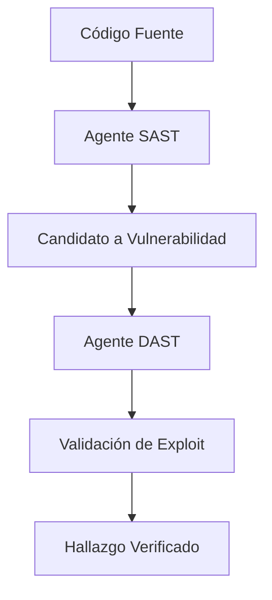

# Análisis Técnico: AppSec y Remediación (Vulnerability Remediation)

Este documento analiza los repositorios que se enfocan en el análisis profundo de aplicaciones y la corrección automática de vulnerabilidades.

---

## 1. Shannon (KeygraphHQ/shannon)
**Resumen Técnico**: Pentester autónomo de caja blanca (white-box) diseñado para aplicaciones web y APIs que analiza el código fuente directamente.

### Fortalezas Identificadas:
- **Correlación Estático-Dinámica**: Analiza el código fuente (SAST) y luego valida los hallazgos con ataques reales (DAST) para eliminar falsos positivos.
- **PoCs Reproducibles**: Política de "no exploit, no report". Cada hallazgo incluye un script de prueba verificable.
- **Análisis de Flujo de Datos (CPG)**: En su versión Pro, utiliza Grafos de Propiedad de Código para rastrear el flujo de datos desde la entrada hasta el sumidero (source-to-sink).
- **Orquestación Temporal**: Uso de Temporal para garantizar la durabilidad y el manejo de fallos en flujos de trabajo largos.

### Fragmento de Código Relevante (Arquitectura de Flujo):

### Recomendaciones para OsintUltimate:
- Implementar un **SAST Orchestrator** que alimente al enjambre con puntos de entrada vulnerables detectados en el código.
- Adoptar la política de **"No Exploit, No Report"** para aumentar la credibilidad de los informes del sistema.

---

## 2. Strix (usestrix/strix)
**Resumen Técnico**: Plataforma centrada en el desarrollador que encuentra vulnerabilidades y propone parches (Auto-fix) integrados en el CI/CD.

### Fortalezas Identificadas:
- **Auto-fix PRs**: Genera Pull Requests listos para ser fusionados que corrigen la vulnerabilidad encontrada.
- **Validación de PoC Real**: Cada vulnerabilidad se confirma mediante la ejecución de un exploit en un entorno seguro antes de proponer la corrección.
- **Integración CI/CD**: Se ejecuta como parte del pipeline de desarrollo, permitiendo el "shift-left security".
- **Agentes Especialistas (Graph of Agents)**: Equipos de agentes que colaboran para resolver problemas complejos de seguridad.

### Recomendaciones para OsintUltimate:
- Desarrollar el **Remediation Agent** (Patcher) que proponga cambios de código basados en los hallazgos verificados.
- Implementar **CI/CD Plugins** para que `OsintUltimate` pueda auditar automáticamente cada commit o PR.
- Integrar la **Validación Automática de Parches**: Tras aplicar una corrección, el sistema debe re-intentar el exploit para confirmar el cierre de la brecha.
