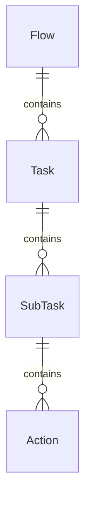

# Análisis Técnico: Orquestadores de Enjambres de IA (AI Swarm Orchestrators)

Este documento consolida los hallazgos de los repositorios especializados en la coordinación de múltiples agentes para pentesting autónomo.

---

## 1. PentAGI (vxcontrol/pentagi)
**Resumen Técnico**: Plataforma de Inteligencia General Artificial para pentesting que utiliza una arquitectura de microservicios escalable. Se destaca por su integración con grafos de conocimiento y un robusto sistema de monitoreo.

### Fortalezas Identificadas:
- **Grafo de Conocimiento (Neo4j + Graphiti)**: Rastrea relaciones semánticas entre entidades y acciones, permitiendo un entendimiento contextual profundo.
- **Sistema de Memoria Inteligente**: Almacenamiento persistente en PostgreSQL con `pgvector` para búsqueda semántica de experiencias previas.
- **Supervisión de Agentes**: Incluye monitoreo de ejecución y planificación inteligente de tareas para modelos pequeños (<32B).
- **Observabilidad**: Integración completa con Grafana, Prometheus, Loki y Jaeger.

### Fragmento de Código Relevante (Arquitectura de Tareas):

### Recomendaciones para OsintUltimate:
- Implementar **Neo4j** para mapear la infraestructura del objetivo y las relaciones de confianza encontradas.
- Adoptar el patrón de **SubTask Decomposition** antes de asignar tareas a los agentes del enjambre.

---

## 2. NeuroSploit v3
**Resumen Técnico**: Plataforma avanzada que combina agentes autónomos con 100 tipos de vulnerabilidades y contenedores Kali aislados por escaneo.

### Fortalezas Identificadas:
- **Arquitectura de 3 Flujos Paralelos**: Reconocimiento, Testeo Junior y Ejecutor de Herramientas corriendo simultáneamente.
- **Pipeline Anti-Alucinación**: Controles negativos, pruebas de ejecución y puntuación de confianza (0-100).
- **Motor de Encadenamiento de Exploits**: Automatiza la transición entre vulnerabilidades (ej. SSRF -> acceso interno).

### Recomendaciones para OsintUltimate:
- Integrar el **Pipeline Anti-Alucinación** para validar hallazgos de la IA antes de reportarlos.
- Implementar el **Exploit Chain Engine** para priorizar pivotes basados en hallazgos verificados.

---

## 3. Pentest Swarm AI (Armur-Ai)
**Resumen Técnico**: Plataforma nativa en Go que despliega agentes especialistas coordinados por un bucle de razonamiento ReAct.

### Fortalezas Identificadas:
- **Herramientas Nativas**: Ejecuta herramientas como `subfinder` y `httpx` como librerías nativas en Go, eliminando el overhead de subprocesos.
- **Playbooks de la Comunidad**: Uso de archivos YAML para definir cadenas de ataque complejas.
- **Cumplimiento y Limpieza**: Cada paso de explotación tiene un comando de limpieza registrado.

### Recomendaciones para OsintUltimate:
- Desarrollar **Playbooks YAML** para estandarizar ataques comunes en el enjambre.
- Asegurar que cada plugin tenga un método `cleanup()` obligatorio.

---

## 4. CAI (aliasrobotics/cai)
**Resumen Técnico**: Framework ligero y modular diseñado para automatización ofensiva y defensiva, con soporte para más de 300 modelos.

### Fortalezas Identificadas:
- **Patrones Agénticos**: Implementa patrones como Swarm, Hierarchical, Auction-Based y Recursive.
- **Handoffs Formales**: Mecanismo explícito para delegar tareas entre agentes especialistas.
- **Guardrails**: Protecciones integradas contra inyección de prompts y comandos peligrosos.

### Recomendaciones para OsintUltimate:
- Adoptar el sistema de **Handoffs** para permitir que un agente `Exploiter` entregue el control a un `C2Operator` de forma estructurada.

---

## 5. Guardian (zakirkun/guardian-cli)
**Resumen Técnico**: Framework de automatización de grado empresarial con enfoque en la captura de evidencia y trazabilidad.

### Fortalezas Identificadas:
- **Captura de Evidencia Enriquecida**: Cada hallazgo está vinculado a la ejecución exacta de la herramienta que lo generó.
- **Validación de Alcance (Scope)**: Blacklist automático de redes privadas y objetivos no autorizados.
- **Informes Profesionales**: Generación de resúmenes ejecutivos y deep-dives técnicos con trazas de decisión de la IA.

### Recomendaciones para OsintUltimate:
- Mejorar el **MultiSink** para incluir fragmentos de la salida estándar de las herramientas como evidencia en los reportes MD.
