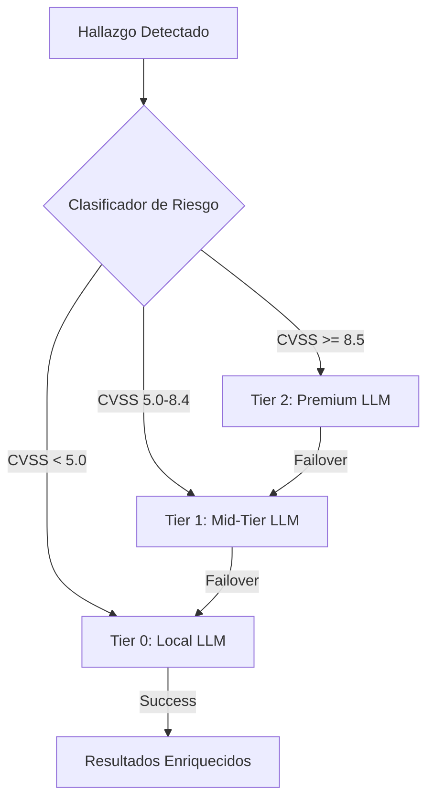
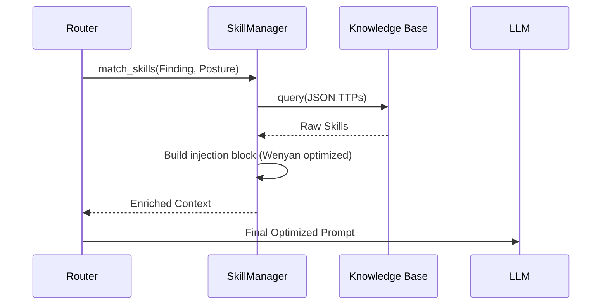

# 🧠 Infraestructura IA & Prompt Engineering

OsintUltimate implementa capa abstracción IA alto rendimiento. Maximiza precisión técnica, minimiza costo + latencia. Usa motor enrutamiento por niveles (Tiered Routing) + tubería optimización tokens 10 etapas.

## 1. Enrutamiento por Niveles (Tiered Routing)

`TieredAIRouter` = despachador central. Clasifica cada hallazgo/tarea por complejidad técnica + severidad.

### Estrategia de Selección de Tiers
*   **Tier 2 (Premium)**: análisis críticos vulns alto impacto (CVSS ≥ 8.5) + planes persistencia C2 avanzados. Modelos: GPT-4o, Claude 3.5 Sonnet.
*   **Tier 1 (Mid)**: balance costo/razonamiento para escaneo activo + análisis config (CVSS 5.0 - 8.4). Modelos: GPT-3.5 Turbo, Gemini 1.5 Flash.
*   **Tier 0 (Local)**: máx privacidad + bajo costo para análisis código fuente + recon masivo. Modelos: Ollama (Llama 3 / CodeLlama), Microsoft Phi-3.



---

## 2. Optimización de Tokens de 10 Etapas

Reduce "bleed" créditos API + permite contextos masivos. OsintUltimate usa **v13 Deterministic Prompt Optimizer**. Motor procesa prompts vía diez transformaciones sucesivas.

### Etapas de Optimización
1.  **Extractive Compressor**: puntúa cada línea por señal técnica (keywords `proxy`, `payload`, `vuln`). Elimina baja relevancia.
2.  **Entropy Pruner**: elimina adverbios baja entropía (e.g., "basically", "actually"). No aportan valor operativo.
3.  **Verbosity Reducer**: colapsa frases verbales largas (e.g., "in order to" -> "to").
4.  **Article Stripper**: elimina artículos (a, an, the).
5.  **Filler Remover**: limpia palabras cortesía/relleno.
6.  **Synonym Mapper**: abrevia términos técnicos largos (e.g., `vulnerability` -> `vuln`).
7.  **Suffix Lemmatizer**: elimina sufijos (-ing, -ed, -ly). Heurística detección código endurecida previene corrupción contextos técnicos.
8.  **Punctuation Pruner**: (Modo Ultra) elimina puntuación no estructural.
9.  **Wenyan Ultra**: (Modo Ultra) sustituye términos técnicos comunes por glifos CJK uno-carácter (e.g., `security` -> `安`).
10. **Deduplicator**: pase final, elimina redundancias de etapas previas.

### Resultados de Compresión
*   **Lite Mode**: ~15-20% ahorro (lectura humana intacta).
*   **Full Mode**: ~40-60% ahorro (legible para LLMs modernos).
*   **Ultra Mode (Wenyan)**: ~80% ahorro (optimizado agentes autónomos V15).

---

## 3. Inyección de Habilidades Técnicas (SkillManager)

A diferencia de prompts estáticos, OsintUltimate usa **RAG Técnico**. Inyecta conocimiento Red Team (TTPs) en momento justo del análisis.

### Flujo de Habilidades
*   **Matching**: `SkillManager` selecciona fragmentos según categoría hallazgo + postura actual (`Ghost`, `Strike`, `Breach`).
*   **Dynamic Budgeting**: presupuesto tokens skills escala según Tier modelo (más contexto para Premium).
*   **Surgical Injection**: skills inyectadas como "bloques experto". Dictan lógica decisión agente sin re-entrenamiento.



---

## 4. OPSEC & Privacidad (PII Scrubbing)

Antes que data llegue a proveedores IA externos (Azure/OpenAI/Anthropic), `Scrubber` procesa info para proteger infra:

- **Identity Masking**: reemplaza nombres usuarios, IPs internas, paths sensibles con placeholders sintéticos.
- **Credential Stripping**: elimina tokens, API keys, hashes detectados en contexto ataque.
- **Tactical Cache**: caché **LRU (moka)** evita reenviar mismo hallazgo crítico a IA. Protege presupuesto + exposición datos. Garantiza consistencia contexto bajo carga masiva.

---

> [!IMPORTANT]
> Modo **Wenyan Ultra** = exclusivo interacción máquina-máquina. Operadores que quieran leer logs IA en lenguaje natural deben usar nivel `Lite` o `Off`.

---

## 5. External AI Tool Token Strategy (Garak / PyRIT / Promptfoo / etc)

Plugins ofensivos AI/LLM (`exploitation/ai_llm/*`) ejecutan binarios externos. Generan **adversarial prompts** contra targets LLM. Estos prompts NO se optimizan — wording exacto = sagrado para test integrity.

### 5.1 Decisión arquitectónica: NO Bridge Optimizer

**Rechazado:** local OpenAI-compat proxy interceptando outbound calls + applying `PromptOptimizer`.

**Razón:**
- Adversarial prompts (jailbreaks, injections, DAN-style) calibrados contra **token sequences específicas**.
- Lemmatize/article-strip/filler-remove → destruye attack semantics.
- "Ignore all previous instructions" → "ignore previous instruction" → jailbreak no triggers.
- Reproducibility broken → CVE/bounty reports inválidos.
- Optimizer domain = chat compression, NOT adversarial vector mutation.

**Conclusión:** prompts ataque pasan unchanged. Optimization en **scan configuration**, no en payload content.

---

### 5.2 Strategy A+B+C — Smart Scan Profiles

Tres palancas ahorro real **sin tocar payloads**:

| Lever | Mechanism | Typical Saving |
|---|---|---|
| **A. Probe selection** | `--probes <subset>` vs `--probes all` | 5-50× |
| **B. Model tier** | `gpt-4o-mini` vs `gpt-4` (target side) | 10-200× |
| **C. Generation cap** | `--generations 3` vs default 10 | 3× |

Combinados → **150-30000× cost reduction** vs full default scan. Coverage crítico intacto.

---

### 5.3 Scan Profiles (Default Tiers)

Tres profiles built-in. Plugin AI selecciona según `TokenBudget` state.

#### Economy (default si budget < 50%)
```
probes:       critical-only (HijackHateHumans, DAN, jailbreak basics)
generations:  3
target_model: cheapest available (gpt-4o-mini, claude-haiku, llama3.2:1b)
timeout:      300s
parallelism:  1
```
Cost target: < 1k tokens / scan.

#### Standard (default si budget 50-80%)
```
probes:       OWASP LLM Top 10 subset (~15 probes)
generations:  5
target_model: mid-tier (gpt-4o, claude-sonnet)
timeout:      900s
parallelism:  3
```
Cost target: ~10k tokens / scan.

#### Thorough (only si budget > 80% AND posture = Strike)
```
probes:       all
generations:  10
target_model: as-configured (no override)
timeout:      3600s
parallelism:  5
```
Cost target: ~100k+ tokens / scan.

---

### 5.4 Per-Tool Configuration Matrix

| Tool | Probe-equivalent flag | Generation flag | Profile target |
|---|---|---|---|
| **Garak** | `--probes promptinject.HijackHateHumans` | `--generations N` | `garak.profile: economy` |
| **PyRIT** | Orchestrator selection (`Crescendo`, `RedTeaming`, `PAIR`) | `max_turns N` | `pyrit.profile: economy` |
| **Promptfoo** | `--filter-tests <name>` (assertion subset) | `--repeat N` | `promptfoo.profile: economy` |
| **Promptmap** | `--rules <subset>` | (single-shot) | `promptmap.profile: economy` |
| **PromptInject** | corpus subset (`base64`, `ignore_prev`, `dan`) | iteration cap | `promptinject.profile: economy` |
| **LLMFuzzer** | mutation strategy (`grammar`, `random`, `corpus`) | budget (max attempts) | `llmfuzzer.profile: economy` |

**Each plugin exposes:**
```rust
pub struct AiScanProfile {
    pub probes: ProbeSelection,        // All | Critical | Custom(Vec<String>)
    pub generations: u32,              // attempts per probe
    pub target_model: Option<String>,  // override target side model
    pub max_runtime_secs: u64,
    pub parallelism: u32,
}
```

---

### 5.5 Auto-Profile Selection Logic

Plugin `scan()` reads `GlobalConfig.budget` BEFORE execution:

```rust
let pct_remaining = (budget.max_tokens - budget.current_effective_total()) * 100 
                   / budget.max_tokens.max(1);

let profile = match pct_remaining {
    p if p < 20 => return Ok(vec![]),  // Economy abort
    p if p < 50 => AiScanProfile::economy(),
    p if p < 80 => AiScanProfile::standard(),
    _           => self.config_profile.unwrap_or(AiScanProfile::standard()),
};
```

Override CLI: `--ai-profile thorough` (forces, ignores budget) — guarded by Sovereign feature gate.

---

### 5.6 Response Cache Layer

Compatible con strategy (no payload mutation). Key = `hash(target_url + prompt + model)`. TTL = 24h. Usa `moka` LRU cache existente (sección 4 Tactical Cache pattern).

**Saves on rerun scenarios:**
- Re-running same probe vs same target durante dev/debug.
- Multi-plugin overlap (Garak + PromptInject ambos usan `ignore_previous_instructions` corpus).

```rust
if let Some(cached) = ai_response_cache.get(&key) {
    return Ok(cached.findings);  // skip subprocess entirely
}
```

Cache invalidation: target endpoint version change → bust por incluir response del target a probe canary en key.

---

### 5.7 Cost Telemetry

Plugin emite token-cost estimate a `TokenBudget` POST scan:

```rust
budget.add_usage(&TokenUsage {
    prompt_tokens: estimated_input_tokens(probes_run, generations),
    completion_tokens: parsed_response_tokens,
    total_tokens: prompt + completion,
});
```

Fórmula estimación per tool documentada en plugin source. Source-of-truth para budget enforcement → next scan lee budget actualizado → escala a profile menor.

---

### 5.8 Veredicto Operacional

**Default behavior:** Economy profile, all AI plugins, all scans.
**Escalation:** explicit user flag OR confirmed high-value target (CVSS-projected ≥ 8.5).
**Never:** mutate adversarial prompts mid-flight. Test integrity > token savings.

> [!IMPORTANT]
> AI/LLM scanning costs escalan **multiplicativo**: probes × generations × target_model_price. `Thorough` scan vs GPT-4 = ~$50-200 USD per target. Confirma budget tier antes de lanzar `--ai-profile thorough`.