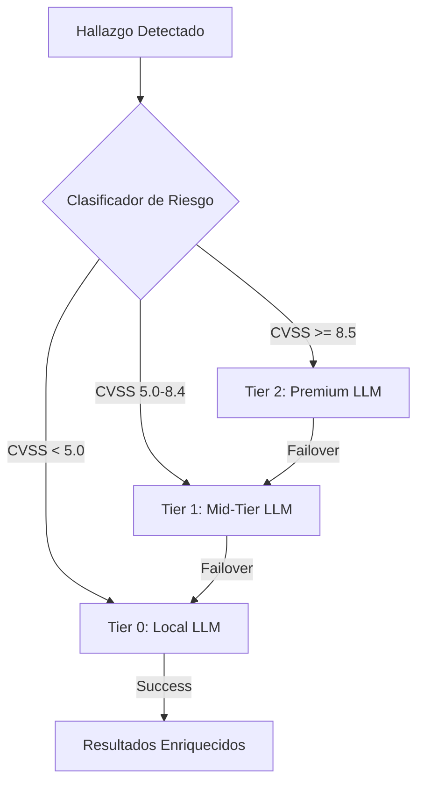
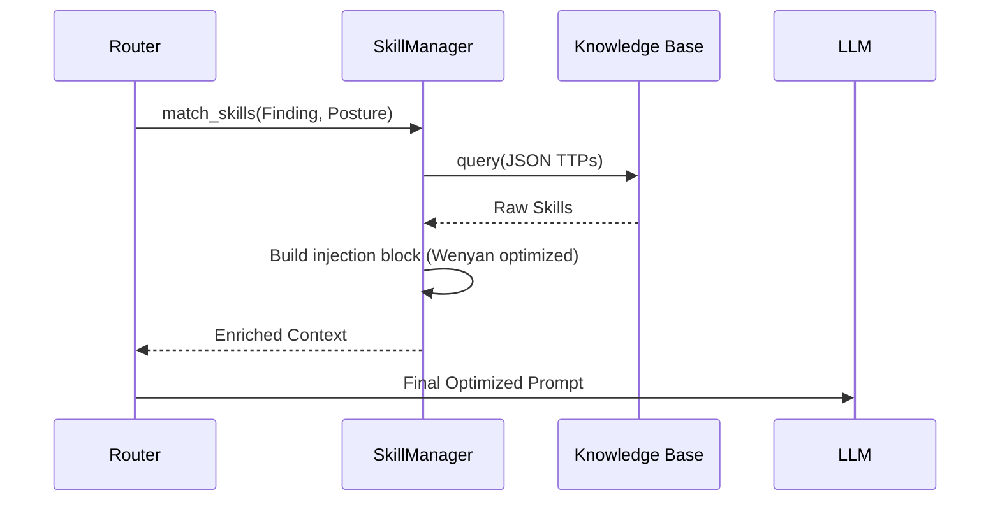

# 🧠 Infraestructura IA & Prompt Engineering

OsintUltimate implementa una capa de abstracción de IA de alto rendimiento diseñada para maximizar la precisión técnica mientras se minimiza el costo operativo y la latencia. El sistema utiliza un motor de enrutamiento por niveles (Tiered Routing) y una tubería de optimización de tokens de 10 etapas.

## 1. Enrutamiento por Niveles (Tiered Routing)

El `TieredAIRouter` actúa como el despachador central, clasificando cada hallazgo y tarea según su complejidad técnica y severidad.

### Estrategia de Selección de Tiers
*   **Tier 2 (Premium)**: Utilizado para análisis críticos de vulnerabilidades de alto impacto (CVSS ≥ 8.5) y planes de persistencia C2 avanzados. Modelos: GPT-4o, Claude 3.5 Sonnet.
*   **Tier 1 (Mid)**: Balance óptimo entre costo y razonamiento para tareas de escaneo activo y análisis de configuración (CVSS 5.0 - 8.4). Modelos: GPT-3.5 Turbo, Gemini 1.5 Flash.
*   **Tier 0 (Local)**: Prioridad máxima para privacidad y bajo costo en tareas de análisis de código fuente y reconocimiento masivo. Modelos: Ollama (Llama 3 / CodeLlama), Microsoft Phi-3.

---

## 2. Optimización de Tokens de 10 Etapas

Para reducir el "bleed" de créditos API y permitir contextos masivos, OsintUltimate utiliza el **v13 Deterministic Prompt Optimizer**. Este motor procesa los prompts a través de diez transformaciones sucesivas.

### Etapas de Optimización
1.  **Extractive Compressor**: Puntúa cada línea según su señal técnica (Keywords como `proxy`, `payload`, `vuln`) y elimina las de baja relevancia.
2.  **Entropy Pruner**: Elimina adverbios de baja entropía (e.g., "basically", "actually") que no aportan valor operativo.
3.  **Verbosity Reducer**: Colapsa frases verbales largas (e.g., "in order to" -> "to").
4.  **Article Stripper**: Elimina artículos definidos e indefinidos (a, an, the).
5.  **Filler Remover**: Limpia palabras de cortesía o relleno innecesario.
6.  **Synonym Mapper**: Abrevia términos técnicos largos (e.g., `vulnerability` -> `vuln`).
7.  **Suffix Lemmatizer**: Elimina sufijos gramaticales (-ing, -ed, -ly) con una heurística de detección de código endurecida para prevenir la corrupción de contextos técnicos.
8.  **Punctuation Pruner**: (Modo Ultra) Elimina puntuación no estructural.
9.  **Wenyan Ultra**: (Modo Ultra) Sustituye términos técnicos comunes por glifos CJK de un solo carácter (e.g., `security` -> `安`).
10. **Deduplicator**: Pase final para eliminar redundancias introducidas por las etapas anteriores.

### Resultados de Compresión
*   **Lite Mode**: ~15-20% de ahorro (Lectura humana intacta).
*   **Full Mode**: ~40-60% de ahorro (Legible para LLMs modernos).
*   **Ultra Mode (Wenyan)**: ~80% de ahorro (Optimizado para agentes autónomos V15).

---

## 3. Inyección de Habilidades Técnicas (SkillManager)

A diferencia de los prompts estáticos, OsintUltimate utiliza un sistema de **RAG Técnico** para inyectar conocimientos específicos de Red Team (TTPs) en el momento justo del análisis.

### Flujo de Habilidades
*   **Matching**: El `SkillManager` selecciona fragmentos de conocimiento basados en la categoría del hallazgo y la postura actual (`Ghost`, `Strike`, `Breach`).
*   **Dynamic Budgeting**: El presupuesto de tokens para habilidades se escala según el Tier del modelo (más contexto para modelos Premium).
*   **Surgical Injection**: Las habilidades se inyectan como "bloques de experto" que dictan la lógica de decisión del agente sin necesidad de re-entrenamiento.

---

## 4. OPSEC & Privacidad (PII Scrubbing)

Antes de que cualquier dato llegue a proveedores de IA externos (Azure/OpenAI/Anthropic), el `Scrubber` procesa la información para proteger la infraestructura:

- **Identity Masking**: Reemplaza nombres de usuarios, IPs internas y paths sensibles por placeholders sintéticos.
- **Credential Stripping**: Elimina automáticamente tokens, API keys y hashes detectados en el contexto de ataque.
- **Tactical Cache**: Utiliza una caché **LRU (moka)** para evitar enviar el mismo hallazgo crítico a la IA varias veces, protegiendo tanto el presupuesto como la exposición de datos y garantizando la consistencia del contexto bajo carga masiva.

---

> [!IMPORTANT]
> El modo **Wenyan Ultra** está diseñado exclusivamente para interacción máquina-máquina. Los operadores que deseen leer los logs de IA en lenguaje natural deben configurar el nivel de optimización en `Lite` o `Off`.
