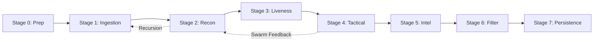

# ⚙️ Engine Core: El Pipeline Soberano (V15.4)

El núcleo de OsintUltimate está diseñado para el alto rendimiento y la ejecución autónoma en entornos endurecidos. El sistema se aleja de los escaneos lineales tradicionales en favor de un **Pipeline Soberano de 8 Etapas**, coordinado mediante canales asíncronos y memoria protegida.

## 1. El Pipeline Soberano (8 Etapas)

La arquitectura de datos de OsintUltimate garantiza que cada activo pase por una serie de guardias de seguridad y enriquecimiento antes de su persistencia final.

### Diagrama de Flujo del Pipeline

---

## 2. Inmersión Técnica por Etapa

### Etapa 0: Mission Preparation
Antes de iniciar cualquier acción de red, el sistema inicializa el entorno operativo:
- **Metadatos**: Se genera un objeto `ScanMetadata` que firma la línea de comandos utilizada y el timestamp de inicio.
- **Sink Init**: El `DataSink` abre los manejadores de archivos en modo exclusivo para evitar colisiones.

### Etapa 1: Autonomous Ingestion
Gestiona la elasticidad del stream de objetivos entrada:
- **Backpressure**: Escala el tamaño de los canales `mpsc` según la concurrencia configurada `(concurrency * 2)`.
- **ShutDown Logic**: Utiliza `CancellationToken` para detener la ingesta de nuevos objetivos instantáneamente sin corromper los que están en tránsito.

### Etapa 2: Recon/Discovery (Scout)
Expansión de la superficie mediante el pool de plugins de descubrimiento:
- **Filtro Bloom**: Implementa un filtro de probabilidad (`FP 0.01%`) para deduplicar millones de activos en memoria de forma atómica.
- **Recursión Táctica**: Cada subdominio descubierto se re-inyecta en la Etapa 1, permitiendo un descubrimiento recursivo infinito hasta que la superficie se estabiliza.

### Etapa 3: Liveness Verification (Gate)
La barrera de seguridad crítica del sistema:
- **Egress Shielding**: La función `is_safe_ip` valida cada resolución DNS.
- **Protección DNS Rebinding**: Bloquea IPs privadas (RFC1918) y loopback, evitando que plugins mal configurados o maliciosos ataquen la infraestructura local del operador.

### Etapa 4: Tactical Execution (War Room)
El motor de asalto donde reside la inteligencia:
- **Orquestador**: Gestiona la ejecución concurrente de plugins mediante `JoinSet`.
- **Memory Backpressure**: Un semáforo monitoriza el uso de memoria física de las herramientas externas; si el sistema detecta presión crítica, ralentiza el despacho de nuevos agentes automáticamente.

### Etapa 5: Post-Scan Enrichment (Intel)
Transformación de datos crudos en inteligencia:
- **Logica CVE**: Se utiliza un `CveCacheManager` global que mapea hallazgos a la base de datos de vulnerabilidades conocida.
- **Inyección de Referencias**: Enriquece automáticamente cada hallazgo con scores CVSS, referencias técnicas y rutas tácticas de explotación.

### Etapa 6: Integrity Filtering (Clean)
Limpieza de ruido operativa:
- **False Positive Filter**: Evalúa cada hallazgo contra firmas conocidas de falsos positivos y puntuaciones de confianza basadas en la fidelidad de la herramienta emisora.

### Etapa 7: Sovereign Persistence (Out)
Persistencia de alta velocidad basada en **Lock-Free Concurrency**:
- **Sumidero V4**: Utiliza una `SegQueue` que permite a múltiples hilos de agentes empujar datos sin bloqueos.
- **Persistence Worker**: Un hilo dedicado consume los lotes de datos y realiza la escritura en disco de forma atómica, garantizando que el I/O no bloquee la velocidad del ataque en la Etapa 4.

---

## 3. Seguridad de Plugins y Aislamiento

OsintUltimate implementa una cadena de carga de plugins de 9 pasos para garantizar que no se ejecute código no autorizado:
1.  **Harden Path**: Normalización de rutas de plugins.
2.  **TOCTOU Lock**: Bloqueo de archivos durante la verificación.
3.  **Signature Verification**: Comprobación de firma Ed25519 del plugin.
4.  **ABI Check**: Verificación de compatibilidad binaria.
5.  **Capability Check**: Validación de permisos requeridos por el plugin.
6.  **Metadata Load**: Carga de metadatos ofensivos.
7.  **Sandbox Spawning**: Preparación del entorno aislado para herramientas.
8.  **Policy Alignment**: Validación contra `ScanLayerPolicy`.
9.  **Execution Slot Admission**: Admisión concurrente regulada.

---

> [!IMPORTANT]
> El pipeline está diseñado para ser **Fail-Closed**. Si la comprobación de salud de la Etapa 3 falla para un host, el sistema descarta el objetivo por completo en lugar de arriesgar una ejecución sin proxies o con IPs inseguras.
