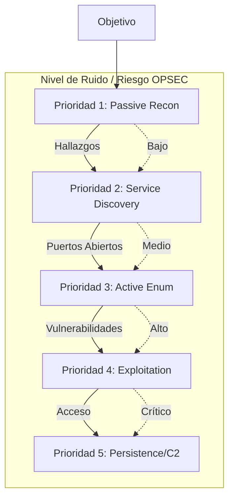
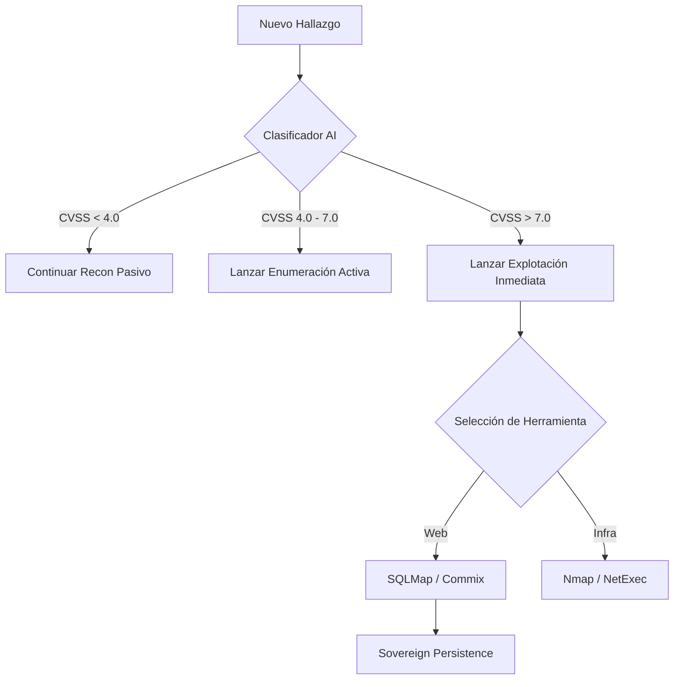

# 🧰 Arsenal de Herramientas y Plugins (Listado Completo)

OsintUltimate no reinventa la rueda; orquesta las mejores herramientas de la industria y de la distribución **BlackArch Linux** mediante wrappers nativos en Rust que garantizan el sigilo y el procesamiento de datos por IA.

---

## 0. Jerarquía y Prioridad de Ejecución

El sistema no lanza todas las herramientas a la vez. Utiliza una **Estrategia de Cascada Táctica** para minimizar el ruido y maximizar el éxito.

### Diagrama de Prioridades (Cascada)

---

## 1. Fase de Reconocimiento (OSINT, Active & Passive)
Estas herramientas se ejecutan en la Etapa 2 (Discovery) para mapear la superficie de ataque.

| Herramienta | Categoría | Función Principal |
| :--- | :--- | :--- |
| **Subfinder** | OSINT | Descubrimiento pasivo de subdominios de alta velocidad. |
| **Amass** | OSINT | Mapeo de DNS y enumeración de infraestructura de red. |
| **Uncover** | OSINT | Búsqueda en motores de internet (Shodan, Censys, FOFA). |
| **SovereignRecon**| OSINT | Plugin interno (Rust) para correlación de activos. |
| **DNSx** | Active | Resolución concurrente masiva y validación de Liveness. |
| **HTTPx** | Active | Probing de servicios HTTP/HTTPS y recolección de banners. |
| **Naabu** | Active | Escaneo rápido y sigiloso de puertos basado en SYN. |
| **Gitleaks** | Passive | Detección de secretos expuestos en repositorios git. |
| **Trufflehog** | Passive | Escaneo de credenciales en repositorios y buckets S3. |
| **Wayback / Gau**| Passive | Recuperación de URLs y endpoints históricos desde Wayback Machine. |
| **Subzy** | Active | Detección agresiva y validación de Subdomain Takeover. |
| **JSluice** | Active | Extracción de secretos y endpoints desde JS (AST parsing). |
| **CertStream** | Real-Time | Descubrimiento en vivo de certificados CT (Caza de subdominios). |
| **Waymore** | Passive | Descubrimiento masivo de URLs históricas y parámetros. |
| **AlterX** | Active | Generación inteligente de permutaciones de subdominios. |
| **GitHub Dorks** | Recon / Passive | Escaneo automatizado de fugas de datos en GitHub mediante dorks específicos. |
| **H2C Smuggler** | Exploit / Web | Detección de HTTP/2 Cleartext smuggling para bypass de proxies y WAFs. |

---

---

## 2. Fase de Enumeración (Network, Web & Cloud)
Identificación de rutas ocultas, tecnologías, configuraciones inseguras y cloud assets.

### Enumeración de Red
*   **Nmap:** Escaneo profundo de puertos y detección de versiones (Service ID, OS Enum).
*   **Rustscan:** Escaneo ultra-rápido como puente hacia Nmap.
*   **Net Engine:** Implementación nativa para validaciones a nivel de socket.

### Enumeración Web (HTTP/S)
*   **Fuzzing & Rutas:** FFuf, Feroxbuster, Kiterunner (APIs), Katana, Dirsearch.
*   **CGI / Parámetros:** x8 (descubrimiento de parámetros de alto rendimiento), Arjun.
*   **GraphQL Hunt:** **InQL** (introspección y esquema), GraphQL Cop.
*   **Prototype Pollution:** **Ppmap** (detección y payloads de contaminación).
*   **CORS Audit:** **Corsy** (análisis de orígenes y cabeceras de credenciales).
*   **Cache Deception:** **WcdScanner** (sondeo de caché vía extensiones estáticas).
*   **Scanners de Config:** Nikto, Snallygaster, WPSec (WordPress), WhatWeb, Tsunami (GCP Scanner).
*   **Patrones y Endpoints:** GF (Grep Patterns), Interactsh (OOB Engine), JSluice (Endpoints en JS).

### Enumeración Cloud (AWS, Azure, GCP)
*   **Pacu / Prowler:** Auditoría de seguridad y enumeración en AWS.
*   **CloudFox / CloudEnum:** Detección de activos y permisos en entornos multicloud.
*   **CloudBrute / KubeBench:** Fuerza bruta de buckets y validación CIS de Kubernetes.

---

## 3. Inteligencia y Auditoría (Vulnerability Scanners)
Plugins que cruzan firmas de vulnerabilidades contra los activos.

| Herramienta | Función Principal |
| :--- | :--- |
| **Nuclei** | Escáner masivo basado en templates YAML (Vulnerabilidades conocidas). |
| **Jaeles** | Escáner similar a Nuclei, especializado en payloads Web/API. |
| **Searchsploit**| Búsqueda automatizada de exploits públicos (Exploit-DB) según versión. |
| **GreyNoise** | Inteligencia de red para identificar ruido de fondo y escáneres masivos. |
| **Trivy / OSV** | Escaneo de vulnerabilidades en contenedores e infraestructuras. |
| **Checkov** | Auditoría de infraestructura como código (IaC). |

---

## 4. Fase de Explotación y Escalada (Strike Mode)
Ataques dirigidos ejecutados bajo confirmación o en modo autónomo si la política lo permite.

### Explotación Web
*   **SQLMap:** Inyecciones SQL (Blind, Time-based, Error-based).
*   **Commix:** Explotación de Inyección de Comandos (RCE).
*   **Dalfox:** Escaneo y validación de Cross-Site Scripting (XSS).
*   **JWT_Tool:** Auditoría de tokens JSON (Firma nula, KIDs, bypass).
*   **GraphQL Cop:** Ataques a endpoints de GraphQL (Introspection, Batching).
*   **NoMore403:** Bypass avanzado de restricciones 403/401 (Headers/Paths).
*   **Smuggler:** Detección de HTTP Request Smuggling (CL.TE/TE.CL).
*   **Wapiti:** Inyección automática de payloads y black-box testing.
*   **SSRF-King:** Detección de Blind SSRF mediante interacción OOB (Interactsh).
*   **Tplmap:** Detección y explotación de SSTI (Server-Side Template Injection).
*   **OpenRedirex:** Fuzzer avanzado para vulnerabilidades de Open Redirect.

### Explotación de Red y Active Directory (Gated: Sovereign)
Las herramientas de esta categoría están restringidas al perfil **Sovereign** mediante gating a nivel de compilación para garantizar el cumplimiento en programas de Bug Bounty.

| Herramienta | Perfil Requerido | Función Principal |
| :--- | :--- | :--- |
| **Impacket** | Sovereign / APT | Navaja suiza para ataques a protocolos Microsoft (SMB, WMI). |
| **NetExec** | Standard | (Anteriormente CrackMapExec) Pivoting y fuerza bruta en redes corporativas. |
| **Responder** | Sovereign / APT | Envenenamiento LLMNR/NBT-NS y relay de NTLM. |
| **PetitPotam** | Sovereign / APT | Coerción forzada de autenticación (RPC) en Active Directory. |
| **Coercer** | Sovereign / APT | Coerción forzada de autenticación (RPC) avanzada. |
| **Hydra** | Standard | Fuerza bruta contra servicios de login (SSH, FTP). |

### Escalada de Privilegios (PrivEsc - Gated: Sovereign)
| Herramienta | Perfil Requerido | Función Principal |
| :--- | :--- | :--- |
| **Certipy** | Sovereign / APT | Abuso de servicios de certificados en ADCS. |
| **Privesc Hunter**| Sovereign / APT | Automatización de rutas de escalada local (Wrappers LinPEAS/WinPEAS). |
| **ScareCrow** | Sovereign / APT | Framework de obfuscación de payloads para evadir EDRs. |
| **Donut** | Sovereign / APT | Generador de shellcode para evasión avanzada. |

---

## 5. Movimiento Lateral, Persistencia y C2 (Breach - Gated: Sovereign)
Consolidación de acceso una vez que se compromete una máquina objetivo.

| Herramienta | Perfil Requerido | Protocolo / Enfoque |
| :--- | :--- | :--- |
| **Bloodhound** | Sovereign / APT | Mapeo de rutas al Domain Admin vía LDAP. |
| **Ligolo-ng** | Sovereign / APT | Túneles tácticos inversos (TUN/TAP) para movimiento lateral. |
| **Sliver / Havoc**| Sovereign / APT | Frameworks C2 integrados para comando y control. |
| **Burp / ZAP / Caido**| Standard | Puentes de verificación y proxificado manual. |

---

## 6. Seguridad Móvil (Mobile Security)
Análisis de artefactos (.apk, .ipa) y auditoría de runtime en dispositivos móviles.

| Herramienta | Función Principal |
| :--- | :--- |
| **MobSF** | Framework de análisis estático y dinámico para Android/iOS. |
| **Frida** | Inyección de scripts para instrumentación dinámica en tiempo de ejecución. |
| **Objection** | Toolkit de exploración de runtime para aplicaciones móviles (vía Frida). |
| **Mariana Trench**| Escáner de flujo de datos (Taint Analysis) para detectar brechas de privacidad en Android. |
| **APKLeaks** | Búsqueda de secretos, APIs y endpoints ocultos en archivos APK. |
| **Drozer** | Evaluación de la superficie de ataque y exposición de componentes en Android. |
| **Apktool / Jadx** | Descompilación y análisis de código fuente Java/Smali. |

---

## 7. Seguridad de IA/LLM (AI & LLM Red Teaming)
Arsenal especializado en la auditoría de modelos de lenguaje y aplicaciones basadas en IA.

| Herramienta | Función Principal |
| :--- | :--- |
| **Garak** | Escáner de vulnerabilidades de LLM (hallucinations, bias, jailbreak). |
| **PyRIT** | Framework de automatización para Red Teaming de sistemas de IA (Microsoft). |
| **Promptmap** | Mapeo y prueba de vectores de inyección de prompts (Prompt Injection). |
| **Vigil** | Auditoría de filtros de entrada/salida en aplicaciones LLM. |
| **Rebuff** | Detección y protección contra ataques de inyección de prompts. |
| **Promptfoo** | Harness de pruebas de regresión y evaluación de prompts para LLM. |
| **LLMFuzzer** | Fuzzing de caja negra para descubrir fallos en endpoints de IA. |
| **ModelScan** | Escaneo de artefactos de modelos ML (pkl, h5, onnx) en busca de malware. |
| **PromptInject**| Corpus de inyecciones clásicas para validación de robustez en prompts. |
| **JWT_Tool Pro**| Auditoría de tokens con parsing JSON estructurado para `alg:none` y `confusion`. |

---

## 8. Configuración por Programa (ProgramConfig)
Para operaciones profesionales de Bug Bounty, el sistema permite cargar archivos `program.toml` o `program.json` que sobrescriben el comportamiento global:
- **Límites de Velocidad (RPS)**: Control granular para evitar bloqueos por WAF.
- **Nuclei Custom Templates**: Ruta a plantillas privadas para el programa.
- **Endpoints Excluidos**: Lista negra de rutas (ej. `/logout`, `/delete`) para evitar acciones destructivas.
- **Cabeceras Personalizadas**: Inserción de cabeceras de identificación (ej. `X-Bug-Bounty: user`).

## 9. Lógica de Priorización de la IA (Swarm Intelligence)

Cuando el modo **Swarm** está activo, la IA toma decisiones de ejecución basadas en los siguientes pesos de prioridad:

1.  **Costo de Tokens vs Probabilidad de Éxito**: Prefiere herramientas que devuelven JSON estructurado (Nmap, Nuclei) sobre herramientas de texto plano extensas.
2.  **Severidad del Hallazgo**: Un puerto `445` (SMB) abierto disparará automáticamente plugins de `Enumeration` de Active Directory con prioridad máxima por encima de un puerto `80`.
3.  **Estado del Presupuesto (Token Budgeting)**: Si queda menos del 20% del presupuesto de IA, el sistema entrará en modo "Economy", ejecutando solo plugins de Recon Pasivo para conservar recursos para la persistencia.

### Diagrama de Decisión Táctica

---

> [!IMPORTANT]
> **Prioridad de Herramientas Críticas:** `Nmap`, `Nuclei` y ahora `MobSF`/`Garak` (en sus respectivos dominios) se consideran herramientas de "Anclaje". El motor siempre intentará ejecutarlas primero en cualquier host o artefacto vivo para establecer la línea base de la superficie táctica. Todas las herramientas arriba descritas están mapeadas a archivos nativos `.rs` dentro del árbol `src/plugins/` y controladas mediante el `Orchestrator` de OsintUltimate.
