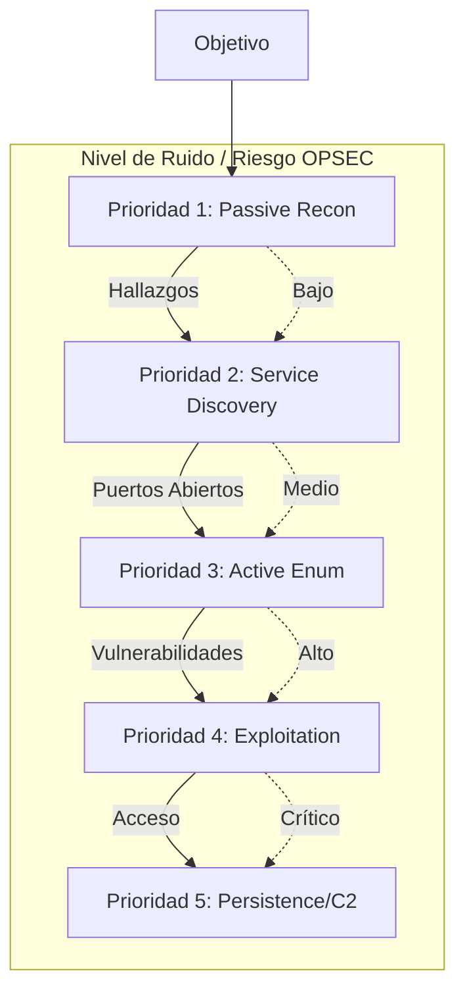
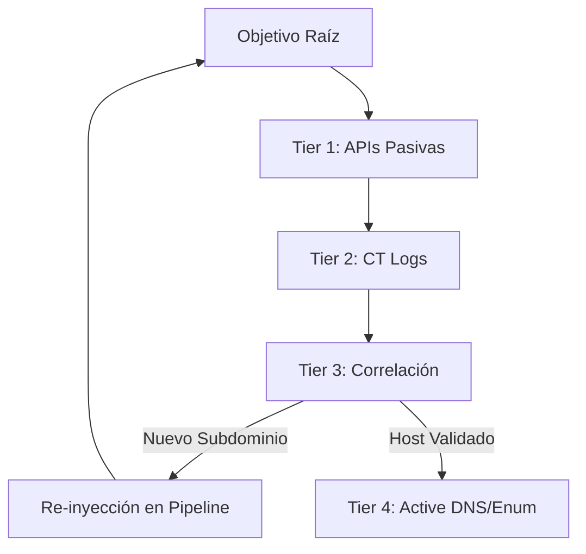
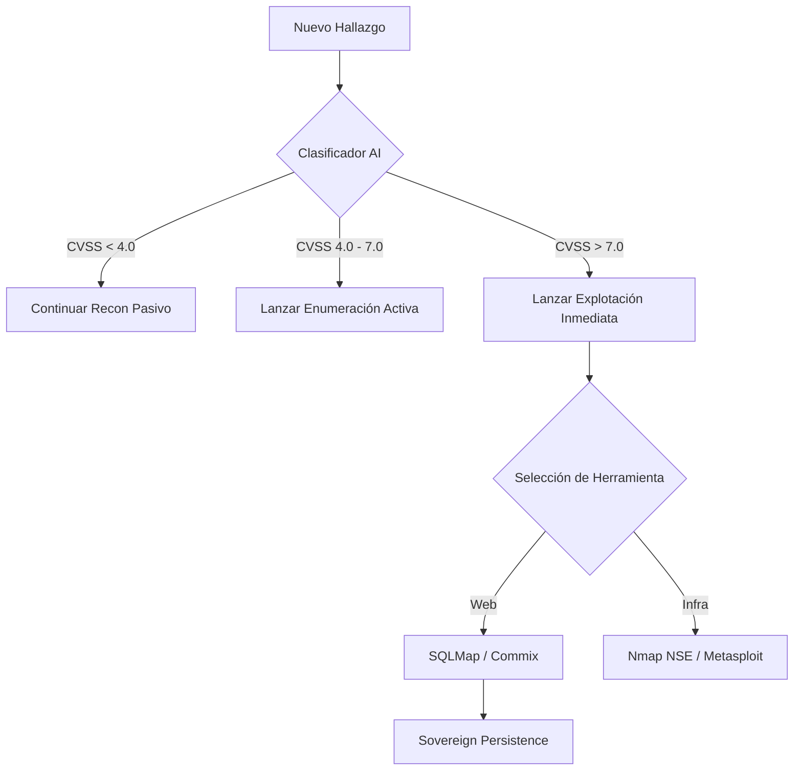

# 🧰 Arsenal de Herramientas y Plugins

OsintUltimate no reinventa la rueda; orquesta las mejores herramientas de la industria y de la distribución **BlackArch Linux** mediante wrappers nativos en Rust que garantizan el sigilo y el procesamiento de datos por IA.

---

## 0. Jerarquía y Prioridad de Ejecución

El sistema no lanza todas las herramientas a la vez. Utiliza una **Estrategia de Cascada Táctica** para minimizar el ruido y maximizar el éxito.

### Diagrama de Prioridades (Cascada)

---

## 1. Fase de Reconocimiento (Passive & OSINT)
Estas herramientas se ejecutan en la Etapa 2 (Discovery) para mapear la superficie sin interacción directa.

| Herramienta | Función Principal | Modo OPSEC |
| :--- | :--- | :--- |
| **Subfinder** | Descubrimiento de subdominios de alta velocidad. | Pasivo (API) |
| **Amass** | Mapeo de DNS y enumeración de infraestructura. | Pasivo/Activo |
| **Uncover** | Búsqueda en motores de búsqueda de internet (Shodan, Censys). | Pasivo (API) |
| **SovereignRecon** | Plugin interno para correlación de activos descubiertos. | Interno |

### Jerarquía Interna de Reconocimiento
No todas las herramientas de recon se lanzan al mismo tiempo. El motor sigue este orden lógico:

1.  **Tier 1: Pasivo Instantáneo (Subfinder/Uncover)**: Consulta de APIs externas. Cero interacción con el objetivo.
2.  **Tier 2: Transparencia de Certificados (CRT.sh)**: Búsqueda en logs de SSL/TLS.
3.  **Tier 3: Correlación (SovereignRecon)**: Fusión de datos y eliminación de ruido en memoria.
4.  **Tier 4: Resolución Activa (Amass Active)**: Solo si es necesario, se realizan consultas DNS directas al objetivo.

---

## 2. Fase de Enumeración (Network & Web)
Identificación de servicios y vulnerabilidades de configuración.

| Herramienta | Función Principal | Aislamiento |
| :--- | :--- | :--- |
| **Nmap** | Escaneo de puertos y detección de versiones (Service ID). | Docker Sandbox |
| **Rustscan** | Escaneo de puertos ultra-rápido basado en Rust. | Nativo |
| **Snallygaster** | Búsqueda de archivos sensibles en servidores web. | Docker Sandbox |
| **FFuf / Dirsearch** | Fuzzing de directorios y descubrimiento de rutas. | Docker Sandbox |
| **ZMap** | Escaneo de redes a nivel de internet (Port 80/443). | Nativo |

---

## 3. Fase de Explotación y Validación (Strike)
Plugins que ejecutan ataques tácticos autorizados.

| Herramienta | Vector de Ataque | Prioridad AI |
| :--- | :--- | :--- |
| **SQLMap** | Explotación de Inyección SQL. | Crítica |
| **Commix** | Explotación de Inyección de Comandos (OS Command Injection). | Crítica |
| **Dalfox** | Escaneo y validación de Cross-Site Scripting (XSS). | Alta |
| **JWT_Tool** | Auditoría y manipulación de tokens JSON Web Tokens. | Media |
| **GraphQL Cop** | Auditoría de seguridad para endpoints GraphQL. | Media |

---

## 4. Fase de Persistencia y C2 (Breach)
Consolidación de acceso y movimiento lateral.

| Herramienta | Función | Protocolo |
| :--- | :--- | :--- |
| **Havoc C2** | Framework de comando y control avanzado. | HTTPS/mTLS |
| **Ligolo-ng** | Túneles tácticos para movimiento lateral y pivoting. | TCP/TLS |
| **Bloodhound** | Análisis de caminos de ataque en Active Directory. | Interno |
| **SovereignC2** | Orquestador de sesiones internas de OsintUltimate. | mTLS |

---

## 5. Infraestructura de Verificación (OOB)
Para detectar vulnerabilidades ciegas (Out-of-Band).

*   **Interactsh**: Cliente para interacción OOB (DNS, HTTP, SMTP).
*   **Burp Collaborator**: Integración mediante puente para verificación OOB premium.
*   **Interactsh (Self-Hosted)**: Servidor dedicado en Azure Africa para máximo sigilo.

---

## ⚙️ ¿Cómo se cargan estas herramientas?

Cada herramienta listada arriba tiene un **Wrapper de Rust** en `src/plugins/` que hereda el trait `Plugin`. Este wrapper se encarga de:
1.  **Formatear argumentos**: Traduce la intención de la IA a flags de comando (e.g., `nmap -sV`).
2.  **Envolver en Proxy**: Inyecta automáticamente el uso de `proxychains4` si el sigilo está activo.
3.  **Parsers Estrictos**: Convierte el output (JSON/Texto) en objetos `Finding` estructurados para el motor.

---

## 6. Lógica de Priorización de la IA (Swarm Intelligence)

Cuando el modo **Swarm** está activo, la IA toma decisiones de ejecución basadas en los siguientes pesos de prioridad:

1.  **Costo de Tokens vs Probabilidad de Éxito**: Prefiere herramientas que devuelven JSON estructurado (Nmap, Nuclei) sobre herramientas de texto plano extensas.
2.  **Severidad del Hallazgo**: Un puerto `445` (SMB) abierto disparará automáticamente plugins de `Enumeration` de Active Directory con prioridad máxima por encima de un puerto `80`.
3.  **Estado del Presupuesto (Token Budgeting)**: Si queda menos del 20% del presupuesto de IA, el sistema entrará en modo "Economy", ejecutando solo plugins de Recon Pasivo para conservar recursos para la persistencia.

### Diagrama de Decisión Táctica

---

> [!IMPORTANT]
> **Prioridad de Herramientas Críticas:** `Nmap` y `Nuclei` se consideran herramientas de "Anclaje". El motor siempre intentará ejecutarlas primero en cualquier host vivo para establecer la línea base de la superficie táctica.
