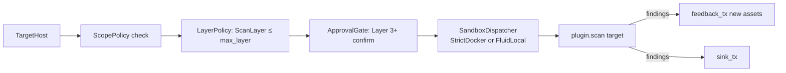

# Plugin Arsenal & Tool Registry

> Source-verified from `src/plugins/`. Last verified: 2026-05-08.
> `sovereign` = compile-time gated (`#[cfg(feature = "sovereign")]`). Not in default release builds.

---

## Plugin Execution Model

Plugins are not run all at once. The `Orchestrator` dispatches them based on the `ScanLayerPolicy` gate. Each plugin declares its `ScanLayer` in `PluginMetadata`.



**ScanLayer thresholds:**

| Layer | Value | Examples |
|---|---|---|
| Passive | 0 | CertStream, passive OSINT, Shodan lookup |
| Discovery | 1 | Subfinder, Amass, DNSx, ASN mapping |
| Scanning | 2 | Nmap, Nuclei, HTTPx, Katana, Shuffledns |
| Verification | 3 | PocValidator, interaction checks |
| Exploitation | 4 | SQLMap, Ghauri, SSRF tools, XSS scanners |
| PostExploitation | 5 | C2, lateral movement, persistence (`sovereign`) |

Default `--max-layer scanning`. Use `--max-layer exploitation` to unlock Layer 4.

---

## Plugin Namespaces

### `reconnaissance` — Layer 1-2

Passive and active surface mapping.

| Plugin | Tool | Key env / config |
|---|---|---|
| passive subdomain discovery | subfinder, amass | — |
| ASN mapping | asnmap | — |
| CDN/cloud detection | cdncheck | — |
| TLS fingerprinting | tlsx | — |
| CertStream daemon | certstream | `CERTSTREAM_KEYWORDS` |
| Shodan lookup | shodan API | `SHODAN_API_KEY` |
| Netlas lookup | netlas API | `NETLAS_API_KEY`, `NETLAS_DAILY_BUDGET` |
| SecurityTrails | securitytrails API | `SECURITYTRAILS_API_KEY` |
| CriminalIP | criminalip API | `CRIMINALIP_API_KEY` |
| Scope extraction | bbscope | — |

---

### `enumeration` — Layer 2

#### Network

| Plugin | Tool | Notes |
|---|---|---|
| Port scanning | nmap | configured by `NmapOptions` (stealth, fragment, decoy, ports, vuln_scan) |
| Web probing | httpx | — |
| DNS resolution | shuffledns | `SHUFFLEDNS_PATH`, `SHUFFLEDNS_RESOLVERS`, `SHUFFLEDNS_WORDLIST` |
| Mass DNS | massdns | `MASSDNS_PATH` |

#### Web

| Plugin | Tool | Notes |
|---|---|---|
| Vulnerability templates | nuclei | `NUCLEI_TAGS`, `NUCLEI_SEVERITY`, `NUCLEI_CUSTOM_TEMPLATES`, `NUCLEI_AUTO_UPDATE` |
| Web crawling | katana | — |
| Directory brute-force | ffuf | — |
| GraphQL schema discovery | clairvoyance | `CLAIRVOYANCE_WORDLIST` |
| JS endpoint extraction | custom | finds `FINDING_JS_ENDPOINT` |
| Historical URLs | waymore | finds `FINDING_WAYMORE_URL` |

---

### `exploitation` — Layer 4

All exploitation plugins require `--max-layer exploitation` or higher.

| Plugin | Tool | Key config | Target |
|---|---|---|---|
| SSRF chain generator | gopherus | `GOPHERUS_PATH` | generates payloads for SSRF → RCE |
| SSRF mapper | ssrfmap | `SSRFMAP_PATH` | blind SSRF + OOB detection |
| SQL injection | ghauri | `GHAURI_PATH` | modern SQLi (alternative to sqlmap) |
| S3 bucket scanner | s3scanner | `S3SCANNER_PATH`, `S3SCANNER_WORDLIST` | open bucket enumeration |
| Reflected XSS | kxss | `KXSS_PATH` | parameter reflection detection |
| NoSQL injection | nosqlmap | `NOSQLMAP_PATH` | MongoDB/Redis injection |
| Auth State Machine | custom | — | OAuth2/OIDC state fixation & step skipping |

---

### `intelligence` — Layer 1

OSINT aggregation and threat correlation. No active scanning.

---

### `verification` — Layer 3

**PocValidator** (`src/core/validation/`): AI-driven PoC generation and verification.

1. `TieredAIRouter.analyze()` — generates a PoC hypothesis.
2. `ValidationGenerator` — transforms hypothesis into executable payload.
3. `ValidationExecutor` — runs payload via `StealthExecutor`.
4. `SovereignValidator` — verifies response confirms vulnerability.
5. Finding status updated to `ValidationStatus::Verified` or `Failed`.

Only triggers for High/Critical findings (risk_score ≥ 8 in autonomous mode).

---

### `detection_evasion` — any layer

- `StealthPolicy` — rate-limiting, header randomization, UA rotation.
- `HumanJitter` — random delay 100–1500ms between requests. Applied in discovery stage when stealth mode active.

---

### `reporting` — sink-side (no layer gate)

Two generators in `src/plugins/reporting/bug_bounty.rs`:

**`generate_reports(target)`** — per-finding Markdown for Medium+ severity:
- Filename: `<host>_<finding-id>.md`
- Sections: Description → Impact → Steps to Reproduce (curl command or nuclei template) → PoC (raw HTTP or JSON evidence) → Exploit Path → References

**`generate_attack_chain_report(target, findings)`** — consolidated multi-finding report:
- Mermaid `graph TD` visualization of attack chain
- Combined impact assessment
- Full chain walkthrough per phase

Both written to `workspace/reports/drafts/` by `BugBountyDraftSink`.

---

### `compliance` — Layer 2

Policy-file driven audit. Reads `POLICY_FILE` env var. Uses `StaticPolicy` or file-loaded rules to gate plugin execution in strict_scope mode.

---

### `lateral_movement` `sovereign` — Layer 5

Active Directory coercion, credential relay. Requires `--max-layer post-exploitation`.

---

### `persistence` `sovereign` — Layer 5

`PersistenceOrchestrator` generates formal `TacticalPlan`:

| Method | Description |
|---|---|
| `SshKeyInjection` | Generates ephemeral Ed25519 keypairs, injects into `authorized_keys` |
| `WebShell` | Deploys obfuscated shell responding only to signed commands |
| `PersistentC2` | Deploys C2 implant with mTLS hardening |
| `ScheduledTask` | Cron/systemd-based persistence |
| `ServiceModification` | Modifies existing service configs |
| `RegistryAutorun` | Windows registry autorun (via Sovereign) |
| `ProcessInjection` | Injects into existing process memory |

C2 session lifecycle: `Staged → Deployed → Established → Sovereign`

---

### `privilege_escalation` `sovereign` — Layer 5

CredentialInjection, ADCS abuse (Certipy), local PrivEsc automation.

---

## Plugin Trait Contract

```rust
#[async_trait]
pub trait ScannerPlugin: Send + Sync {
    fn name(&self) -> &'static str;
    fn metadata(&self) -> PluginMetadata;      // layer, risk_level, capabilities, cost, mitre_attacks
    fn capabilities(&self) -> Vec<Capability>;
    async fn check_dependencies(&self) -> Result<bool>;
    async fn scan(&self, target: &TargetHost) -> Result<Vec<Finding>>;
    fn set_feedback_channel(&self, tx: Sender<TargetHost>) {}  // optional, for asset injection
}
```

`PluginMetadata.is_destructive` — if true, orchestrator enforces approval regardless of layer. `poc_mode` — non-destructive test mode available.

---

## Dynamic Plugin Loading

External `.so` plugins loaded from `--plugins-dir <DIR>` at runtime via `DynamicPluginLoader`. Signature verified (Ed25519) before loading. ABI compatibility checked. Runs through same `SandboxDispatcher` + `LayerPolicy` chain as built-in plugins.

---

## P0 Tools (Required at Startup)

These are checked by `binary_health_check()` at startup. Missing = warning, not abort:

```
bbscope   asnmap   cdncheck   tlsx   clairvoyance
```
