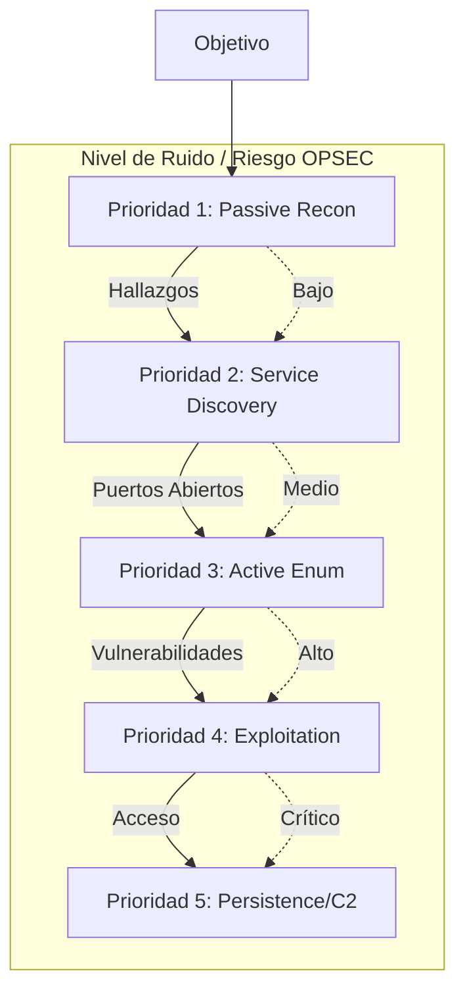
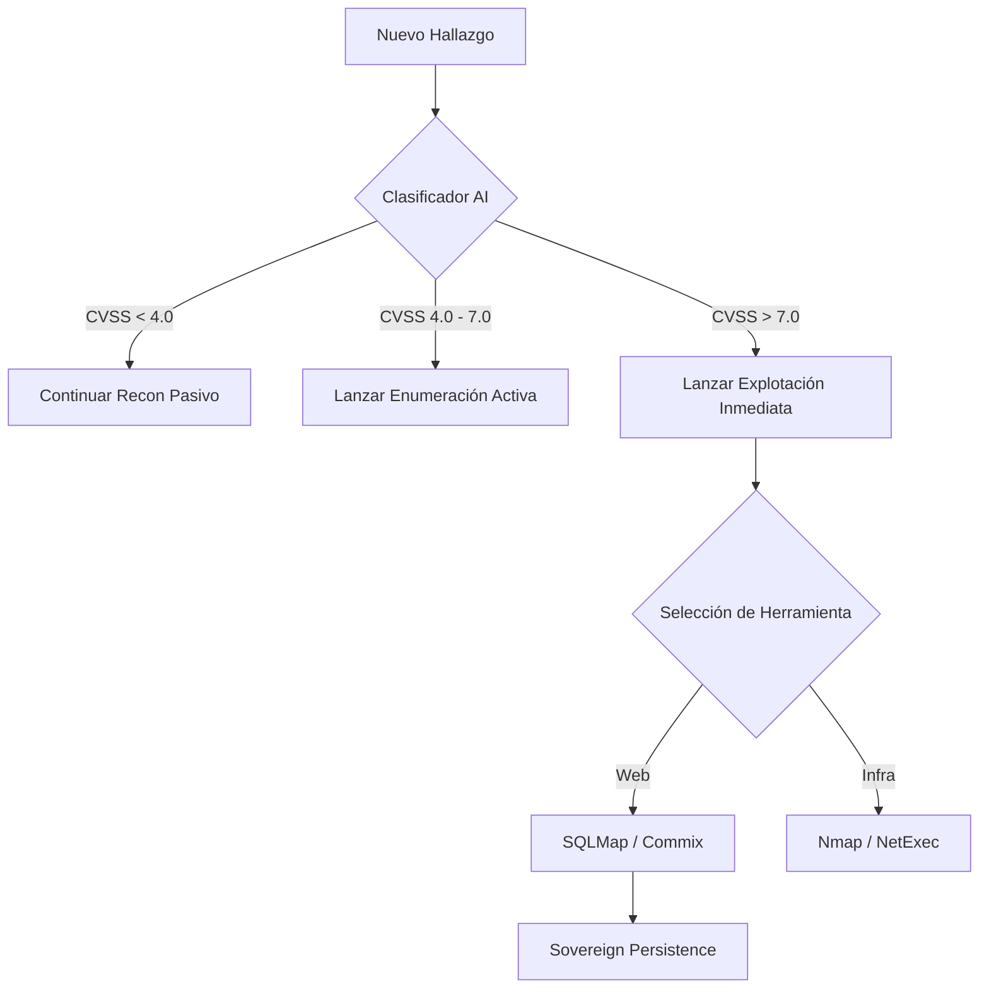

# 🧰 Arsenal de Herramientas y Plugins (Listado Completo)

OsintUltimate no reinventa la rueda; orquesta las mejores herramientas de la industria y de la distribución **BlackArch Linux** mediante wrappers nativos en Rust que garantizan el sigilo y el procesamiento de datos por IA.

---

## 0. Jerarquía y Prioridad de Ejecución

El sistema no lanza todas las herramientas a la vez. Utiliza una **Estrategia de Cascada Táctica** para minimizar el ruido y maximizar el éxito.

### Diagrama de Prioridades (Cascada)

---

## 1. Fase de Reconocimiento (OSINT, Active & Passive)
Estas herramientas se ejecutan en la Etapa 2 (Discovery) para mapear la superficie de ataque.

| Herramienta | Categoría | Función Principal |
| :--- | :--- | :--- |
| **Subfinder** | OSINT | Descubrimiento pasivo de subdominios de alta velocidad. |
| **Amass** | OSINT | Mapeo de DNS y enumeración de infraestructura de red. |
| **Uncover** | OSINT | Búsqueda en motores de internet (Shodan, Censys, FOFA). |
| **SovereignRecon**| OSINT | Plugin interno (Rust) para correlación de activos. |
| **DNSx** | Active | Resolución concurrente masiva y validación de Liveness. |
| **HTTPx** | Active | Probing de servicios HTTP/HTTPS y recolección de banners. |
| **Naabu** | Active | Escaneo rápido y sigiloso de puertos basado en SYN. |
| **Gitleaks** | Passive | Detección de secretos expuestos en repositorios git. |
| **Trufflehog** | Passive | Escaneo de credenciales en repositorios y buckets S3. |
| **Wayback / Gau**| Passive | Recuperación de URLs y endpoints históricos desde Wayback Machine. |
| **Subzy** | Active | Detección agresiva y validación de Subdomain Takeover. |
| **JSluice** | Active | Extracción de secretos y endpoints desde JS (AST parsing). |
| **CertStream** | Real-Time | Descubrimiento en vivo de certificados CT (Caza de subdominios). |
| **Waymore** | Passive | Descubrimiento masivo de URLs históricas y parámetros. |
| **AlterX** | Active | Generación inteligente de permutaciones de subdominios. |

---

## 2. Fase de Enumeración (Network, Web & Cloud)
Identificación de rutas ocultas, tecnologías, configuraciones inseguras y cloud assets.

### Enumeración de Red
*   **Nmap:** Escaneo profundo de puertos y detección de versiones (Service ID, OS Enum).
*   **Rustscan:** Escaneo ultra-rápido como puente hacia Nmap.
*   **Net Engine:** Implementación nativa para validaciones a nivel de socket.

### Enumeración Web (HTTP/S)
*   **Fuzzing & Rutas:** FFuf, Feroxbuster, Kiterunner (APIs), Katana, Dirsearch.
*   **CGI / Parámetros:** x8 (descubrimiento de parámetros de alto rendimiento), Arjun.
*   **GraphQL Hunt:** **InQL** (introspección y esquema), GraphQL Cop.
*   **Prototype Pollution:** **Ppmap** (detección y payloads de contaminación).
*   **CORS Audit:** **Corsy** (análisis de orígenes y cabeceras de credenciales).
*   **Cache Deception:** **WcdScanner** (sondeo de caché vía extensiones estáticas).
*   **Scanners de Config:** Nikto, Snallygaster, WPSec (WordPress), WhatWeb, Tsunami (GCP Scanner).
*   **Patrones y Endpoints:** GF (Grep Patterns), Interactsh (OOB Engine), JSluice (Endpoints en JS).

### Enumeración Cloud (AWS, Azure, GCP)
*   **Pacu / Prowler:** Auditoría de seguridad y enumeración en AWS.
*   **CloudFox / CloudEnum:** Detección de activos y permisos en entornos multicloud.
*   **CloudBrute / KubeBench:** Fuerza bruta de buckets y validación CIS de Kubernetes.

---

## 3. Inteligencia y Auditoría (Vulnerability Scanners)
Plugins que cruzan firmas de vulnerabilidades contra los activos.

| Herramienta | Función Principal |
| :--- | :--- |
| **Nuclei** | Escáner masivo basado en templates YAML (Vulnerabilidades conocidas). |
| **Jaeles** | Escáner similar a Nuclei, especializado en payloads Web/API. |
| **Searchsploit**| Búsqueda automatizada de exploits públicos (Exploit-DB) según versión. |
| **GreyNoise** | Inteligencia de red para identificar ruido de fondo y escáneres masivos. |
| **Trivy / OSV** | Escaneo de vulnerabilidades en contenedores e infraestructuras. |
| **Checkov** | Auditoría de infraestructura como código (IaC). |

---

## 4. Fase de Explotación y Escalada (Strike Mode)
Ataques dirigidos ejecutados bajo confirmación o en modo autónomo si la política lo permite.

### Explotación Web
*   **SQLMap:** Inyecciones SQL (Blind, Time-based, Error-based).
*   **Commix:** Explotación de Inyección de Comandos (RCE).
*   **Dalfox:** Escaneo y validación de Cross-Site Scripting (XSS).
*   **JWT_Tool:** Auditoría de tokens JSON (Firma nula, KIDs, bypass).
*   **GraphQL Cop:** Ataques a endpoints de GraphQL (Introspection, Batching).
*   **NoMore403:** Bypass avanzado de restricciones 403/401 (Headers/Paths).
*   **Smuggler:** Detección de HTTP Request Smuggling (CL.TE/TE.CL).
*   **Wapiti:** Inyección automática de payloads y black-box testing.
*   **SSRF-King:** Detección de Blind SSRF mediante interacción OOB (Interactsh).
*   **Tplmap:** Detección y explotación de SSTI (Server-Side Template Injection).
*   **OpenRedirex:** Fuzzer avanzado para vulnerabilidades de Open Redirect.

### Explotación de Red y Active Directory
*   **Impacket:** Navaja suiza para ataques a protocolos Microsoft (SMB, WMI).
*   **NetExec:** (Anteriormente CrackMapExec) Pivoting y fuerza bruta en redes corporativas.
*   **Responder / PetitPotam:** Envenenamiento LLMNR/NBT-NS y relay de NTLM.
*   **Coercer:** Coerción forzada de autenticación (RPC) en Active Directory.
*   **Hydra:** Ataques de fuerza bruta y diccionario contra servicios de login (SSH, FTP).

### Escalada de Privilegios (PrivEsc)
*   **Certipy:** Abuso de servicios de certificados en Active Directory (ADCS).
*   **Privesc Hunter:** Automatización de rutas de escalada local (LinPEAS/WinPEAS wrappers).

---

## 5. Movimiento Lateral, Persistencia y C2 (Breach)
Consolidación de acceso una vez que se compromete una máquina objetivo.

| Herramienta | Protocolo / Enfoque |
| :--- | :--- |
| **Bloodhound** | Recolección e ingestión de datos LDAP para trazar rutas al Domain Admin. |
| **Ligolo-ng** | Túneles tácticos inversos (TUN/TAP) para movimiento lateral sin proxychains. |
| **Sliver / Havoc**| Frameworks C2 integrados para comando y control avanzado. |
| **Burp / ZAP / Caido**| Puentes de verificación y proxificado de tráfico web para análisis manual. |

---

## 6. Lógica de Priorización de la IA (Swarm Intelligence)

Cuando el modo **Swarm** está activo, la IA toma decisiones de ejecución basadas en los siguientes pesos de prioridad:

1.  **Costo de Tokens vs Probabilidad de Éxito**: Prefiere herramientas que devuelven JSON estructurado (Nmap, Nuclei) sobre herramientas de texto plano extensas.
2.  **Severidad del Hallazgo**: Un puerto `445` (SMB) abierto disparará automáticamente plugins de `Enumeration` de Active Directory con prioridad máxima por encima de un puerto `80`.
3.  **Estado del Presupuesto (Token Budgeting)**: Si queda menos del 20% del presupuesto de IA, el sistema entrará en modo "Economy", ejecutando solo plugins de Recon Pasivo para conservar recursos para la persistencia.

### Diagrama de Decisión Táctica

---

> [!IMPORTANT]
> **Prioridad de Herramientas Críticas:** `Nmap` y `Nuclei` se consideran herramientas de "Anclaje". El motor siempre intentará ejecutarlas primero en cualquier host vivo para establecer la línea base de la superficie táctica. Todas las herramientas arriba descritas están mapeadas a archivos nativos `.rs` dentro del árbol `src/plugins/` y controladas mediante el `Orchestrator` de OsintUltimate.
