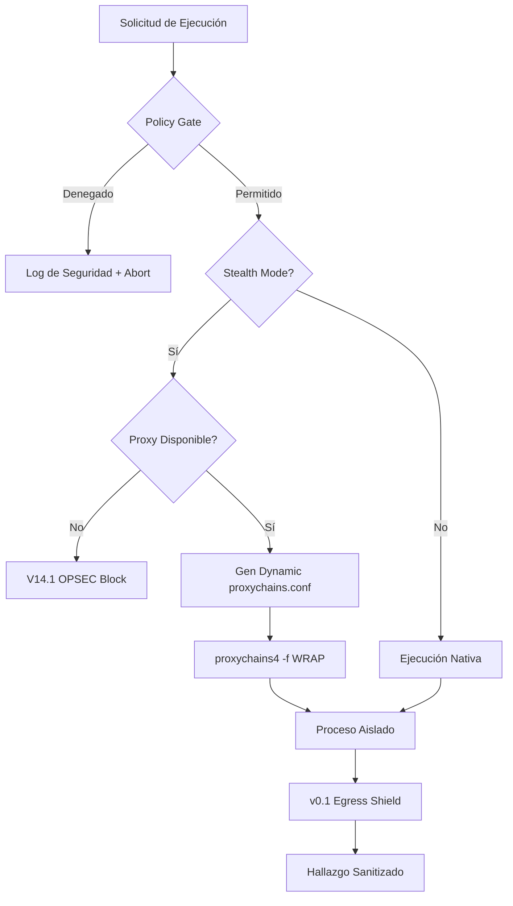
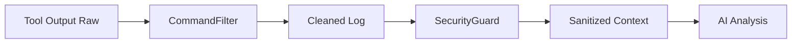

# 🛡️ Sigilo e Infraestructura (OPSEC)

OsintUltimate prioriza el sigilo operacional (OPSEC) por encima de cualquier otra métrica. El sistema está diseñado para ser indetectable por WAFs modernos y sistemas de protección de infraestructura, implementando una arquitectura de "Fail-Closed" en todas sus capas de salida.

## 1. Ejecución Sigilosa (StealthExecutor)

El `StealthExecutor` es la única vía autorizada para la interacción con binarios del sistema operativo y herramientas externas (Nmap, Nuclei, etc.).

### Modos de Ejecución
*   **GhostMode (Pasivo)**: Ejecución mínima de herramientas de descubrimiento. No permite vectores de explotación remota.
*   **StrikeMode (Activo)**: Habilita la ejecución de PoCs y validación de vulnerabilidades mediante una arquitectura de túneles dedicada.

### Garantías de Seguridad
1.  **Fail-Closed Policy**: Cada comando es validado contra `PolicyProvider`. Si un binario no está explícitamente permitido o los argumentos son sospechosos, el proceso se aborta antes de iniciarse.
2.  **Neutralización de Entorno**: Se utiliza `env_clear()` para eliminar variables de entorno que puedan revelar información del host (paths de usuario, versiones de compiladores, locales).
3.  **Transparencia de Proxy**: El ejecutor envuelve automáticamente los comandos con `proxychains4` si el sigilo está activo, garantizando que el tráfico real nunca provenga de la IP de origen.

---

## 2. Gestión de Egreso (ProxyManager)

El `ProxyManager` no es solo un rotador de IPs, sino un sistema de gestión de identidad táctica.

### Mecanismos de Identidad
*   **RT-Identity (Identity Bonding)**: El sistema asigna un **User-Agent** persistente a cada host objetivo. Esto evita que los WAFs detecten incoherencias en la identidad del navegador durante una sesión de ataque prolongada.
*   **Managed Exits**: OsintUltimate gestiona sus propios nodos de salida (DigitalOcean VPS) que son auditados cada 60 segundos mediante comprobaciones de salud (TCP Ping). Si un nodo falla, es expulsado inmediatamente del pool activo.

### Supervisión y Resiliencia
- **Task Leak Protection**: El supervisor de proxies utiliza `AbortHandle` para garantizar el cierre total de tareas asíncronas al finalizar la misión, evitando fugas de memoria en ejecuciones prolongadas.
- **Health Checks**: Un hilo de fondo monitorea constantemente la latencia y disponibilidad de los proxies. Solo los nodos con latencias estables son seleccionados para tareas críticas.

---

## 3. Sandboxing y Aislamiento de Herramientas

OsintUltimate utiliza Docker para aislar la ejecución de herramientas externas, garantizando que el entorno del host permanezca inalterado.

### Hardened Sandbox (v0.1.0)
- **Proxy Injection**: El `SandboxDispatcher` detecta automáticamente el estado del `ProxyManager`. Si el sigilo está activo, inyecta variables de entorno (`ALL_PROXY`, `HTTP_PROXY`, etc.) dentro del contenedor.
- **Network Isolation**: Los contenedores operan con políticas de red restringidas, forzando todo el tráfico saliente a través de la infraestructura de egreso gestionada.

Toda la información que sale de un binario y entra en la pipeline es procesada por el **Egress Shield** para evitar fugas de información sensible y ruido innecesario.

### Transformaciones del Escudo
1.  **Scrubbing de Secretos**: El `SecurityGuard` utiliza regex de alto rendimiento para identificar y redactar automáticamente:
    - API Keys (OpenAI, Anthropic, AWS, GitHub).
    - JWTs y Tokens de sesión.
    - URLs de bases de datos con credenciales.
    - Llaves privadas (RSA/Ed25519).
2.  **Filtrado de Ruido Táctico**: Elimina secuencias ANSI, barras de progreso y ruido legal (Copyrights) que consume tokens de IA innecesariamente.
3.  **Filtrado Específico de Herramientas**:
    - **Nmap**: Elimina líneas de "NSE: Initiating..." y estados de transición de servicios.
    - **Nuclei**: Solo conserva hallazgos de severidad Info, Warning o Crítica, descartando logs de depuración.

---

## 4. Fail-Closed Egress: La Regla de Oro

OsintUltimate opera bajo el principio de **Fail-Closed**. Si la infraestructura de sigilo (proxies) no produce un estado de `readiness` verificado en 30 segundos, el sistema se bloquea por completo. Es preferible fallar en la ejecución que arriesgar la exposición de la infraestructura del Red Team.

---

> [!CAUTION]
> El bypass manual del `StealthExecutor` está estrictamente prohibido en entornos de producción, ya que anula la cadena de anonimización y la auditoría de políticas de seguridad.
