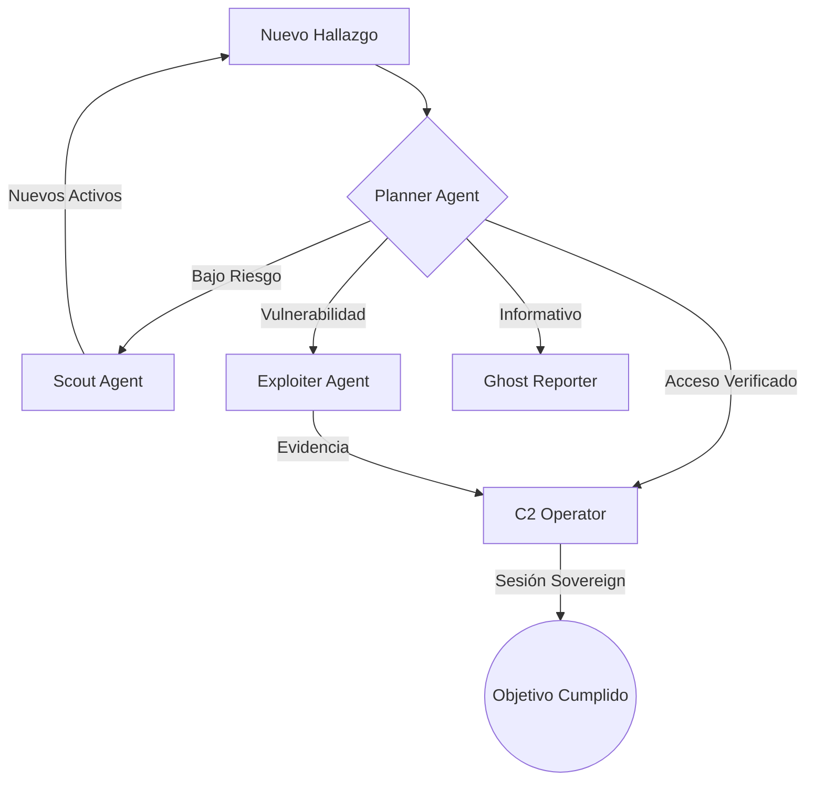
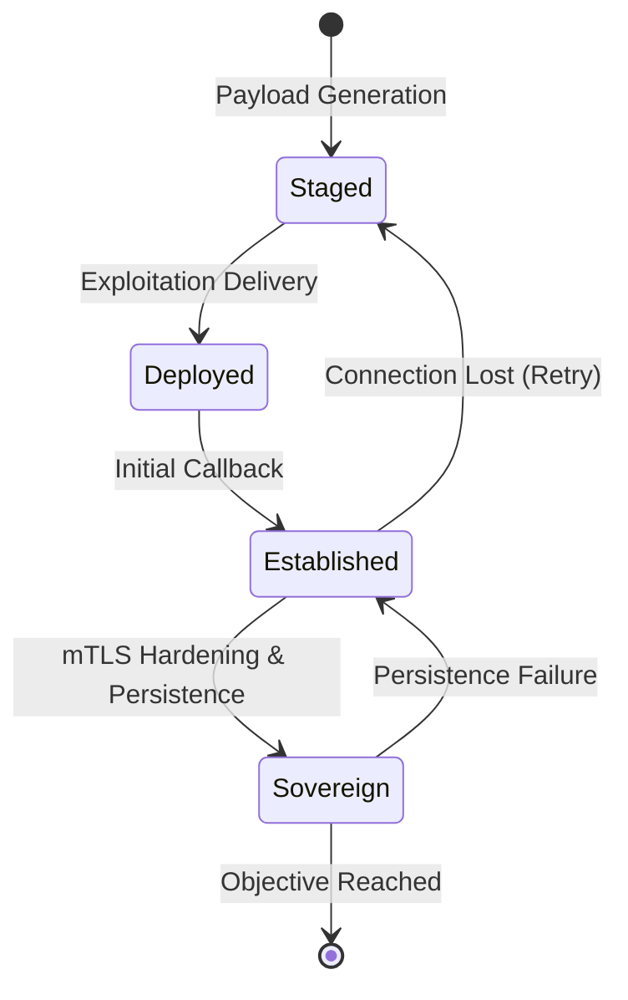

# 🐝 Swarm & Multi-Agent Intelligence

OsintUltimate utiliza un sistema de inteligencia descentralizada basado en un **enjambre de agentes autónomos**. A diferencia de los escaneos secuenciales tradicionales, el enjambre reacciona dinámicamente a los hallazgos en tiempo real, priorizando objetivos de alto valor y gestionando recursos de forma inteligente.

## 1. Arquitectura de Coordinación Autónoma

El enjambre opera bajo el framework **V15 OPPLAN**, que organiza las misiones en estados de compromiso (`EngagementState`) y objetivos tácticos (`Objective`).

### Bucle de Decisión del Enjambre
1.  **Descubrimiento**: Un agente `Scout` identifica una superficie de ataque o activo.
2.  **Correlación**: El `CorrelationEngine` vincula el nuevo hallazgo con rutas de ataque existentes.
3.  **Planificación**: El agente `Planner` evalúa la severidad y asigna el hallazgo al rol más adecuado.
4.  **Ejecución Concurrente**: Se spawnea un agente especializado en un entorno aislado (`JoinSet`).
5.  **Persistencia de Resultados**: Los hallazgos verificados fluyen de vuelta al canal central.

---

## 2. Economía de Recursos (Token Budgeting)

Para garantizar la viabilidad operativa en despliegues de larga duración, el sistema implementa una **Economía de Tokens** endurecida:

*   **TokenBudget**: Un presupuesto global que rastrea el consumo de prompts y completaciones de IA.
*   **Priorización de Admisión**: El sistema reserva automáticamente el 25% del presupuesto para tareas de alta prioridad (`Planner`), limitando a los agentes de bajo nivel (`Scout`) cuando los recursos escasean.
*   **TokenGuard (RAII)**: Cada agente recibe una "guardia" de tokens al iniciar. Si el agente falla o entra en pánico, el sistema **RAII** (Resource Acquisition Is Initialization) garantiza que los tokens reservados no utilizados se liberen de forma atómica.

---

## 3. Roles Tácticos y Posturas

El comportamiento de los agentes está dictado por su **Postura Adaptativa** (`Posture`):

| Rol | Postura Predeterminada | Función Principal |
| :--- | :--- | :--- |
| **Scout** | `Ghost` (Pasiva) | Mapeo de subdominios, detección de servicios y huellas tecnológicas. |
| **Exploiter** | `Strike` (Activa) | Validación técnica de vulnerabilidades, inyección de payloads y generación de PoCs. |
| **C2 Operator** | `Breach` (Persistencia) | Consolidación de acceso, despliegue de implantes y preparación de movimiento lateral. |
| **Planner** | `Ghost` | Análisis de grafos de ataque y optimización de presupuesto. |

---

## 4. Deep-Dive Nivel APT: Persistencia y Comando (C2)

OsintUltimate eleva la fase de post-explotación a un estándar de **Threat Actor** avanzado mediante la orquestación de persistencia y sesiones soberanas.

### A. Persistence Orchestrator
El orquestador de persistencia no solo "ejecuta comandos", sino que genera un `TacticalPlan` formal:
*   **Vectores de Avance**: Soporta inyección de llaves SSH Ed25519 efímeras, WebShells ofuscados con headers de control personalizados (X-Sovereign) y modificación de servicios.
*   **Vault Archiving**: Toda la evidencia táctica y llaves privadas generadas se aseguran automáticamente en el Vault local del operador.

### B. Ciclo de Vida de Sesión C2 (Sovereign State)
El sistema gestiona la progresión de acceso mediante una máquina de estados estricta:

1.  **Staged**: Payload preparado y ofuscado específicamente para el objetivo.
2.  **Deployed**: El implante ha sido transferido exitosamente al host.
3.  **Established**: Se ha verificado el primer "callback" o baliza.
4.  **Sovereign**: Sesión endurecida. La conexión es verificada mediante **mTLS**, es persistente a reinicios y cuenta con canales de respaldo.

### C. Consolidación de Acceso Profesional
Para mantener el acceso en entornos endurecidos, el `C2Operator`:
*   Genera **pares de claves Ed25519 efímeras** para inyecciones SSH tácticas, evitando el uso de contraseñas.
*   Utiliza **WebShell Droppers** que solo responden a comandos firmados o headers específicos, reduciendo la visibilidad ante Blue Teams.
*   Documenta automáticamente la "Ruta Táctica" (`tactical_path`) para facilitar el movimiento lateral una vez consolidado el nodo.

---

> [!TIP]
> En misiones de alta criticidad, el sistema cambia automáticamente a **Modo Soberano**, donde el presupuesto de tokens se ignora para asegurar que las sesiones C2 establecidas no se pierdan por falta de recursos.
