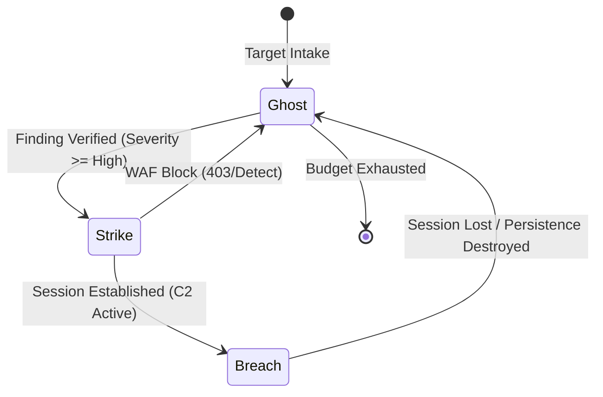

# 🎭 Adaptive Evasion: The Posture Manual (V14)

OsintUltimate V14 operates under the **Adaptive Stealth Protocol**, a state-machine driven framework that modulates engagement noise based on target sensitivity and detection feedback.

---

## 🏗️ Engagement Postures (`Posture`)

The engagement state is tracked in the `AdaptiveContext` and determines the strictness of OPSEC gates.

### 1. 👻 GHOST (Passive/Ultra-Stealth)
- **Objective**: Maximum anonymity, infrastructure discovery.
- **Ruleset**:
    - **No-Proxy, No-Traffic**: Hard-gate enforced. All packets MUST traverse a randomized SOCKS5 exit.
    - **Identity Rotation**: Host-pinned User-Agent rotation active.
    - **Throttle**: High jitter, log-normal human latency emulation.
- **Auto-Pivot**: If a WAF block is detected (`block_count > 0`), the system locks into GHOST until evasion entropy is sufficient.

### 2. ⚡ STRIKE (Active/Precision)
- **Objective**: Vulnerability validation and exploit delivery.
- **Ruleset**:
    - **Target Pinning**: IP pinning active to prevent DNS rebinding detection.
    - **Payload Mutation**: Adaptive AI-generated payload variants (Ollama/Local) to bypass static signatures.
    - **Gate**: Requires higher token budget reservation for `Exploiter` agents.

### 3. 🔱 BREACH (Persistence/Sovereign)
- **Objective**: Post-exploitation and lateral movement.
- **Ruleset**:
    - **C2 Integration**: Handover to sovereign C2 operators (Sliver/Havoc).
    - **Egress Hardening**: Transition from ephemeral SOCKS5 to persistent managed exit nodes (`managed_exits`).
    - **Human-Check**: Exploits with Risk Score >= 70 require manual approval via the `ApprovalGate`.

---

## 🛡️ Stealth Infrastructure (`ProxyManager`)

The `ProxyManager` is the technical enforcer of the Posture Manual.

### Hard-Gate: Fail-Closed Egress
Implementing the "No-Proxy, No-Traffic" directive:
- `get_client_fail_closed()`: Returns an `Err` and aborts functionality if no healthy proxies are available. **There is no fallback to the local IP.**

### Identity Evasion Specs
- **User-Agent Rotation**: Static pool of 100+ modern browser strings.
- **RT-Identity Cache**: Ensures that `Target A` always sees `User-Agent X`, while `Target B` sees `User-Agent Y`, preventing fingerprinting based on inconsistent headers.

---

## 📊 Posture Transition State Machine

---

## 📑 Implementation Facts (Single Source of Truth)

- **State Container**: `src/core/ai/types.rs` -> `AdaptiveContext.posture`
- **Enforcement Layer**: `src/utils/proxy.rs` -> `ProxyManager`
- **Transition Logic**: `src/core/swarm/orchestrator.rs` -> `execute_scout` / `execute_exploiter`

> [!IMPORTANT]
> Posture transitions are **autonomous**. The system will automatically downgrade to `Ghost` if metadata reveals a high probability of detection, regardless of the user's initial flags.

> [!CAUTION]
> Manually overriding postures via `--force-strike` bypasses some safety gates but maintains the `Fail-Closed` egress policy.
