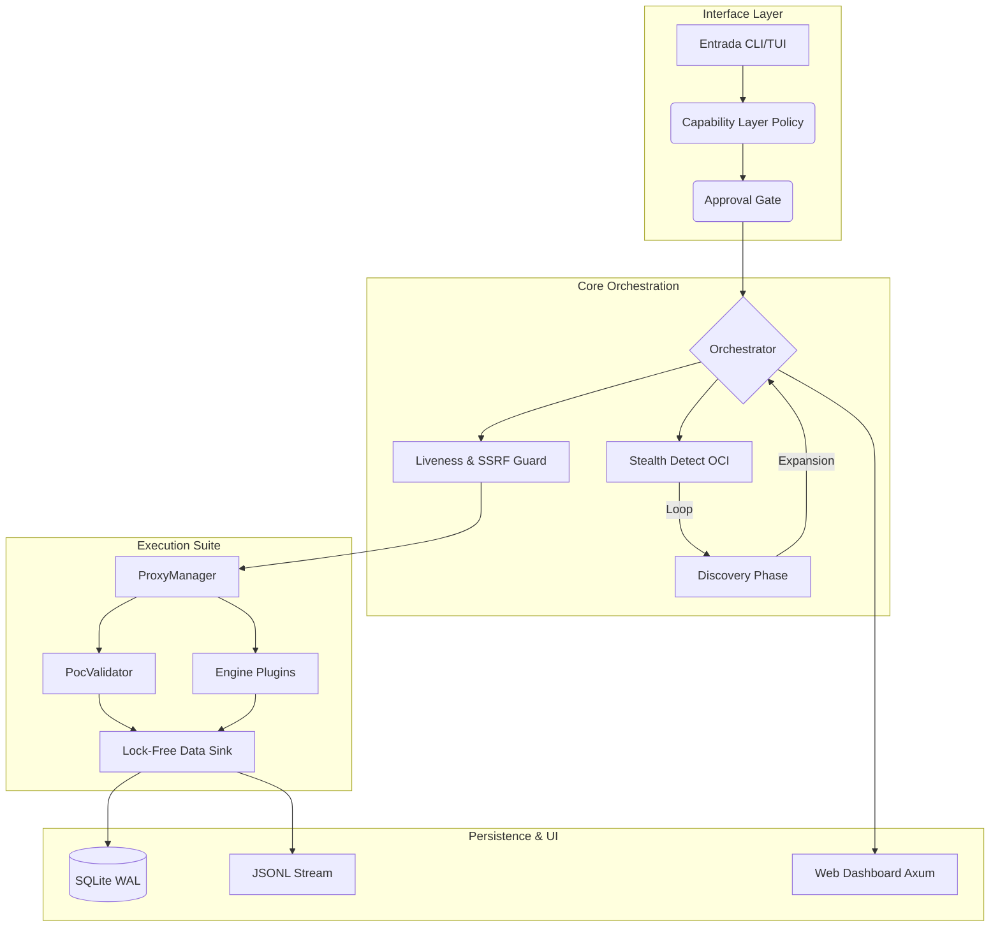

# 🏗️ Arquitectura Técnica OsintUltimate V13

> **Protocolo de Hardening Stealth: Precisión Binaria y Evasión Autónoma**

Este documento detalla el diseño interno, la infraestructura de concurrencia y los mecanismos de evasión del núcleo de **OsintUltimate V13**. Esta versión representa la culminación de la transición hacia un modelo **puro de sigilo y arquitectura asíncrona modular**.

---

## 1. Filosofía de Diseño: "Stealth First"

OsintUltimate V13 no es solo un escáner; es un **orquestador de inteligencia distribuido** diseñado para operar en entornos hostiles.

### Pilares Fundamentales
1.  **Aislamiento de Aplicación**: Uso de `io-uring` y `tokio` para I/O de red de alto rendimiento sin bloqueos de syscalls tradicionales.
2.  **Infraestructura de Salida Autónoma**: Gestión dinámica de nodos de salida en la nube (DigitalOcean) para evitar la atribución.
3.  **Hardening de Egress**: Políticas rígidas de validación de argumentos y pinning de IP para prevenir fugas accidentales y ataques de DNS Rebinding.

---

## 2. Diagrama de Arquitectura de Alto Nivel

Este diagrama muestra la interacción entre los componentes principales del motor desde la ingesta de objetivos hasta la persistencia.



---

## 3. Modelo de Concurrencia e Internals

V13 utiliza un modelo de comunicación basado en pasos de mensajes para evitar el overhead de bloqueos de memoria.

### Flujo de Concurrencia (Canales y Queues)

```mermaid
graph LR
    subgraph "Main Thread"
        ORC[Orchestrator]
    end

    subgraph "Worker Pool"
        W1[Scanner 1]
        W2[Scanner 2]
        WN[Scanner N]
    end

    subgraph "Persistence Pipeline"
        SQ((SegQueue Lock-Free))
        SB[Sink Batcher]
    end

    ORC -->|tokio::spawn| W1
    ORC -->|tokio::spawn| W2
    ORC -->|tokio::spawn| WN

    W1 -->|Push| SQ
    W2 -->|Push| SQ
    WN -->|Push| SQ

    SQ -->|Pop Batch| SB
    SB -->|Write| DB[(Storage)]

    Note over SQ, SB: Zero-wait for workers
```

---

## 4. Innovaciones Técnicas (Vectores V13)

### Vector 1: Native io-uring Scanner
Sustituye el modelo `fork/exec` para tareas de red críticas. Utiliza hilos de polling del kernel (`SQPOLL`) para enviar ráfagas de paquetes SYN, minimizando el impacto en el rendimiento del CPU y evitando la detección por análisis de tiempos de syscall.

### Vector 2: Evasión Estocástica (Thompson Sampling)
El motor de evasión aprende qué estrategias (Headers, TLS, Proxies) son más efectivas contra un objetivo específico en tiempo real, utilizando una distribución Beta para seleccionar la táctica con mayor probabilidad de éxito.

### Vector 3: Detección OCI y Proxies Efímeros
- **OCI Detection**: Si el motor detecta que corre en Oracle Cloud, fuerza el modo de proxy total.
- **DO Provisioning**: Despliegue automático de nodos SOCKS5 en DigitalOcean con auto-destrucción programada.

### Vector 4: Hardening del Validador (CRIT-001)
El `PocValidator` implementa validación semántica de argumentos. Por ejemplo, al ejecutar `nmap`, solo se permiten flags pre-aprobadas bajo una estructura de plantillas segura, eliminando la posibilidad de inyección de comandos.

---

## 5. Requerimientos de Sistema y Optimización

Basado en la auditoría de hardware V13, el sistema se adapta dinámicamente:

| Recurso | Modo UltraLow (1GB RAM) | Modo Professional (8GB+ RAM) |
| :--- | :--- | :--- |
| **Concurrencia** | 5-10 hilos máx. | 100+ hilos. |
| **Sandboxing** | Fluid (ProcessGuard native) | Strict (Docker ephimeral) |
| **Backpressure** | Activo a los 500MB | Activo a los 4GB |
| **Storage** | SSD recomendado | NVMe / SSD requerido |

---

© 2026 RedTeam Lab | OsintUltimate V13 Architectural Spec
