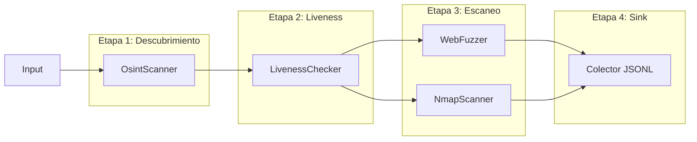

# 🏗️ Arquitectura del Sistema OsintUltimate

Este documento proporciona una visión profunda del diseño técnico, las estructuras de datos y la lógica del pipeline del **RedTeam Rust Core (v2.1)**.

## 1. Filosofía Central
El motor está diseñado para una **Concurrencia Masiva con Seguridad**. Utiliza un "Pipeline basado en Etapas" donde cada etapa está aislada por canales asíncronos (`tokio::sync::mpsc`).

### Restricciones Clave:
*   **Streams de Costo Cero en Memoria**: Los datos se procesan a medida que llegan, evitando la necesidad de cargar miles de objetivos en RAM.
*   **Lógica No Bloqueante**: Todos los plugins deben ser `async`. La E/S bloqueante se delega a `spawn_blocking`.
*   **Sigilo por Diseño**: El jitter y la rotación de proxies están integrados en el núcleo, no son añadidos posteriormente.

---

## 2. El Pipeline de 4 Etapas

### Etapa 1: Descubrimiento (OSINT)
*   **Entrada**: Objetivos iniciales proporcionados a través de la CLI.
*   **Lógica**: Utiliza `OsintScanner` (logs de Transparencia de Certificados) para expandir la superficie de ataque.
*   **Backpressure**: Implementado mediante un límite rígido en el tamaño de los canales (`clamp(100, 1000)`), evitando que la memoria se sature si la entrada es masiva.
*   **Deduplicación**: Utiliza un `DashSet` global para evitar re-escanear el mismo subdominio descubierto múltiples veces.

### Etapa 2: Liveness (Verificación)
*   **Lógica**: Verifica si el host se resuelve a una IP pública.
*   **Seguridad**: Implementa una protección estricta contra SSRF. Bloquea rangos privados (RFC1918), CGNAT y rangos de metadatos Cloud.
*   **Eficiencia**: Utiliza un `hickory-resolver` compartido para DNS asíncrono de alta velocidad.

### Etapa 3: Escaneo (Superficie de Ataque)
*   **Lógica**: Ejecución paralela de las implementaciones registradas de `ScannerPlugin`.
*   **Optimización de Memoria**: Utiliza `Arc` para compartir el objeto `TargetHost` entre múltiples plugins concurrentes, eliminando clones innecesarios en el hot path.
*   **Concurrencia**: Controlada por el `Orchestrator` utilizando `StreamExt::buffer_unordered(N)`.
*   **Evasión**: El jitter se aplica matemáticamente utilizando una **distribución LogNormal** para imitar los patrones de clic humanos.

### Etapa 4: Sink (Colector)
*   **Formato**: JSON Lines (`.jsonl`).
*   **Fiabilidad**: Se vuelca a disco cada 10 resultados para sobrevivir a fallos del sistema o interrupciones manuales (`SIGINT`).
*   **Generación de Reportes**: Al finalizar, activa un motor de plantillas HTML basado en Handlebars para generar un reporte visual.

---

## 3. Modelo de Concurrencia (`Orchestrator`)
El `Orchestrator` utiliza `futures::stream::unfold` para extraer de un canal y `buffer_unordered` para procesar en paralelo.

### Cierre Elegante (Graceful Shutdown)
Cuando se recibe una señal de apagado:
1.  El stream `unfold` deja de extraer nuevos elementos.
2.  El canal se cierra.
3.  Cualquier elemento actualmente "en tránsito" (almacenado en el canal pero aún no procesado) es extraído y marcado como `TargetStatus::Dead` con un hallazgo `SHUTDOWN_ABORT`, asegurando que no haya pérdida de datos.
4.  El colector termina de escribir todos los elementos antes de salir.

---

## 4. Mecanismos de Seguridad y Sigilo

### Protección SSRF (`liveness.rs`)
El sistema impone una política de "Buscar pero no Tocar" para la infraestructura interna. Cualquier IP que se resuelva a los siguientes rangos es descartada inmediatamente:
*   `10.0.0.0/8`, `172.16.0.0/12`, `192.168.0.0/16` (Privado)
*   `127.0.0.0/8` (Loopback)
*   `100.64.0.0/10` (CGNAT - evita el acceso a metadatos de GCP/AWS)
*   `169.254.0.0/16` (Enlace Local)

### Jitter Humano (`common.rs`)
Utilizamos una distribución LogNormal porque los tiempos de reacción humanos no son lineales. La estructura `HumanJitter` calcula una duración de sueño que se agrupa alrededor de una media pero permite "colas largas", haciendo que la detección automatizada sea significativamente más difícil.

---

## 5. Guía de Desarrollo
Consulte [PLUGIN_DEVELOPMENT.md](./PLUGIN_DEVELOPMENT.md) para obtener instrucciones sobre cómo extender las capacidades de escaneo.
