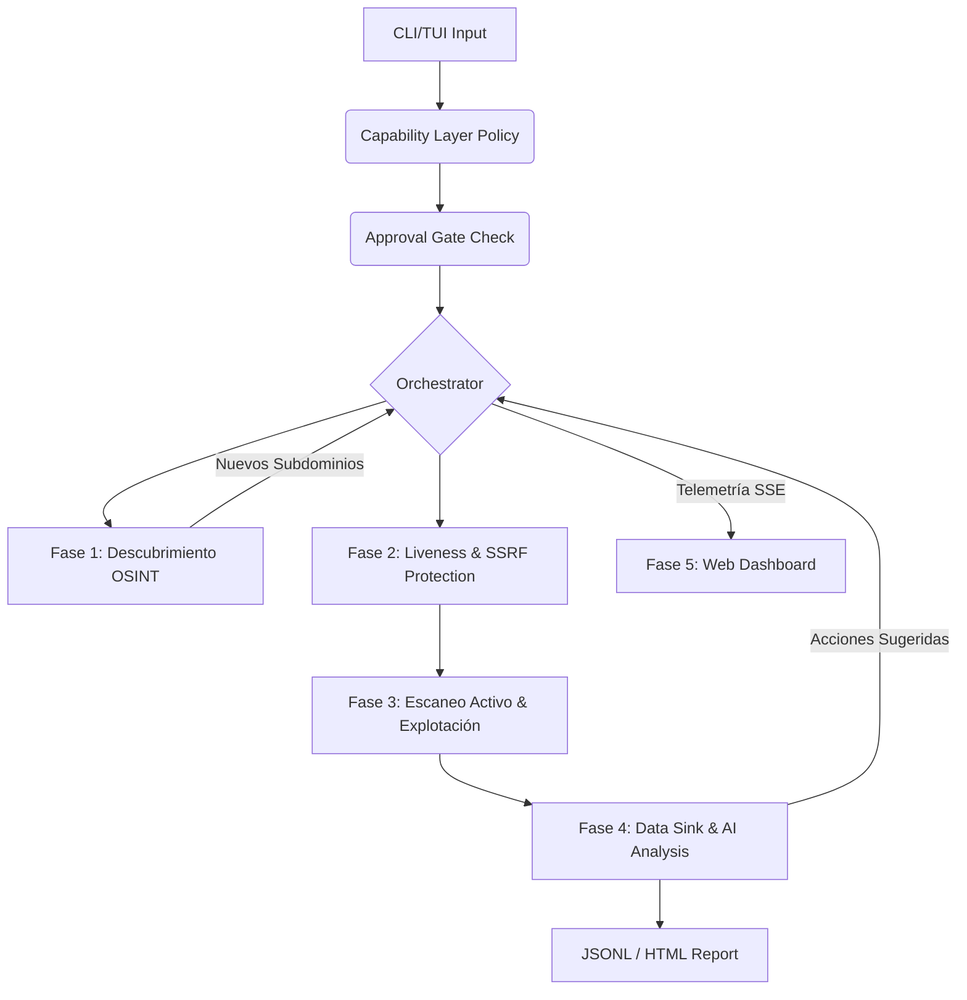

# 🏗️ Arquitectura Técnica OsintUltimate v4.0

> **Motor de Evaluación de Red Team de Alto Rendimiento, Asíncrono y Autónomo**

Este documento detalla el diseño interno, los flujos de datos y las garantías de seguridad del núcleo de **OsintUltimate v4.0**, re-arquitecturado íntegramente en Rust para máxima eficiencia, sigilo y adaptabilidad.

---

## 1. Filosofía de Diseño: "Atomicidad y Concurrencia"

OsintUltimate v3.0 no es solo un escáner; es un **orquestador de inteligencia**. Se basa en tres pilares:
1.  **Costo Cero de Memoria**: Procesamiento de flujos (streaming) mediante `tokio::sync::mpsc` y `JSONL`, permitiendo miles de objetivos en hardware de 1GB RAM gracias al sistema de **Backpressure**.
2.  **Aislamiento de Seguridad**: Cada herramienta externa se ejecuta en un grupo de procesos (`PGID`) propio, con límites de recursos (`rlimit`) y limpieza automática.
3.  **Decisión Autónoma y Estocástica**: Un sistema de IA en cascada (`TieredAIRouter`) y un motor de evasión probabilístico (`StochasticEvasionPolicy`) eligen la mejor ruta de ataque.

---

## 2. El Pipeline Circular de 4 Fases

A diferencia de los escáneres lineales, OsintUltimate utiliza un pipeline circular que expande dinámicamente la superficie de ataque.

### Fase 1: Descubrimiento (Expansion)
*   **Plugins**: `OsintScanner`, `Subfinder`, `Amass`.
*   **Deduplicación**: Implementada mediante `Bloom Filters` y `DashSet` globales para evitar ciclos infinitos.
*   **Velocidad**: Resolución DNS asíncrona nativa (`hickory-resolver`) capaz de 10k+ QPS.

### Fase 2: Liveness & Seguridad
*   **SSRF Shield**: Bloqueo estricto de IPs privadas (`RFC1918`), `CGNAT`, `169.254.x.x` y metadatos cloud.
*   **Verificación Híbrida**: Ping ICMP + TCP Syn + DNS Over HTTPS (DoH) para validar hosts sin dejar rastro en logs de red local.

### Fase 3: Escaneo y Explotación (Capability Layers)
El sistema organiza los plugins en capas de riesgo:
1.  **Passive**: Solo fuentes externas.
2.  **Discovery**: Enumeración ligera.
3.  **Scanning**: Análisis de vulnerabilidades.
4.  **Verification**: Confirmación de hallazgos (Burp/Zap).
5.  **Exploitation**: Ejecución de exploits (SqlMap/Commix).
6.  **Post-Exploitation**: Movimiento lateral y persistencia.

### Fase 4: Data Sink & AI Cascade
*   **Streaming Persistence**: Los resultados se escriben línea a línea en disco como `JSONL`, evitando picos de RAM.
*   **Análisis Tiered**:
    *   **Local (Ollama)**: Análisis rápido de hallazgos informativos y mutación de payloads para evasión de WAF (Thompson Sampling).
    *   **Mid (Azure OpenAI)**: Triaje de vulnerabilidades medianas y correlación de ataques.
    *   **Premium (Gemini Pro)**: Análisis profundo de cadenas de ataque críticas y generación de reportes ejecutivos.

### Fase 5: Telemetría y Monitoreo (Dashboard) [NUEVO]
Un servidor embebido **Axum** procesa eventos en tiempo real:
*   **SSE (Server-Sent Events)**: Enrutamiento directo de hallazgos desde el orquestador al navegador sin polling.
*   **Gestión de Estado**: Uso de `DashMap` compartido para rastrear miles de objetivos con latencia mínima.
*   **Zero Footprint**: Los assets frontend están integrados en el binario (`rust-embed`).

### Fase de Infraestructura: Adaptabilidad Automática [NUEVO]
El sistema detecta el entorno de ejecución antes de iniciar (`detect_infrastructure`):
- **UltraLowMemory (≤1.5GB RAM)**: Capa la concurrencia a 10 y activa límites estrictos.
- **LocalPC**: Optimiza para 30 hilos y sigilo balanceado.
- **Server**: Desbloquea escalabilidad masiva (100+ hilos).

---

## 3. Componentes del Núcleo

### `Orchestrator`
Gestiona la concurrencia a través de `Semaphores` y `RwLock`. Ahora es **Adaptativo**: ajusta su semáforo de memoria y número de hilos según el hardware detectado en el inicio. Utiliza `StreamExt::buffer_unordered` para maximizar el rendimiento.

### `TacticalWebhookSink` [OPTIMIZADO]
Diseñado para entornos de alta latencia (C2 remoto/VPS):
- **Batching**: Acumula hasta 10 objetivos/hallazgos antes de realizar el envío.
- **Compresión Gzip**: Comprime los payloads de red mediante `flate2` para minimizar el tráfico y la latencia.

### `ExternalToolGuard`
Envuelve herramientas como `nmap` o `sqlmap`. 
- **Sandboxing**: Limpia variables de entorno y utiliza `setsid`.
- **Resource Control**: Limita la RAM vurtual a 512MB por subproceso.
- **Zombie Prevention**: Mata el `PGID` completo si hay un timeout.

### `DecoyController` [NUEVO]
Gestiona el ciclo de vida de señuelos DNS (via Cloudflare) y tripwires persistentes (via SQLite WAL).

### `WafEvasionEngine` [NUEVO]
Máquina de estados reactiva que escala de Headers → TLS → Local AI → IP Rotation ante respuestas HTTP 403.

### `MemoryMonitor`
Hilo de fondo que vigila `/proc/self/status`. Implementa **Backpressure**: si el consumo de RAM supera el límite suave, el orquestador pausa la ingesta de nuevos objetivos hasta que la memoria se libere.

---

## 4. Evasión y Sigilo (OPSEC)

1.  **Jitter LogNormal**: En lugar de pausas constantes, utiliza una distribución matemática que imita el comportamiento humano.
2.  **Rotación de Proxies**: Pool de clientes `DashMap` que garantiza una rotación de IP efectiva por cada plugin.
3.  **UA Randomization**: Rotación de User-Agents de navegadores modernos y reales.
4.  **Behavioral Jitter**: Pequeñas variaciones en el orden de los escaneos y tiempos entre peticiones.

---

## 5. Salidas y Reportes

*   **JSONL**: Formato base para procesamiento masivo y estabilidad.
*   **SQLite**: Persistencia relacional para consultas complejas y gestión de estado.
*   **Lock-Free Sink**: Uso de `SegQueue` para inserciones masivas sin bloqueos de Mutex en la base de datos.
*   **HTML Visual**: Reporte tipo semáforo con tablas interactivas y clasificación CVSS.
*   **Audit Log**: Registro inmutable de cada acción, quién la aprobó y por qué.

---

© 2026 RedTeam Lab | OsintUltimate v4.0 Documentation
