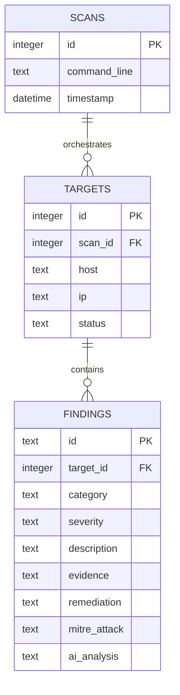
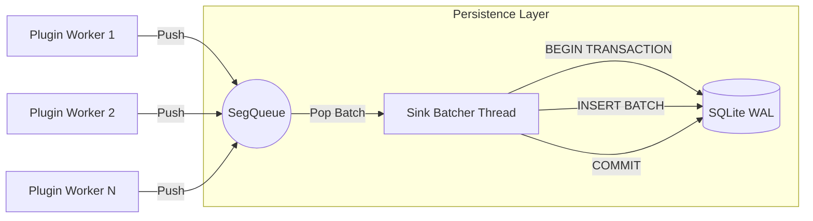

# 📊 Persistence Schema & Lock-Free Sink

This document describes the storage architecture of **OsintUltimate V14.1**, focused on data integrity and high performance through non-blocking transactions.

---

## 1. Database Schema (SQLite)

OsintUltimate utilizes SQLite in **WAL (Write-Ahead Logging)** mode to allow concurrent reads and writes without data corruption or lock contention.

### Core Entities

### Table Specifications

- **SCANS**: Records every execution of the engine. The `command_line` field allows for complete reproducibility of the mission.
- **TARGETS**: Represents the analyzed hosts. The status (`Pending`, `Scanning`, `Completed`, `Failed`) is updated in real-time.
- **FINDINGS**: Stores technical results. 
    - `evidence`: Raw payload and target response (JSON).
    - `ai_analysis`: Logic generated by the `TieredAIRouter` (JSON).
    - `mitre_attack`: Mapping to MITRE ATT&CK tactics and techniques.

---

## 2. Lock-Free Sink Architecture (`SegQueue`)

To prevent network workers (scanners) from blocking while waiting for database I/O, V14.1+ utilizes a decoupled result sink.

### Data Flow
1.  **Ingestion**: When a plugin generates a result, it pushes it to a **`SegQueue`** (a lock-free segmented queue from the `crossbeam` crate).
2.  **Non-Blocking Worker**: The plugin thread immediately continues with the next target or task.
3.  **Sink Batcher**: A dedicated thread monitors the queue. When elements are detected, it extracts and writes them to the database within a **single transaction (batch)**.

### Concurrency Diagram: Sink Internals

---

## 3. Performance Optimizations

- **WAL Mode**: Drastically improves concurrency performance by allowing readers to not block writers.
- **Dynamic Batching**: The sink accumulates results based on a timer or a minimum batch size (e.g., 10 elements or 5 seconds), reducing disk I/O overhead.
- **Streaming JSONL**: As a backup and OpSec measure, every finding is also written to a `.jsonl` file in real-time, ensuring progress is saved even in the event of a catastrophic system failure.

---

© 2026 RedTeam Lab | OsintUltimate V14.1 Persistence Spec
