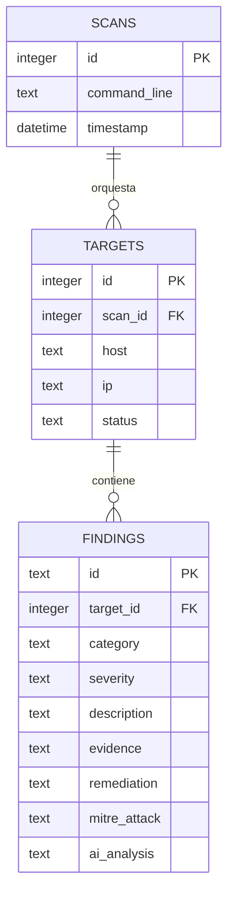
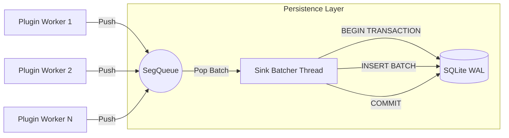

# 📊 Esquema de Persistencia y Lock-Free Sink

Este documento describe la arquitectura de almacenamiento de OsintUltimate V13, centrada en la integridad de datos y el alto rendimiento mediante transacciones no bloqueantes.

---

## 1. Esquema de Base de Datos (SQLite)

OsintUltimate utiliza SQLite en modo **WAL (Write-Ahead Logging)** para permitir lecturas y escrituras concurrentes sin corrupción de datos.

### Entidades Principales

### Detalles de Tablas

- **SCANS**: Registra cada ejecución del motor. El campo `command_line` permite la reproducibilidad completa del escaneo.
- **TARGETS**: Representa los hosts analizados. El estado (`Pending`, `Scanning`, `Completed`, `Failed`) se actualiza en tiempo real.
- **FINDINGS**: Almacena los resultados técnicos. 
    - `evidence`: Payload bruto y respuesta del objetivo (JSON).
    - `ai_analysis`: Razonamiento generado por el `TieredAIRouter` (JSON).
    - `mitre_attack`: Mapeo a tácticas y técnicas de MITRE.

---

## 2. Arquitectura Lock-Free Sink (`SegQueue`)

Para evitar que los trabajadores de red (scanners) se bloqueen esperando a que la base de datos termine una escritura, v4.0+ utiliza un sumidero desacoplado.

### Flujo de Datos
1.  **Ingesta**: Cuando un plugin genera un resultado, lo envía a una **`SegQueue`** (cola segmentada lock-free de la crate `crossbeam`).
2.  **Worker No-Bloqueante**: El hilo del plugin continúa inmediatamente con el siguiente objetivo.
3.  **Sink Batcher**: Un hilo dedicado monitorea la cola. Cuando detecta elementos, los extrae y los escribe en la base de datos dentro de una **transacción única (batch)**.

### Diagrama de Concurrencia: Sink Internals

---

## 3. Optimizaciones de Rendimiento

- **Modo WAL**: Mejora drásticamente el rendimiento de concurrencia al permitir que los lectores no bloqueen a los escritores.
- **Batching Dinámico**: El sumidero acumula resultados basándose en un temporizador o en un tamaño de lote mínimo (ej. 10 elementos o 5 segundos), reduciendo el overhead de las operaciones de IO de disco.
- **Streaming JSONL**: Como medida de backup y OPSEC, cada hallazgo también se escribe en un archivo `.jsonl` en tiempo real, garantizando que el progreso se guarde incluso ante un fallo catastrófico del sistema.

---

© 2026 RedTeam Lab | OsintUltimate V13 Persistence Spec
