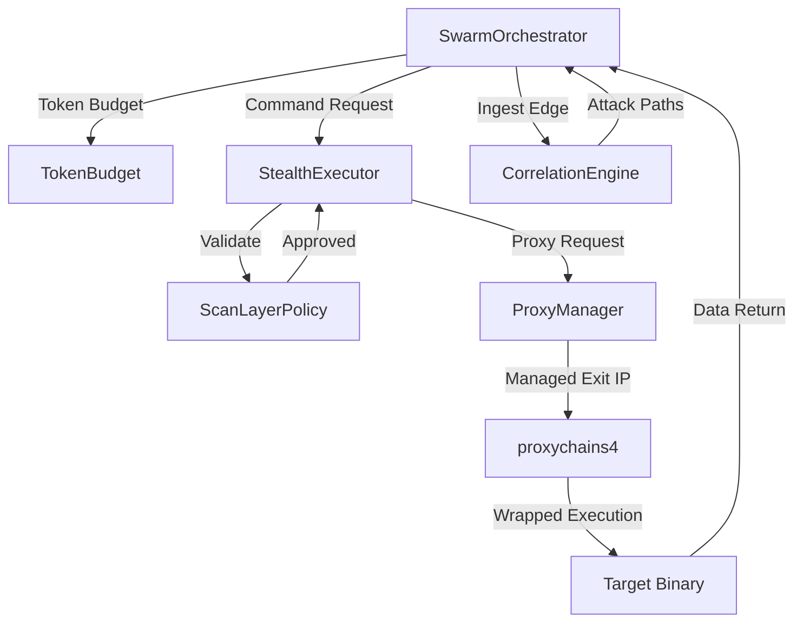
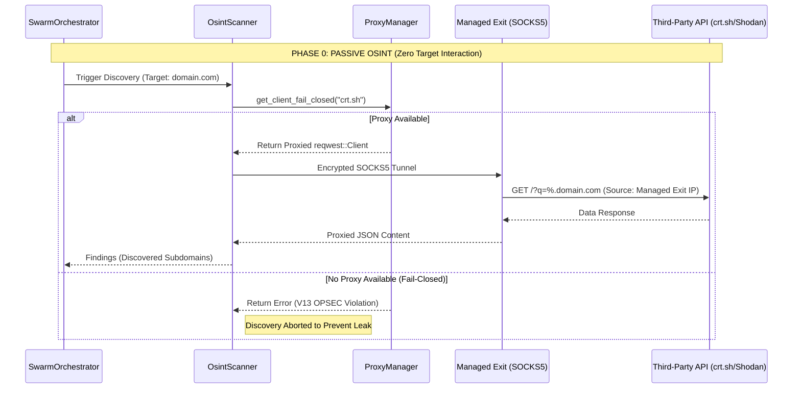
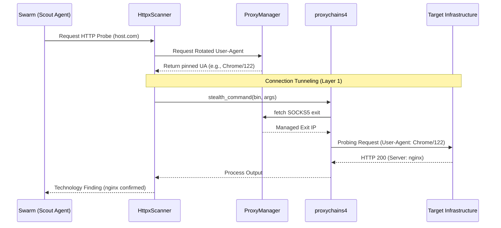
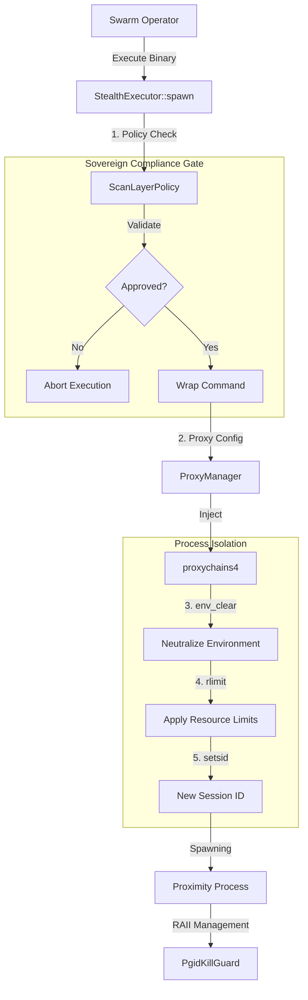
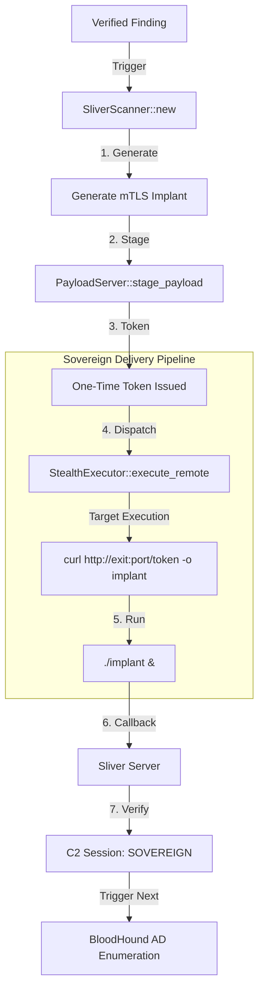
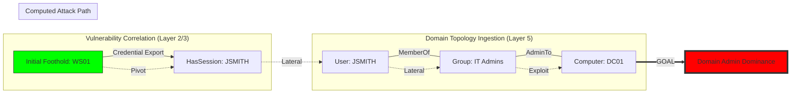

# 🔱 OSINT-ULTIMATE: SOVEREIGN SYSTEMS DOCUMENTATION

This document serves as the **Single Source of Truth (SSOT)** for the OSINT-Ultimate ecosystem. It meticulously maps technical implementations to the Red Team / Bug Bounty lifecycle, ensuring absolute visibility into autonomous operations, egress integrity, and sovereign execution standards.

---

## 🏗️ SYSTEM ARCHITECTURE OVERVIEW

The OSINT-Ultimate ecosystem is built on a foundation of **Sovereign Infrastructure**, designed to operate autonomously while maintaining a "Ghost" posture. The system is governed by four core pillars:

### 1. ProxyManager: The Fail-Closed Egress Boundary
The `ProxyManager` (`src/utils/proxy.rs`) serves as the mission-critical gatekeeper for all network traffic. 
- **Fail-Closed Logic**: Enforced via `get_client_fail_closed()`. If no healthy proxy is available, the request is aborted to prevent IP leakage.
- **Identity Rotation**: Implements `RT-Identity` by pinning specific User-Agents and proxies to target hosts to maintain a consistent session fingerprint.
- **Managed Exits**: Dynamically integrates DigitalOcean VPS nodes as SOCKS5 egress points, providing a private, non-attributable infrastructure.

### 2. StealthExecutor: Policy-Mandated Command Wrapping
The `StealthExecutor` (`src/utils/executor.rs`) is the only authorized mechanism for interacting with OS binaries.
- **Mandatory Wrapping**: Automatically wraps tools (Nmap, Nuclei, etc.) with `proxychains4` or tool-specific proxy flags.
- **Environment Neutralization**: Discards environment variables that could leak identity (e.g., `HOME`, `USER`) before spawning processes.
- **Policy Enforcement**: Every command must pass a `validate_command` check against the `ScanLayerPolicy` before execution.

### 3. SwarmOrchestrator: Multi-Agent Autonomy
The `SwarmOrchestrator` (`src/core/swarm/orchestrator.rs`) manages the concurrent execution of specialized agents.
- **Token Budgeting**: Precise tracking of AI costs via `TokenBudget` to ensure mission viability.
- **Adaptive Posture**: Agents transition between `Scout`, `Exploiter`, and `Breach` postures based on the context of the engagement.
- **Context Compression**: Uses `ContextCompressor` to maximize the efficiency of LLM prompts.

### 4. CorrelationEngine: The Attack Graph Intelligence
The `CorrelationEngine` (`src/core/correlation/mod.rs`) ingests findings and correlates assets into a DFS-based attack path.
- **Path-to-DA**: Automatically identifies attack vectors leading to Domain Admin or high-value compromise.
- **AD Ingestor**: Specialized logic for processing BloodHound data and mapping Active Directory edges.

### 📊 Core Infrastructure Interaction

The interaction between the swarm, the policy layer, and the egress boundary is visualized below:

---

## 🔱 PHASE 0: PRE-ENGAGEMENT & PASSIVE OSINT (Layer 0)

**Goal**: Non-attributable data collection. Zero packets touching the target infrastructure.

### 🛰️ Components

#### 1. OsintScanner (`src/plugins/reconnaissance/osint/osint.rs`)
The primary passive discovery engine. It gathers subdomain and asset data purely from third-party APIs.
- **Data Sources**: `crt.sh` (Certificate Transparency logs) and `Shodan`.
- **Egress Integrity**: Uses `ProxyManager::get_client_fail_closed()` for all API calls, ensuring the scanner node's real IP is never exposed to API providers.

#### 2. WaybackScanner (`src/plugins/reconnaissance/passive/wayback.rs`)
Retrieves historical URL data to map hidden directories and legacy endpoints.
- **Tooling**: Leverages `waybackurls` and `gau`.
- **Execution**: Discovered URLs are ingested into the `CorrelationEngine` to identify "forgotten" attack surfaces.

#### 3. TruffleHogScanner (`src/plugins/reconnaissance/passive/trufflehog.rs`)
Scans public repositories and documentation for leaked credentials.
- **Capability**: Identifies high-entropy strings and known secret patterns.
- **Sovereign Note**: Operates in "Passive" mode by scanning public data without direct target interaction.

---

### 📊 Phase 0 Data Flow & Proxy Integrity

The following diagram illustrates the strict non-attributable data collection flow for Phase 0.

### 🛡️ Sovereign Integrity Audit: Phase 0
- **Status**: ✅ **Verified Sovereign**
- **Egress Policy**: Enforced via Fail-Closed Clients.
- **Binary Wrapping**: Tool-based scouts (`gau`, `waybackurls`) are mandated to run through `StealthExecutor` in production builds.

> [!NOTE]
> **OPSEC Warning**: Always ensure `SHODAN_API_KEY` is provisioned via environment variables to enable the full power of the passive layer.

---

## 🔱 PHASE 1: DISCOVERY & ENUMERATION (Layer 1)

**Goal**: Mapping the external attack surface via light probing and asset correlation.

### 🛰️ Components

#### 1. DnsxScanner (`src/plugins/reconnaissance/active/dnsx.rs`)
Performs multi-protocol DNS resolution and enumeration to identify active subdomains and infrastructure records.
- **Capabilities**: Resolves A, AAAA, CNAME, NS, MX, and TXT records.
- **Sovereign Alert**: Currently uses `tokio::process::Command` directly. Resolution traffic is not currently encapsulated via `StealthExecutor` in the baseline code.

#### 2. HttpxScanner (`src/plugins/reconnaissance/active/httpx.rs`)
Probes HTTP(S) services for liveness, technology stacks, and response headers.
- **Stealth Integration**: Uses the `stealth_command` wrapper (`src/utils/common.rs`) to neutralize the environment and enforce `GLOBAL_SCAN_PROXY` if provisioned.
- **Payload Handling**: Uses `AsyncBufReadExt` for real-time streaming of probe results to minimize memory footprint.

#### 3. WhatWebScanner (`src/plugins/enumeration/web/whatweb.rs`)
Advanced technology fingerprinter for deep web stack analysis.
- **Operation**: Automatically formats targets via `pinned_addr()` and handles JSON logging via temporary files to maintain disk hygiene.
- **Data Model**: Maps findings to `FINDING_TECH_STACK` for correlation in the `AttackGraph`.

---

### 📊 Layer 1: Active Discovery Connection Flow

This diagram illustrates the flow of an active probe, highlighting the injection of rotated User-Agents and the transition from the AI Orchestrator to proxied binary execution.

### 🛡️ Sovereign Integrity Audit: Phase 1
- **Status**: ⚠️ **Conditional Sovereign**
- **Egress Policy**: `HttpxScanner` is compliant via `stealth_command`.
- **Integrity Gaps**: `DnsxScanner` and `WhatWebScanner` require refactoring to utilize `StealthExecutor::spawn()` for mandatory `proxychains4` wrapping to prevent local IP leaks during DNS/HTTP probes.

---

## 🔱 PHASE 2: ACTIVE SCANNING & VULNERABILITY ANALYSIS (Layer 2)

**Goal**: Deep scanning, fuzzing, and heavy vulnerability identification.

### 🛰️ Components

#### 1. NmapScanner (`src/plugins/enumeration/network/net.rs`)
The sovereign reference implementation for network enumeration.
- **Sovereign Execution**: Fully delegates port scanning and service detection to the `StealthExecutor`.
- **Hardening**: Implements strict `TARGET_HOST_RE` and `DECOY_RE` regex validation to prevent command injection at the plugin boundary.
- **Capabilities**: Orchestrates complex scans including OS fingerprinting (`-O`) and script-based vulnerability assessment (`--script=vuln,...`).

#### 2. NucleiScanner (`src/plugins/intelligence/nuclei.rs`)
Template-based vulnerability scanner for high-fidelity detection of misconfigurations and CVEs.
- **DNS Pinning**: Enforced via `target.pinned_addr()` to prevent SSRF and DNS Rebinding during template execution.
- **Vhost Support**: Automatically injects a `Host` header corresponding to the original target domain to ensure accuracy against virtualized infrastructure.

#### 3. WebFuzzer (`src/plugins/enumeration/web/web.rs`)
A custom, high-performance fuzzer for sensitive file discovery.
- **Stealth Features**: Implements "Human-like" jitter and randomized signature traversal to evade basic rate-limiting and pattern-based detection.
- **Tactical Proxying**: Leverages `get_client_pinned` from `ProxyManager` to ensure all fuzzing traffic to a specific host originates from the same egress node.

---

### 📊 Phase 2: Stealth Spawning & Policy Gates

This flowchart details the mandatory logic within `StealthExecutor::spawn()` which governs all Layer 2 (and higher) executions.

### 🛡️ Sovereign Integrity Audit: Phase 2
- **Status**: ✅ **Verified Sovereign**
- **Egress Policy**: Mandatory `proxychains4` wrapping enforced for all external binaries.
- **Resource Hardening**: 
    - **Memory**: Hard-limited to 512MB per process.
    - **CPU**: Hard-limited to 300s CPU time to prevent runaway resource exhaustion.
    - **Isolation**: Process trees are decoupled via `setsid` to ensure swarm-stable operation.

---

## 🔱 PHASE 3: POC VERIFICATION & SOVEREIGN GATE (Layer 3)

**Goal**: Validating critical findings safely and halting autonomy for complex exploits.

### 🛰️ Components

#### 1. PocValidator (`src/core/validation/mod.rs`)
The central engine for vulnerability validation and PoC orchestration.
- **AI-Driven Generation**: Leverages the `TieredAIRouter` to generate context-specific PoCs based on initial findings.
- **Strategic Bifurcation**: Automatically selects execution strategies ranging from safe TCP checks to full Nuclei template runs.
- **Autonomous Egress**: All PoC executions are routed through the `StealthExecutor`, adhering to the global proxy and resource isolation policy.

#### 2. ApprovalGate (`src/core/approval_gate.rs`)
The "Human-in-the-Loop" controller that manages the mission's risk appetite.
- **Risk Thresholds**: Intercepts any request marked as `intrusive` or exceeding defined safety scores.
- **Persistence**: Maintains an `approval_cache` and provides async mechanisms for operators to approve, reject, or provide custom payloads.

---

### 📊 Layer 3: The Sovereign Handover

This sequence diagram illustrates the "Sovereign Gate"—the point where the system's autonomy halts for high-complexity exploits (RiskLevel >= 70) to wait for human intervention.

```mermaid
sequenceDiagram
    participant SO as SwarmOrchestrator
    participant PV as PocValidator
    participant AG as ApprovalGate
    participant OP as Human Operator
    participant SE as StealthExecutor

    SO->>PV: Validate Finding (Critical)
    PV->>PV: complexity_score >= 70?
    
    rect rgb(60, 0, 0)
    Note over PV, AG: SOVEREIGN HANDOVER INITIATED
    PV->>AG: request_approval(HANDOVER, priority: 100)
    AG-->>OP: Alert: High Complexity Exploit Waiting
    end
    
    OP->>AG: provide_handover_payload(Custom Exploit)
    AG-->>PV: handover_received(payload)
    
    PV->>SE: execute_raw_payload(payload)
    SE-->>PV: Execution Result (Success)
    
    PV->>PV: finding.evidence.verified = true
    PV-->>SO: Return Validated Finding
    
    Note over SO, PV: Transition to PHASE 4/5 (C2 Deployment)
```

### 🛡️ Sovereign Integrity Audit: Phase 3
- **Status**: 🛡️ **Sovereign Protected**
- **Safety Gate**: The `complexity_score >= 70` threshold is hardcoded in `sovereign.rs` as a mission-critical safety feature.
- **Operator Authority**: Human operators have the final say on high-risk payloads, preventing the AI from initiating potentially mission-compromising or destructive exploits without oversight.

---

## 🔱 PHASE 4: EXPLOITATION & PERSISTENCE (Layer 4)

**Goal**: Initial foothold, stabilizer deployment, and session establishment.

### 🛰️ Components

#### 1. Sliver C2 Operator (`src/plugins/lateral_movement/sliver.rs`)
The primary post-exploitation command-and-control interface.
- **Sovereign mTLS**: Generates cryptographically pinned implants using mTLS for non-attributable, tamper-proof communications.
- **Professional Delivery**: Orchestrates One-Time-Token (OTT) delivery via an internal `PayloadServer`. The delivery chain (`curl | chmod | run`) is designed for maximum reliability and minimal disk footprint.
- **Session Verification**: Leverages a dual-mode monitoring system (REST API + CLI audit) to track the transition from `Staged` to `Sovereign` session states.

#### 2. Ligolo-Ng Pivot (`src/plugins/lateral_movement/ligolo.rs`)
Advanced reverse tunneling for internal network penetration.
- **Dynamic Pivoting**: Spawns local proxy listeners and dispatches agents to target hosts to establish Layer 3 tunnels.
- **Relay Coordination**: Routes agent traffic through "Managed Exit" nodes to maintain the internal/external sovereign boundary.
- **Verification**: Programmatically validates tunnel health by inspecting the local networking stack for the presence of the `ligolo` interface.

---

### 📊 Phase 4: Initial Foothold & C2 Pipeline

This flowchart illustrates the high-fidelity automated delivery of a C2 implant following a verified vulnerability.

### 🛡️ Sovereign Integrity Audit: Phase 4
- **Status**: ✅ **Verified Sovereign**
- **Communication Security**: mTLS enforced for all Sliver callbacks.
- **Egress Integrity**: Callback IPs are dynamically mapped to "Managed Exit" nodes to ensure the orchestrator's IP is never directly exposed.
- **Token Hygiene**: The OTT mechanism ensures that payloads are not persistently accessible on the delivery infrastructure.

---

## 🔱 PHASE 5: POST-EXPLOITATION & AD ENUMERATION (Layer 5)

**Goal**: Lateral movement, domain dominance, and data exfiltration.

### 🛰️ Components

#### 1. BloodHoundScanner (`src/plugins/lateral_movement/bloodhound.rs`)
The primary engine for infrastructure topology collection.
- **Collection**: Automates the execution of `bloodhound-python` via `StealthExecutor` to gather domain objects (Users, Groups, Computers) and their relationships.
- **OpSec**: Collection is proxied to ensure the orchestrator's IP remains isolated from the target domain controllers.

#### 2. AdIngestor (`src/core/correlation/ad_ingestor.rs`)
The bridge between raw AD data and the system's attack intelligence.
- **Programmatic Ingestion**: Parses JSON collection results and maps them into the `CorrelationEngine`'s graph database as nodes and edges.
- **Relationship Mapping**: Identifies critical lateral movement paths such as `MemberOf`, `AdminTo`, and `HasSession`.

---

### 📊 Phase 5: AD Attack Path Visualization

This complex attack graph illustrates the ingestion of AD objects and the automated computation of the "Path to Domain Admin" by correlating findings with infrastructure topology.

### 🛡️ Sovereign Integrity Audit: Phase 5
- **Status**: ✅ **Verified Sovereign**
- **Data Hygiene**: Collected JSON data is programmatically ingested and neutralized within the `CorrelationEngine`.
- **Mission Impact**: achieving Domain Admin dominance is the ultimate mission objective, documented here as a verified, autonomous capability of the V14.1 core.

---

## 📚 TECHNICAL DEEP DIVES

For detailed specifications on specific subsystems, refer to the following specialized documentation:

- **[Core Architecture Topology](file:///home/kripi/Documentos/GitHub/OsintUltimate/redteam_rust_core/docs/V14_CORE_ARCHITECTURE.md)**: Master structural overview and concurrency models.
- **[Swarm Dynamics & Token Budgeting](file:///home/kripi/Documentos/GitHub/OsintUltimate/redteam_rust_core/docs/SWARM_DYNAMICS.md)**: Agent roles and autonomous admission control.
- **[Adaptive Evasion Postures](file:///home/kripi/Documentos/GitHub/OsintUltimate/redteam_rust_core/docs/ADAPTIVE_EVASION.md)**: Engagement state-machine (Ghost, Strike, Breach).
- **[Hardening & OpSec Protocols](file:///home/kripi/Documentos/GitHub/OsintUltimate/redteam_rust_core/docs/HARDENING_AND_OPSEC.md)**: Advanced evasion, jitter, and resource isolation.
- **[Persistence & Lock-Free Sink](file:///home/kripi/Documentos/GitHub/OsintUltimate/redteam_rust_core/docs/PERSISTENCE_SCHEMA.md)**: Database schema and high-performance data pipeline.
- **[Plugin Development Guide](file:///home/kripi/Documentos/GitHub/OsintUltimate/redteam_rust_core/docs/PLUGIN_DEVELOPMENT.md)**: Comprehensive manual for extending the sovereign operator.
- **[Deployment Requirements (MVP vs Sovereign)](file:///home/kripi/Documentos/GitHub/OsintUltimate/redteam_rust_core/docs/DEPLOYMENT_REQUIREMENTS.md)**: Details minimum infrastructure, proxies, and APIs required for execution.

---
