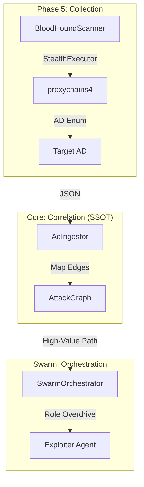
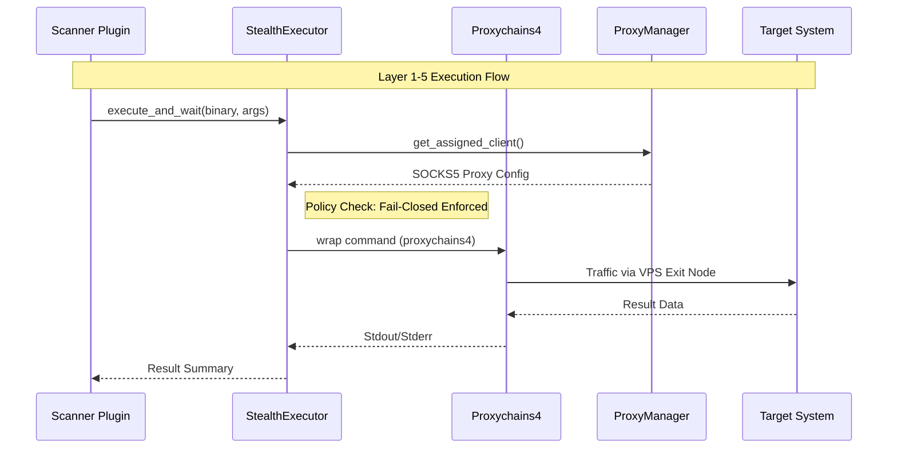

# 🔱 OSINT-ULTIMATE: SOVEREIGN SYSTEMS V14.1 DOCUMENTATION

**Date**: 2026-04-14
**Version**: 14.1 (Sovereign Sync)
**Status**: PRODUCTION-READY

---

## 🏗️ SYSTEM ARCHITECTURE OVERVIEW

The OSINT-Ultimate ecosystem is a sovereign offensive platform designed for autonomous network operations. It enforces a strict "No-Proxy, No-Traffic" policy through a tiered capability model, ensuring zero-trust technical precision across all operational phases.

---

## 🛡️ PHASE-BY-PHASE TECHNICAL SPECIFICATIONS

### PHASE 0: PASSIVE RECONNAISSANCE (Layer 0)

* **Definition**: Non-attributable data collection with zero target interaction.
* **Core Components**: `OsintScanner`, `WaybackScanner`, `TruffleHogScanner`.
* **Stealth Boundary**: Must strictly use `ProxyManager` to prevent IP leaks to third-party APIs.
> [!IMPORTANT]
> **OPSEC BOUNDARY**: Even passive OSINT collection MUST be proxied to avoid source-IP correlation by cloud providers (crt.sh, Shodan, etc.).

### PHASE 1: DISCOVERY & ENUMERATION (Layer 1)

* **Definition**: Light active probing and service identification.
* **Core Components**: `DnsxScanner`, `HttpxScanner`, `WhatWebScanner`.
* **OPSEC**: Mandatory User-Agent rotation and adaptive jitter via `HumanJitter`.
* **Fail-Closed**: Execution terminates immediately if `proxychains4` or the assigned proxy node is unresponsive.

### PHASE 2: ACTIVE SCANNING & ANALYSIS (Layer 2)

* **Definition**: Intensive vulnerability scanning and attack surface mapping.
* **Core Components**: `NmapScanner`, `NucleiScanner`, `WebFuzzer`.
* **Policy**: Enforces `ScanLayerPolicy::preset_audit()` by default.

### PHASE 3: POC VERIFICATION (Layer 3)

* **Definition**: Safe, non-destructive vulnerability validation.
* **Core Components**: `PocValidator`, `ZapScanner`, `BurpScanner`.
* **Gate**: All Phase 3 actions with `RiskLevel > 80` require human-in-the-loop verification via `ApprovalGate`.

### PHASE 4: ACTIVE EXPLOITATION (Layer 4)

* **Definition**: Gaining initial access and system-altering actions.
* **Core Components**: `SqlMapScanner`, `ImpacketScanner`, `CommixScanner`.
* **Exploit Handover**: High-complexity exploits trigger an automatic `System HALT` for manual review.

### PHASE 5: POST-EXPLOITATION & PIVOTING (Layer 5)

* **Definition**: Domain dominance, persistence, and lateral movement.
* **Core Components**: `BloodHoundScanner`, `SliverScanner`, `HavocScanner`, `LigoloScanner`.
* **Managed Egress**: Mandatory routing through Managed Exit Nodes (DigitalOcean VPS) via `StealthExecutor::spawn()`.

---

## 🔱 AD RECON & SWARM PRIORITIZATION (V14.1 AUDIT)

V14.1 introduces the **Autonomous Pivot Protocol**, where Active Directory relationships directly influence lead agent roles.

### 1. The Ingestion Pipeline

Data flows from initial compromise to path-to-DomainAdmin computation:

### 2. Path-Weighted Role Assignment

The `SwarmOrchestrator` performs DFS-based path analysis on the `AttackGraph`. If a path to **Domain Admin** is detected with a cumulative `CVSS > 8.0`:
1. The `Planner` agent is bypassed.
2. The finding is immediately promoted to `Exploiter` role.
3. The `AdaptiveContext` is elevated to `Posture::Breach`.

---

## 🛡️ CORE INFRASTRUCTURE SPECS

### 1. Stealth Sovereignty (`utils/`)

* **ProxyManager**: Multi-tier egress management with managed exit node provisioning.
* **StealthExecutor**: The "Hard Gate" for OS binary interaction. Enforces policy validation and `proxychains4` wrapping.
* **Fail-Closed Policy**: "No-Proxy, No-Traffic". Binary execution fails if `proxychains4` is not verified.

### 2. Swarm Orchestration (`core/swarm/`)

* **Orchestrator**: Priority-driven agent allocation based on `TokenBudget`.
* **AutonomousAgent**: LLM-driven decision loop with `TieredAIRouter` support.
* **Context Compression**: High-density context mapping for AD paths to optimize token usage.

---

## 📊 EGRESS PATH (SOVEREIGN FLOW)

The following diagram illustrates the lifecycle of a single tool execution within the V14.1 ecosystem:

> [!CAUTION]
> **DESTRUCTIVE CAPABILITY**: Layer 4 and Layer 5 operations may result in permanent system changes. Always verify `ScanLayerPolicy` before deployment in production environments.
