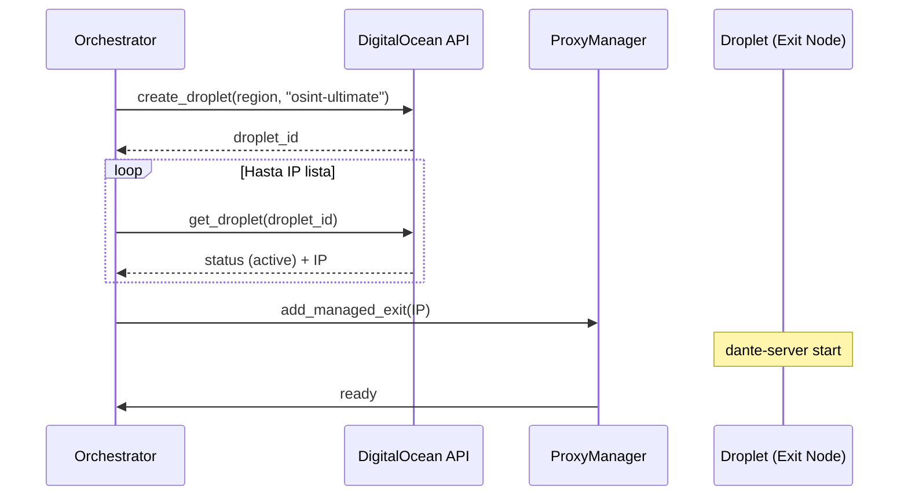
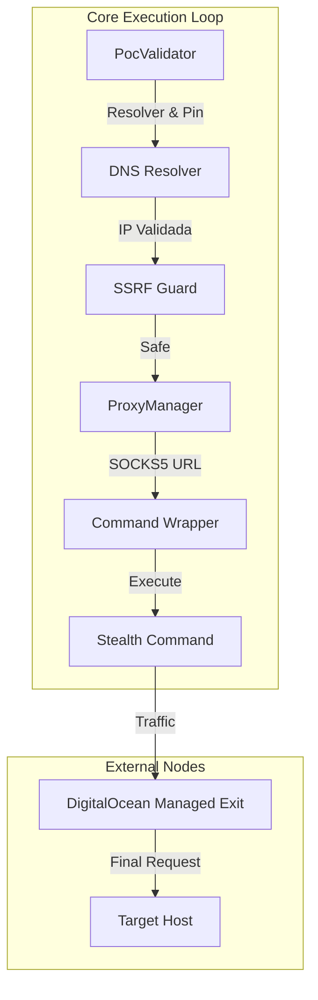

# 🕵️ Infraestructura Stealth y Evasión (V13)

Este documento detalla el funcionamiento de la **infraestructura de sigilo autónoma** implementada en OsintUltimate V13, diseñada para maximizar el anonimato y la resiliencia operativa mediante el despliegue dinámico de recursos en la nube.

---

## 1. Detección de Entorno OCI (`stealth_detect.rs`)

El motor es autoconsciente de su entorno de ejecución. Específicamente, detecta si se está ejecutando dentro de **Oracle Cloud Infrastructure (OCI)** para activar políticas de sigilo forzado.

### Lógica de Detección
Utiliza el servicio de metadatos de instancia (IMDS) v2 de Oracle Cloud:
- **Endpoint**: `http://169.254.169.254/opc/v2/instance/`
- **Cabecera**: `Authorization: Bearer Oracle`

Si la petición devuelve un estado exitoso, el sistema asume que el orquestador corre en OCI y activa el **"Total Proxy Mode"**, forzando que absolutamente todo el tráfico ofensivo pase por nodos de salida secundarios para evitar la exposición de la IP de la infraestructura de mando y control (C2).

---

## 2. Aprovisionamiento Autónomo de Proxies (`digital_ocean.rs`)

V13 introduce un ciclo de vida automatizado para nodos de salida efímeros utilizando **DigitalOcean**.

### Flujo de Trabajo de Droplets
1.  **Creación**: Cuando se requiere una IP fresca (debido a bloqueos WAF o rotación periódica), el motor solicita un Droplet `s-1vcpu-1gb` ($6/mes) en una región aleatoria.
2.  **Configuración (Cloud-Init)**: Se inyecta un script `user_data` que automatiza:
    - Instalación de `dante-server` (Proxy SOCKS5).
    - Configuración de reglas de paso sin autenticación (restringidas por IP si es necesario).
    - **Auto-destrucción**: Un comando `shutdown -h +240` asegura que el nodo se apague tras 4 horas para evitar sobrecostos si el orquestador falla.
3.  **Inyección**: Una vez que el Droplet reporta una IP pública, esta se añade automáticamente al `ProxyManager`.

### Diagrama de Secuencia: Aprovisionamiento de Salida

---

## 3. Control de Egress y Hardening del Validador

El componente `PocValidator` actúa como el gatekeeper final para el tráfico saliente durante la validación de hallazgos.

### Medidas de Seguridad V13
- **Mandatory IP Pinning**: Se resuelve la IP del objetivo una sola vez y se "pinea" en todas las peticiones subsiguientes para prevenir ataques de **DNS Rebinding**.
- **Proxy Wrapping**: Antes de ejecutar cualquier herramienta CLI (nmap, curl), el `ProxyManager` "envuelve" el comando inyectando los parámetros de proxy específicos (`-x` para curl, `--proxies` para nmap) utilizando los nodos de salida de DigitalOcean.
- **SSRF Shield**: Validación asíncrona contra rangos restringidos (RFC1918, CGNAT, Cloud Metadata) antes de permitir cualquier conexión.

### Diagrama de Concurrencia: Validación de PoC

---

## 4. Jitter Adaptativo y Reputación

El `ProxyManager` no solo rota IPs, sino que aprende de su rendimiento:
- **Jitter Log-Normal**: Imita la navegación humana con retrasos realistas.
- **Cool-down de Reputación**: Si un proxy es detectado o devuelve 403 frecuentemente, se le asigna una penalización de latencia de 10s y se mueve al final de la cola de selección.

---

© 2026 RedTeam Lab | OsintUltimate V13 Stealth Infrastructure Spec
