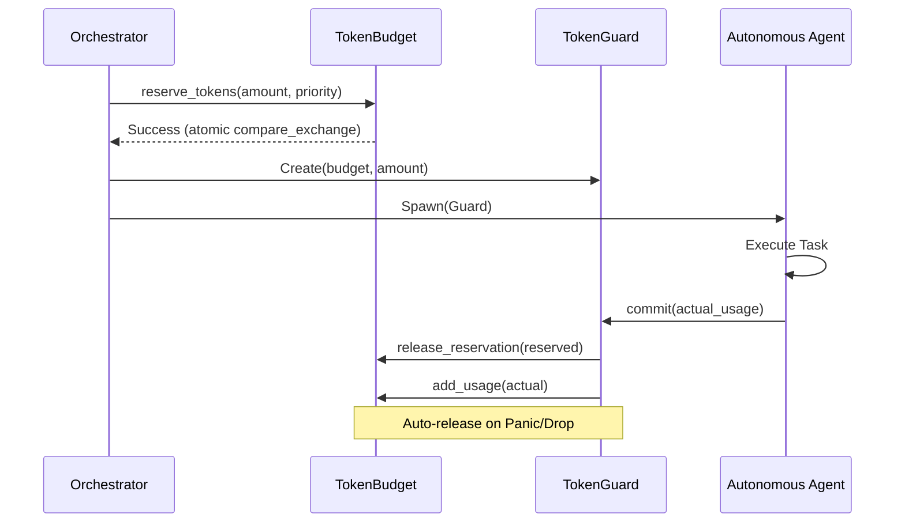

# 🐝 Swarm Dynamics & Token Budgeting (V14)

OsintUltimate V14 utilizes a high-concurrency, priority-aware **Swarm Orchestrator** to manage autonomous agents. This system is governed by a strict admission control engine that prevents resource exhaustion and ensures critical tactical analysis always has available budget.

---

## 🏗️ The Multi-Agent Swarm

Tasks are delegated to specialized agents based on the finding category and engagement posture.

### Agent Roles (`AgentRole`)

| Role | Priority | Description |
| :--- | :--- | :--- |
| **Planner** | `High` | Strategic decision maker. Analyzes findings to determine the next tactical step. |
| **Exploiter** | `Normal` | Active validation agent. Runs PoCs and intrusive scans to verify vulnerabilities. |
| **Scout** | `Low` | Infrastructure discovery agent. Performs nmap, nuclei, and tech-stack fingerprinting. |
| **C2Operator** | `Normal` | Post-exploitation agent. Manages sessions and persistence deployment. |
| **GhostReporter** | `Low` | Passive archival agent. Records findings without further interaction. |

---

## 💸 Token Admission Control (`TokenBudget`)

To prevent the AI from consuming the entire operational budget on low-value discovery, the `TokenBudget` implements **Priority-Based Throttling**.

### Admission Thresholds

Budget admission is calculated using `(Total Used + Reserved) / Max Tokens`.

- **High Priority (Planner)**: 100% Threshold. Can use the last remaining tokens for critical strategy.
- **Normal Priority (Exploiter/C2)**: 90% Threshold. Admission is refused if the budget exceeds 90% utilization.
- **Low Priority (Scout/Reporter)**: 75% Threshold. Throttled early to preserve space for high-value analysis.

### Emergency Pivot (95% Hard Gate)
If the **effective budget** (Total + Reserved) exceeds **95%**, the Orchestrator forces an emergency pivot: **All active tasks are converted to `GhostReporter`** to ensure final state archival before shutdown.

---

## 🛡️ RAII Token Reservations (`TokenGuard`)

V14 implements a race-condition safe reservation system using Rust's RAII (Resource Acquisition Is Initialization) pattern.

### Safety Features:
1. **Panic Isolation**: If an agent panics, the `TokenGuard` is dropped, automatically releasing its reserved tokens back to the pool.
2. **Per-Agent Capping**: Every request is clamped to `max_per_agent` (def: 50% of total budget) to prevent a single complex exploit from starving the swarm.

---

## 📊 Operational Metric: Starvation Prevention

> [!IMPORTANT]
> The `TokenBudget` uses atomic `Ordering::SeqCst` for all reservation logic to ensure strict consistency across the `JoinSet` worker pool. Admission control is technically absolute: **No Proxy, No Budget, No Execution.**

> [!CAUTION]
> If a task is skipped due to budget exhaustion, it is logged with `warn!` and the finding remains in the `CorrelationEngine` as "Unprocessed/Pending".
