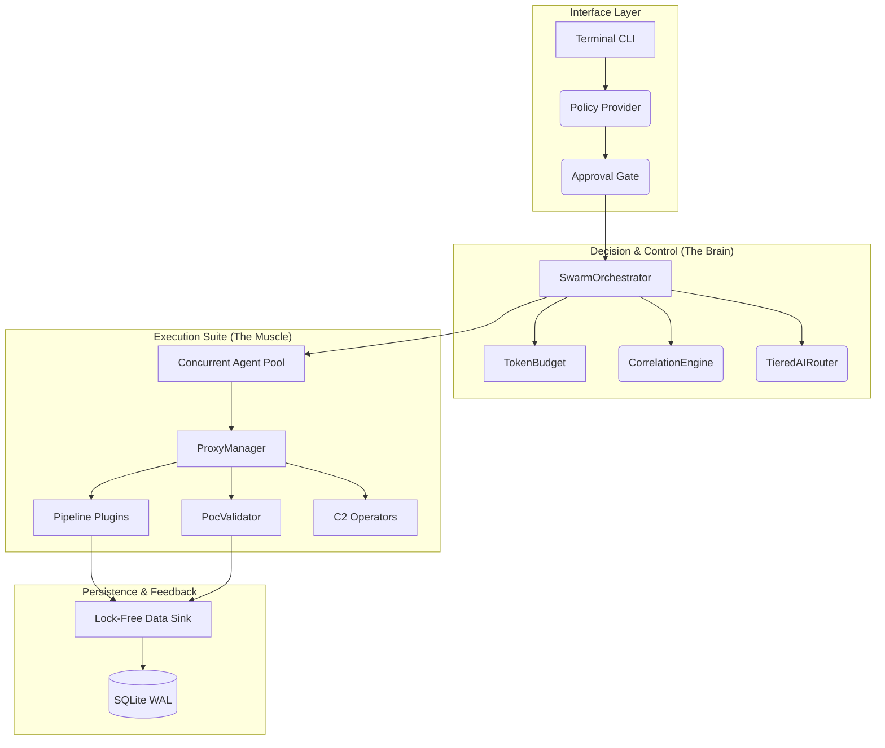
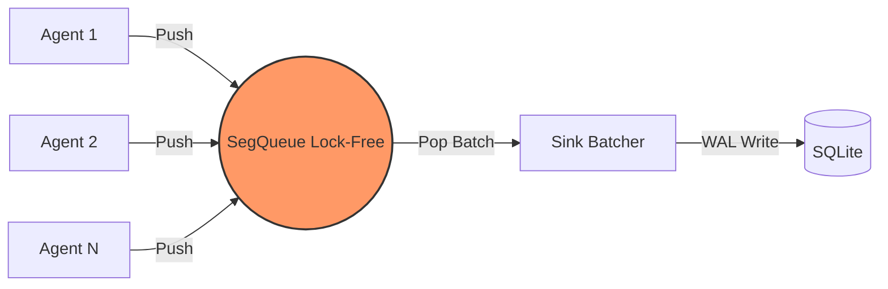

# 🏗️ OsintUltimate V14: Core Architecture (Master SSOT)

> [!NOTE]
> This document provides the high-level architecture. For detailed operational specifications and V14.1 Sovereign Sync details, see [SOVEREIGN_SYSTEMS.md](file:///home/kripi/Documentos/GitHub/OsintUltimate/redteam_rust_core/docs/SOVEREIGN_SYSTEMS.md).

OsintUltimate V14 is a high-performance, autonomous red-teaming orchestrator built in Rust. It utilizes **Lock-Free concurrency**, **io-uring I/O**, and **Adaptive AI Routing** to deliver production-grade offensive security.

---

## 1. System Topology

The system is architected as a set of decoupled domain services coordinated by the `SwarmOrchestrator`.

---

## 2. Core Components

### 🧠 SwarmOrchestrator (`src/core/swarm/`)
The central nervous system. It manages the lifecycle of autonomous agents, handles `JoinSet` workers, and enforces the **95% Token Hard-Gate**.

### 💸 TokenBudget (`src/core/swarm/budget.rs`)
Atomic admission control. Implements priority-aware reservation levels:
- **High**: 100% capacity.
- **Normal**: 90% capacity.
- **Low**: 75% capacity.

### 🛡️ ProxyManager (`src/utils/proxy.rs`)
The stealth enforcement layer. Implements **Fail-Closed Egress** (No-Proxy, No-Traffic) and maintains consistent **RT-Identity** per host using User-Agent pinning.

### 🔱 CorrelationEngine (`src/core/correlation.rs`)
Persistent tactical state. Tracks findings across subdomains and identifies high-value attack paths (e.g., AD Path-to-DA) to prioritize agent tasks.

---

## 3. High-Performance Concurrency

V14 avoids traditional mutex bottlenecks using a lock-free persistence pipeline.

### Technical Specs:
- **Runtime**: `Tokio` (Multi-threaded worker pool).
- **Networking**: `io-uring` integration for low-latency header analysis.
- **State Management**: `Arc<DashMap>` for concurrent shared-state lookups without global locks.

---

## 4. Operational Guardrails

> [!IMPORTANT]
> **V14 Sovereignty**: Any exploit with a `RiskScore >= 70` triggers an automatic Halting State. The orchestrator will NOT proceed until a signed decision is received via the `ApprovalGate` (Human-in-the-loop).

> [!CAUTION]
> **Telemetry Leaks**: Deployment in "Sovereign Mode" disables all external OTLP telemetry unless a secure, proxied sink is configured.
