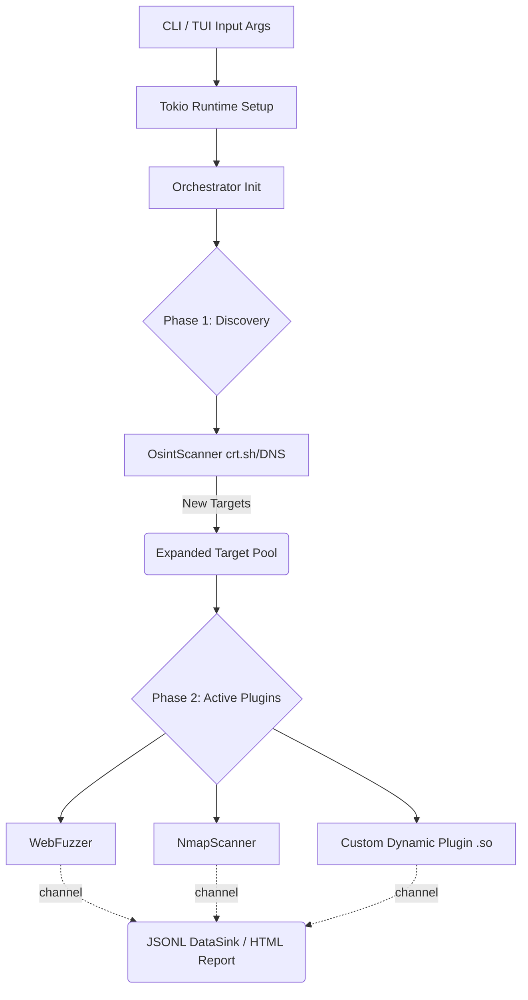

# Arquitectura de OsintUltimatev2

OsintUltimate v2 ha sido reescrito desde cero en Rust, pasando de una arquitectura monohilo en Python a un **motor concurrente asíncrono de alto rendimiento** impulsado por `tokio`. Esto elimina cuellos de botella del Global Interpreter Lock (GIL) y previene errores de corrupción de memoria al operar con miles de hilos virtuales.

## 1. El Motor Asíncrono (`tokio` + `futures`)

Todo el núcleo gira alrededor del runtime asíncrono `tokio`. En lugar de instanciar procesos pesados del SO, el motor agrupa las tareas (escaneo de puertos, peticiones de fuerza bruta, resolución DNS) en un `FuturesUnordered`.

*   **Concurrency Binding (`Semaphore`)**: Para proteger el sistema de agotar los descriptores de archivo locales o de saturar los enlaces de red, un `Semaphore` global controla la tasa exacta de ejecución en paralelo. Si la concurrencia se ajusta a `50`, solo `50` futuros accederán a los recursos de I/O de red en un momento dado.
*   **Cancelación en Cascada (`CancellationToken`)**: En caso de un (Ctrl+C), el pipeline entero se apaga con gracia (Graceful Shutdown) gracias a un `CancellationToken` transmitido en jerarquía hacia abajo hasta la última petición HTTP pendiente.

## 2. El Pipeline de Ejecución (`core::pipeline`)

La ejecución de OsintUltimate no es lineal; es un grafo de dependencias de dos fases principales.

### Fase 1: Descubrimiento (Discovery)
Módulos que implementan el trait `DiscoveryPlugin` toman un objetivo raíz (ej. `example.com`) y expanden la superficie de ataque, es decir, buscan subdominios, endpoints pasivos o rangos IP.

*   Todo objetivo nuevo descubierto (`sub.example.com`) se introduce inmediatamente en el ciclo, pasando de 1 TargetHost a N TargetHosts antes de la fase de ataque activa.

### Fase 2: Escaneo Activo (Scanning)
Cada objetivo de la lista estabilizada (original + descubiertos) pasa luego por los plugins de escaneo activo que implementan el trait `ScannerPlugin` (ej. `WebFuzzer`, `NmapScanner`).

*   Los plugins atacan al host de forma paralela.

## 3. Entidades Clave

*   **`Orchestrator`**: Inicia y sincroniza las fases. Coordina qué hosts deben ser escaneados por qué plugins basándose en comprobaciones previas (Liveness). Si un host está inactivo por ICMP/TCP Synth, el `Orchestrator` podría detener los plugins dependientes.
*   **`LivenessChecker`**: Validaciones pre-escaneo híbridas (DNS resolution via DoH + ICMP Ping) para evitar lanzar mil cargas útiles contra IPs "muertas".
*   **`DataSink` / `JsonlSink`**: Un recolector asíncrono. Cada hilo en Rust envía su `Finding` a través de un canal (`mpsc`). El `JsonlSink` serializa y persigue ("flushea") en disco en tiempo real como línea de JSON, eliminando los clásicos picos de consumo de memoria RAM generados por mantener diccionarios de resultados pesados.

## Diagrama de Bloques Abstracto

